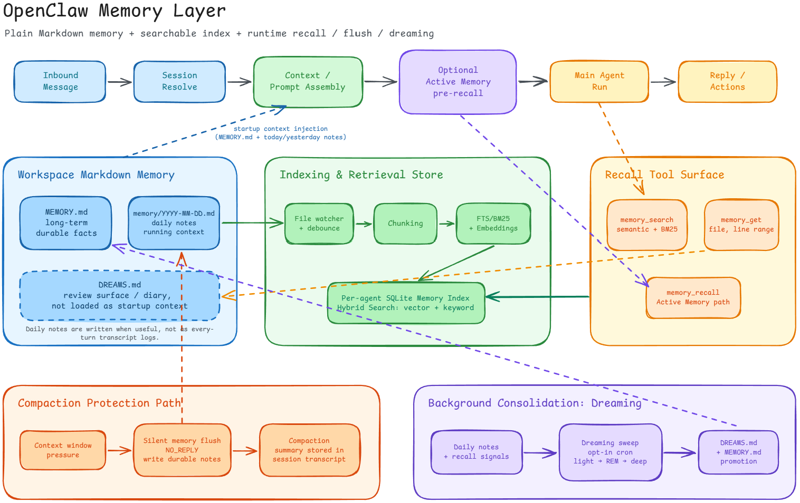

# OpenClaw's Memory Layer

OpenClaw의 Memory에 대해서 학습한 내용을 정리하고자 한다.

- OpenClaw는 agent workspace에 plain Markdown 파일들에 기억해야할 것들을 작성한다.
- local filesystem에 저장이 되는 방식이기 때문에, OpenClaw가 어떤 값들을 저장했는지 직접 확인하는 것도 가능하다.

여기서 Plain Markdown Files는 크게 3개다.

1. MEMORY.md
   - 장기 메모리를 위한 파일이다.
   - 객관적(혹은 durable한) 팩트, 사용자의 선호와 결정
   - 모든 session의 시작 시점 loading된다. (모든 execution이 아니라, session initial 단계를 말하는 것임)
2. memory/YYYY-MM-DD.md
   - 데일리 노트처럼 기록된다.
   - 오늘과 어제의 노트가 session 시작 시에 자동으로 loading된다.
   - 모든 대화 턴마다 모든 대화 기록되는 건 아니고, agent가 '이건 기억해야지'하는 것들을 daily note에 기록하는 방식이다.
3. DREAMS.md (optional)
   - 데일리 노트, Human Review Interaction, 잘못된 판단 등으로부터 패턴을 찾고, 실수를 교정하고, 더 일반화된 결론 도출
   - 과거 데이터를 기반으로, 나중에 생성된 정제된 해석을 과거 시점에 맞춰서 보강하기
   - retrospective correction + reinterpretation
   - 과거 기록에 대한 정확한 해석을 덧붙이는 것
   - 정리하자면, 에이전트가 과거 경험을 재해석해서 도출한 인사이트와 그 요약을, 사람이 검증할 수 있도록 기록한 Meta Memory Layer

> [!NOTE]
> 위 파일들은 `~/.openclaw/workspace`에 저장된다.

OpenClaw 에이전트는 2개의 Memory 관련 도구에 접근할 수 있다.

1. `memory_search`
   - semantic search를 통해 관련된 notes를 찾는다.
   - semantic search이기 때문에 wording이 달라도 찾을 수 있다.
2. `memory_get`
   - 특정 memory 파일이나 파일의 특정 범위(line 범위)를 읽는다.

위 두 도구는 `memory-core`라는 memory plugin으로 에이전트에게 제공된다.

> 질문
>
> Q. Plain text로 구성된 markdown 파일인데 semantic search를 어떻게 하지?
>
> A. Plain text에 semantic search를 하는 게 아니라, 별도의 chunking + embedding 과정이 존재한다.
>
> Q. 그럼 이 chunking data의 source는 뭐지?
>
> A. 메모리 파일(MEMORY.md, .memory/\*.md)
>
> Q. 그럼 embedding을 위한 provider가 없으면 `memory_search`는 무용지물인가?
>
> A.

memory_search의 검색 작동 방식을 좀 더 살펴보자.

1. query가 날라오면
2. 이걸 Tokenize해서 BM25 Search(키워드 기반 검색)을 한다
3. 위 과정과 병렬로, query에 대해 Embedding을 해서 Vector Search를 수행한다.
4. 이 2개의 search 결과를 적절히 Weighted Merge해서 Top Results를 반환한다.

> [!NOTE]
> Embedding이 설정되지 않을 경우, FTS(Full-Text Search)가 대신한다고 한다.

> 여기서 질문
>
> Q. Vector Search, BM25 Keyword Search, FTS 모두 별도로 동작하는지? 혹은 Vector Research와 BM25가 같이 동작하고, FTS가 또 따로 동작하는지? 혹은 둘중 하나만?

검색 품질을 향상하기 위한 2개의 optional한 기능이 있다.

1. Temporal decay(시간 감쇠)
   - 오래된 노트에 대해서 ranking 가중치를 점점 줄인다.
   - 반감기는 30일이다. 즉, 30일마다 ranking 가중치가 50% 감소한다.
   - 다만 `MEMORY.md` 같은 핵심 메모리 파일은 영향을 받지 않는다.
2. MMR (다양성)
   - 중복 결과를 줄인다.
   - 여러 개의 노트가 모두 같은 내용을 언급하더라도, top results에는 해당 노트가 반복되지 않도록 한다.

## Built-in Memory Engine

OpenClaw의 기본 메모리 백엔드이다. Agent별로 SQLite 데이터베이스에 Memory Index를 저장하며, 추가적인 의존성이 없다.

여기서는 총 5가지의 기능을 제공한다.

1. Keyworkd search
   - FTS5를 활용한 Full-text indexding (BM25 scoring)
   - 이 Index를 기반으로 keyword search
2. Vector search
3. Hybrid search
   - Keyword search와 Vector search를 하이브리드로 사용한다.
   - 이 둘의 결과를 그대로 가져가는 것은 아니고, merge 과정에서 Top results를 선별한다.
4. CJK support
   - Chinese, Japanese Korean에 대한 Trigram Tokenizer를 지원한다는 의미
5. sqlite-vec acceleration (optional)
   - 데이터베이스 내에서 vector query를 가속화하기 위한 것.

Vector search는 Embedding을 포함하기 때문에 Embedding Provider가 필요하다. 근데 OpenClaw는 LLM 모델을 위해 사용자가 제공한 Provider API 키를 자동으로 감지해서 Embedding에 활용한다. 별도 구성도 필요하지 않다. 물론 Local Embedding Provider를 직접 구성해서 사용하는 것도 가능하다. 이 경우 자동감지는 없다.

> [!IMPORTANT]
> 만약 Embedding Provider가 제공되지 않는다면, Vector search나 Hybrid search가 아니라 Keyword search만 사용하게 된다.

### Indexing은 어떻게 동작하는가?

MEMORY.md와 memory/\*.md를 chunking + indexing하고, 이를 Agent별 SQLite DB에 저장한다.

> [!IMPORTANT]
> 메모리 파일이 변경되면 재인덱싱이 트리거되고, Embedding Provider나 Model, Chunking 구성이 바뀌면 전체 Index가 다시 빌드된다.

## Honcho Memory

Honcho는 stateful한 agent를 만들기 위한 open source memory library이다. Workspace의 Markdown 파일을 넘어서, Cross-session Context를 에이전트에게 제공한다.

제공하는 기능은 다음과 같다.

1. Cross-session memory
   - 모든 대화 턴 이후에 해당 대화 내용을 저장해서, 세션 재설정이나 Compaction, 채널 전환 이후에도 Context가 유지된다.
2. User modeling
   - 각 사용자(Preferences, Facts, Communication Style)와 에이전트(Personaltiy, Learned Behaviours)
3. Semantic search
   - 현재 세션뿐 아니라, 과거 대화의 관찰 결과를 대상으로도 검색한다.
   - 과거 대화 내역을 direct로 검색한다는 게 아니라, 과거 대화를 기반으로 Observation을 만들고, 그 Observation가 semantic search 범위에 포함된다는 의미
4. Multi-agent awareness
   - 부모 에이전트가 하위 에이전트의 활동을 관찰한다

> 질문
>
> Q. 4번이 왜 Honcho에 포함되는거지? 메모리와 크게 관련이 없어보이는 기능인데.

> [!TIP]
> Honcho와 Built-in Memory는 함께 사용할 수 있다.

Honcho쪽을 더 딥하게 파보면 좋을 것 같다. Honcho에 대한 좀 더 자세한 얘기는 추후에 별도의 문서에서 다룰 예정이다.

## Active Memory

Active Memory는 메모리를 저장하는 새로운 백엔드라기보다는, 메인 에이전트가 답변을 만들기 전에 관련된 메모리를 먼저 찾아보게 하는 optional plugin이다.

조금 더 구체적으로 말하면, eligible한 대화 세션에서 메인 답변이 생성되기 전에 **blocking memory sub-agent**가 한 번 실행된다. 이 sub-agent는 `memory_recall`, `memory_search`, `memory_get` 같은 memory recall 도구만 사용할 수 있고, 관련 기억이 있으면 짧은 summary를 반환한다. 관련 기억이 없거나 확신이 낮으면 `NONE`을 반환해야 한다.

> [!IMPORTANT]
> 여기서 오해하면 안되는 게, 이거는 session 시작 시 발생하는 memory file injection과는 다르다. Active Memory는 세션 시작 시에 실행되는 게 아니라, Agent Loop가 돌면서 새로운 user turn이 들어온 뒤 main agent가 그 turn에 대한 답변 생성을 시작하기 직전에 실행된다.

이 summary는 사용자에게 바로 보이는 답변으로 출력되는 것이 아니라, 메인 에이전트의 답변 생성 전에 **hidden context**로 붙는다. 그래서 메인 에이전트는 사용자가 직접 "예전에 말한 거 찾아봐"라고 하지 않아도, 자연스럽게 과거 선호나 장기 맥락을 반영할 수 있다.

그럼 이 Active Memory가 왜 필요할까?

기본적인 memory system은 보통 reactive하다.

- 메인 에이전트가 필요하다고 판단해야 memory search를 호출한다.
- 사용자가 직접 어떠한 기억을 검색하라고 말해야 한다.
- 또는 사용자가 명시적으로 "remember this"라고 해야 한다.

근데 실제 대화에서는 memory가 필요한 순간이 답변 생성 전에 이미 지나가버리는 경우가 있다. 예를 들어 사용자가 "저번에 말한 그 방식으로 해줘"처럼 말했을 때, 메인 에이전트가 memory search를 떠올리지 못하면 에이전트가 생성한 답변 혹은 행위는 관련된 memory를 고려하지 않게 된다.

위 문제를 줄이기 위해, Active Memory는 메인 답변 전에 제한된 한 번의 memory recall 기회를 제공한다.

물론 모든 경우에 이 Active Memory가 동작하는 것은 아니고, 별도의 동작 조건이 있다.

1. `active-memory` plugin이 enabled 상태여야 한다. (당연)
2. 현재 agent id가 `config.agents`에 포함되어야 한다.
3. 현재 chat type이 `allowedChatTypes`에 포함되어야 한다.
   - 아래에서 좀 더 자세히 다룬다.
4. interactive persistent chat session이어야 한다.

> [!IMPORTANT]
> OpenClaw 전체의 모든 inference path에서 항상 도는 기능은 아니다. Direct message 같은 **user-facing persistent session**에서는 적합하지만, headless one-shot run, background job, internal worker, sub-agent helper execution 같은 곳에서는 기본적으로 적합하지 않다.

> 질문 (Copilot이 답변)
>
> Q. 왜 적합하지 않지?
>
> A. Active Memory는 메인 답변 전에 hidden context를 자동으로 추가하는 기능이다. 그래서 user-facing persistent session처럼 "이전 맥락이나 선호를 자연스럽게 반영하는 것"이 가치가 있는 경우에는 잘 맞는다.
>
> 반대로 one-shot task, background job, internal worker는 보통 입력이 명시적이고 **결과가 재현 가능**해야 한다. 여기에 과거 memory가 자동으로 섞이면 예상하지 못한 개인화, latency 증가, non-deterministic한 실행 결과, context 오염이 생길 수 있다.
>
> 예를 들어 background job은 같은 입력이면 같은 행동을 하는 편이 좋고, internal sub-agent는 상위 agent가 넘긴 task 범위 안에서만 동작하는 편이 안전하다. public/group/channel 환경에서도 특정 개인의 memory가 hidden context로 섞이면 다른 참여자에게 surprise가 되거나 privacy 이슈가 될 수 있다.

> Q. 그럼 Active Memory는 개인화된 메모리만 참고하는가?
>
> A. 꼭 그렇지는 않다. Active Memory 자체는 "개인화된 메모리만 조회한다"는 별도 저장소라기보다는, 현재 설정된 memory recall pipeline을 메인 답변 전에 한 번 실행하는 layer에 가깝다.
>
> 그래서 실제로 참고하는 대상은 연결된 memory backend와 recall 도구가 무엇을 검색할 수 있느냐에 따라 달라진다. 예를 들어 `memory-core`를 쓰면 `MEMORY.md`, `memory/*.md`처럼 인덱싱된 메모리 파일에서 관련 내용을 찾을 수 있고, Honcho 같은 backend를 함께 쓰면 사용자 선호나 과거 대화에서 추출된 observation도 recall 대상이 될 수 있다.
>
> 다만 Active Memory가 특히 빛나는 영역은 개인화된 장기 맥락이다. 안정적인 선호, 반복되는 습관, 이전에 합의한 작업 방식처럼 "사용자가 굳이 다시 말하지 않아도 답변에 반영되면 자연스러운 정보"를 메인 답변 전에 끌어오는 데 목적이 있기 때문이다. 즉, 개인화 memory 전용 기능은 아니지만, 개인화와 continuity를 위해 쓰일 때 가장 효과가 크다고 볼 수 있다.

실제 흐름은 다음과 같이 이해할 수 있다.

1. 사용자가 메시지를 보낸다.
2. Active Memory가 현재 메시지나 최근 대화 맥락을 기반으로 memory query를 만든다.
3. blocking memory sub-agent가 memory recall 도구를 사용해 관련 기억을 찾는다.
4. 찾은 내용이 충분히 관련 있으면 짧은 summary를 만든다.
5. 이 summary가 hidden `active_memory_plugin` context로 메인 답변 앞에 붙는다.
6. 메인 에이전트가 그 context를 참고해서 최종 답변을 생성한다.

> [!WARNING]
> Active Memory는 답변 경로에 **blocking**으로 들어간다. 따라서 기억을 더 잘 찾을수록 개인화와 연속성은 좋아질 수 있지만, 그만큼 latency도 늘어날 수 있다. 그래서 QueryMode를 통해 sub-agent가 볼 수 있는 대화 범위를 제어한다.

1. `message`
   - 최신 사용자 메시지만 본다.
   - 가장 빠르다.
2. `recent`
   - 최근 몇 개의 user/assistant turn을 함께 본다.
   - follow-up 질문이 어느 정도 있는 일반 대화에 적합하다.
3. `full`
   - 더 긴 대화 맥락을 본다.
   - 가장 느릴 수 있다.
   - 맥락 의존성이 큰 대화에서는 유용하지만, 기본값으로 쓰기에는 부담이 있다.

어떤 경우에 적합한가?

1. 사용자의 안정적인 선호가 중요한 경우
   - 예: 좋아하는 음식, 선호하는 설명 방식, 자주 쓰는 개발 스타일
2. 장기적인 사용자 맥락이 답변 품질에 영향을 주는 경우
   - 예: 특정 프로젝트의 방향성, 반복되는 의사결정, 이전에 합의한 작업 방식
3. 대화의 continuity가 중요한 user-facing agent
   - 예: 개인 비서, 코딩 파트너, 운영 지원 agent

> [!CAUTION]
> 다음과 같은 경우에는 Active Memory가 잘 맞지 않는다.
>
> 1. one-shot API task
> 2. 자동화 worker나 background job
> 3. 내부 sub-agent 실행
> 4. 숨겨진 개인화가 사용자에게 surprise로 느껴질 수 있는 public/group/channel 환경

정리하면, Active Memory는 "메모리를 더 많이 저장하는 기능"이라기보다 **메모리를 찾아야 할 타이밍을 메인 답변 이전으로 앞당기는 기능**에 가깝다. Memory Search가 저장된 기억을 찾는 기술이라면, Active Memory는 그 검색을 언제 자동으로 시도할지 결정하는 conversational enrichment layer라고 볼 수 있다.

## Compaction

모든 모델은 한 번에 처리할 수 있는 최대 토큰수가 정해져있다. 이걸 Context Window라고 하는데, Context Window의 한도에 가까워지면 오래된 메시지를 Compaction한다.

동작 방식을 간단히 살펴보자면,

1. 오래된 대화 턴을 요약한다.
2. 이 요약은 session transcript에 저장된다
3. 최근 메시지는 압축하지 않고 그대로 유지한다.

> [!WARNING]
> Compaction을 하는 시점에는 대화 내역을 Chunking한다. 이때 도구 호출과 도구 호출 결과가 서로 다른 chunk로 split된다면 reasoning이 깨질 수 있다.

```text
# 예시
--- chunk A ---
[assistant] tool_call: getWeather("Seoul")

--- chunk B ---
[tool] toolResult: { "temp": 18, "condition": "cloudy" }
```

이런 경우에는 그 쌍(도구 호출-결과)이 함께 유지되도록 다음과 같이 split 위치가 tool block 바깥으로 이동하게 된다.

```text
# 기존
... previous messages ...
[assistant] tool_call: X   ← split point (여기서 자르려고 함)
[tool] toolResult: Y
...
```

```text
# split point 변경
... previous messages ...
--- split ---
[assistant] tool_call: X
[tool] toolResult: Y
...
```

> [!IMPORTANT]
> Compaction을 한다고 해서 디스크에 저장된 memory 파일이 압축되는 것은 아니다. Compaction은 다음 턴에 Agent에게 주어질 내용만 바꾸는 것이다. 물론 Session Transcript에는 Compaction 내용이 저장된다.

## 그럼 OpenClaw의 Orchestration Layer에서 Memory는 언제, 어떻게 개입하는가?

OpenClaw는 Agent Loop를 계속 돌면서 동작하게 되고, Memory는 이 Agent Loop의 여러 시점에 서로 다른 형태로 개입하게 된다.

OpenClaw의 Agent Loop를 아주 단순화하면 다음과 같다.

```text
Inbound Message
  -> Session Resolve
  -> Context / Prompt Assembly
  -> Optional Active Memory
  -> Main Agent Run
  -> Tool Execution / Memory Search
  -> Transcript Persistence
  -> Optional Memory Flush
  -> Optional Compaction
  -> Optional Dreaming
```

여기서 Memory가 개입하는 지점을 나눠보면 대략 다음과 같다.

### 1. Session이 시작될 때: 기본 memory file이 context에 들어간다

첫 번째 Memory 개입은 Session 시작 시점에 발생한다.

먼저 사용자의 메시지가 들어오면 OpenClaw Gateway는 이 메시지가 어떤 session에 속하는지 결정한다. Direct Message인지, Group인지, Channel인지, Cron Job인지에 따라 `sessionKey`가 달라지고, 그 `sessionKey`가 현재 이어갈 `sessionId`를 가리킨다.

이후 Agent Run을 준비하면서 workspace, skills, bootstrap/context files, session transcript 등을 바탕으로 model context가 구성된다.

이 시점에 위에서 언급한 memory file 중 일부가 기본 context로 들어간다.

Recap을 하자면,

1. `MEMORY.md`
   - 장기 기억이다.
   - durable한 fact, 사용자의 preference, 중요한 decision을 담는다.
   - session 시작 시점에 기본 context로 들어간다.
2. `memory/YYYY-MM-DD.md`
   - daily note이다.
   - 세션 시작 시, 오늘과 어제의 note가 자동으로 들어간다.

> [!NOTE]
> 여기서 `DREAMS.md`는 제외된다. `DREAMS.md`는 session 초기에 기본 context로 로딩되는 파일이라기보다는, Dreaming 결과와 사람이 검토할 수 있는 meta memory / review 내용을 남기는 surface에 가깝다. 여기서 검증되거나 승격된 내용이 나중에 `MEMORY.md`에 반영되면, 그때부터 session 초기 context에 들어올 수 있다.

정리하자면, 이 단계의 Memory는 dynamic하게 필요에 따라 추가되는 게 아닌 **초기 context injection**에 가깝다. 에이전트가 따로 `memory_search`를 호출하지 않아도, 기본적으로 기억해야 하는 핵심 메모리 일부가 프롬프트 구성 단계에 들어간다.

### 2. Main Agent Run 중: 에이전트가 필요하다고 판단하면 memory tool을 호출한다

두 번째 Memory 개입은 Agent가 필요에 따라 도구를 호출해 메모리를 "검색"하는 방식이다.

Main agent가 reasoning 과정을 통해 memory의 필요성을 느껴, 메모리 검색 도구를 호출하는 단계다.

OpenClaw 에이전트는 `memory_search`, `memory_get` 같은 memory tool에 접근할 수 있다. 그래서 답변을 만들다가 **과거 정보가 필요하다고 판단**하면 직접 memory를 검색하거나 특정 파일 범위를 읽을 수 있다.

이 방식은 기본적으로 reactive하다. 다시 말하자면,

- 사용자가 "전에 말한 설정 찾아봐"라고 요청할 수 있다.
- 에이전트가 스스로 "이건 memory를 찾아봐야겠다"고 판단할 수 있다.
- 검색 결과를 보고 다시 `memory_get`으로 원문을 확인할 수 있다.

> [!IMPORTANT]
> 이 방식은 **에이전트가 memory search의 필요성을 떠올려야 한다는 한계**가 있다. 앞에서 Active Memory가 필요한 이유가 바로 이 지점이다.

### 3. Main Reply 직전: Active Memory가 먼저 memory recall을 시도할 수 있다

세 번째 Memory 개입은 위에서 언급한 Active Memory이다.

Active Memory가 켜져 있고, 현재 session이 eligible하다면 main reply가 생성되기 전에 별도의 **blocking memory sub-agent**가 먼저 실행된다.

이 sub-agent는 현재 메시지나 최근 대화 맥락을 보고 memory query를 만든 뒤, `memory_recall`, `memory_search`, `memory_get` 같은 recall 도구로 관련 memory를 찾는다.

찾은 내용이 충분히 관련 있으면 짧은 summary를 만들고, 이 summary가 hidden `active_memory_plugin` context로 main reply 앞에 붙는다. 관련 memory가 없거나 확신이 낮으면 `NONE`을 반환한다.

이 단계의 Memory는 main agent가 직접 호출하는 tool search와 다르다.

1. main agent가 답변을 시작하기 전에 먼저 실행된다.
2. 결과는 사용자에게 직접 보이지 않고 hidden context로 들어간다.
3. user-facing persistent session에서 continuity와 personalization을 높이는 데 초점이 있다.

정리하면, Active Memory는 **검색 도구 자체**라기보다는, 검색을 main reply 이전에 자동으로 시도하는 orchestration layer라고 볼 수 있다.

> [!IMPORTANT]
> 여기서 "Main Reply 직전"은 session 시작 시점이 아니라, 새로운 user turn이 들어온 뒤 main agent가 해당 turn의 답변 생성을 시작하기 직전을 의미한다. 따라서 session 시작 시 `MEMORY.md`, `memory/*.md` 같은 기본 memory file을 context에 넣는 것과 Active Memory가 검색 결과를 hidden context로 붙이는 것은 다른 단계다.

### 4. Memory file이 바뀌면: indexing layer가 다시 따라붙는다

Memory의 원천은 Markdown file이지만, `memory_search`가 매번 Markdown file을 처음부터 훑는 것은 아니다. 위에서도 언급했지만, `memory-core` 같은 backend는 `MEMORY.md`, `memory/*.md` 등을 chunking + indexing해서 Agent별 SQLite DB에 저장한다.

따라서 에이전트가 memory file을 수정하거나 사용자가 직접 파일을 수정하면, reindex 과정을 통해 memory index를 다시 갱신한다.

> [!NOTE]
> 이 단계는 model의 답변 생성 경로에 직접 끼어드는 것은 아니고, 이후 `memory_search`나 Active Memory recall이 더 최신 index를 사용할 수 있게 만드는 **maintenance layer**에 가깝다.

> 질문
>
> Q. 그러면 memory file에 쓰는 것과 memory search에 잡히는 것은 완전히 동시에 일어나는가?
>
> A. 개념적으로는 분리되어 있다. file write가 source 데이터 변경이고, indexing은 이를 검색 가능한 형태로 반영하는 과정이다. 대부분은 자동으로 따라오지만, 결과가 이상하거나 stale하게 느껴지면 `openclaw memory status`나 `openclaw memory index --force` 같은 확인/재빌드가 필요할 수 있다.
>
> Q. 그럼 memory write 이후에는 indexing이 무조건 따라오나? 혹은 cronjob처럼 주기적으로 indexing이 수행되나?
>
> A. Built-in memory engine 기준으로는 cronjob처럼 주기적으로만 도는 구조라기보다는, memory file 변경을 file watcher가 감지해서 **reindex를 트리거하는 구조**에 가깝다. 문서상으로는 memory file 변경 후 약 1.5초 debounce 뒤 reindex가 수행된다고 한다. 참고로 QMD backend는 별도의 file watcher와 interval timer를 함께 가질 수 있어서, backend에 따라 갱신 방식은 조금 다를 수 있다.

> [!NOTE]
> debounce란, 짧은 시간 안에 같은 이벤트가 여러 번 발생할 때, 이벤트가 발생할 때마다 바로 처리하지 않고 잠깐 기다렸다가 마지막 이벤트 기준으로 한 번만 처리하는 방식이다.
>
> 예를 들어 파일 저장 과정에서 변경 이벤트가 여러 번 발생해도, 1.5초 동안 추가 변경이 없을 때 reindex를 한 번만 수행하는 식이다. 불필요한 중복 indexing을 줄이기 위한 장치라고 보면 된다.

### 5. Compaction 직전: Memory Flush가 silent housekeeping으로 들어갈 수 있다

긴 대화가 context window에 가까워지면 OpenClaw는 compaction을 수행한다. 이때 오래된 대화가 요약되기 때문에, 중요한 사실이 아직 memory file에 저장되지 않았다면 요약 과정에서 약해지거나 사라질 수 있다.

그래서 OpenClaw는 compaction 전에 **silent memory flush turn**을 실행할 수 있다.

이 memory flush의 목적은 다음과 같다.

1. 곧 compaction될 대화 안에서 durable한 정보를 찾는다.
2. 필요한 경우 `memory/YYYY-MM-DD.md` 같은 memory file에 저장한다.
3. 사용자에게는 답변을 보내지 않도록 `NO_REPLY` 형태로 조용히 끝낸다.

> [!IMPORTANT]
> Compaction은 session transcript를 요약하는 기능이고, memory flush는 compaction 전에 **잃어버리면 안 되는 정보를 memory file로 대피시키는 기능**이다.
>
> Compaction 자체가 Memory 파일을 압축하거나 정리하는 것은 아니다. Compaction은 다음 턴에 model이 보게 될 session context를 줄이는 것이고, Memory Flush는 그 전에 durable state를 disk에 남기는 보조 과정이다.

### 6. 대화 이후 / 백그라운드: Dreaming이 memory를 정리하고 승격할 수 있다

Dreaming은 일반적인 main reply path와는 조금 다르다. 답변을 만들기 위해 매 turn 동작하는 기능이라기보다는, memory를 나중에 다시 검토하고 정리하는 background consolidation에 가깝다.

Dreaming은 daily note, short-term signal, human review interaction 등을 보고 장기적으로 남길 만한 후보를 찾는다. 이 후보가 충분히 qualified하면 `MEMORY.md` 같은 장기 메모리로 승격될 수 있고, 그 판단 과정이나 review 가능한 요약은 `DREAMS.md`에 남는다.

위에서 언급한 Live dreaming과 Grounded backfill이 이에 해당한다.

> [!NOTE]
> Dreaming은 orchestration layer의 실시간 답변 경로보다는 **post-processing / consolidation layer**으로 이해할 수 있다.

### 전체적으로 정리하면

OpenClaw의 Memory 개입 지점은 다음처럼 구분할 수 있다.

| 시점                           | 개입 방식                                               | 성격                   |
| ------------------------------ | ------------------------------------------------------- | ---------------------- |
| Session 시작 / prompt assembly | `MEMORY.md`, 오늘과 어제의 daily notes를 context에 포함 | 기본 context injection |
| Main Agent Run 중              | `memory_search`, `memory_get` 호출                      | reactive retrieval     |
| Main Reply 직전                | Active Memory sub-agent가 먼저 recall                   | proactive retrieval    |
| Memory file 변경 후            | chunking + indexing + SQLite index 갱신                 | search maintenance     |
| Compaction 직전                | silent memory flush로 durable info 저장                 | context loss 방지      |
| Background / scheduled         | Dreaming으로 후보 평가 및 장기 기억 승격                | memory consolidation   |

따라서 OpenClaw에서 Memory는 단순히 "프롬프트 앞에 붙는 파일"만을 의미하지 않는다. 어떤 때는 prompt assembly의 일부이고, 어떤 때는 agent가 직접 호출하는 tool이며, 어떤 때는 Active Memory처럼 main reply 전에 자동으로 실행되는 sub-agent이고, 또 어떤 때는 compaction이나 dreaming과 연결된 housekeeping/consolidation 과정이다.

마지막으로 전체 그림을 보면 다음과 같다.


