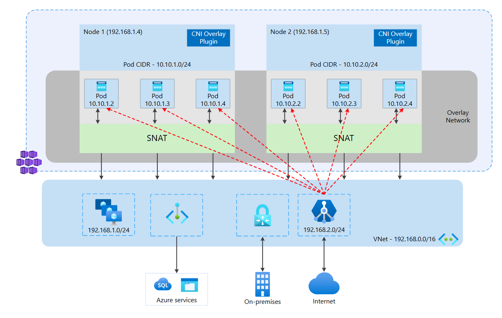

# AGFC and Azure CNI Overlay Networking

## 개요

이 문서는 Azure CNI Overlay를 사용하는 AKS에서 AGFC(Application Gateway for Containers)가 backend Pod와 통신하는 방식을 정리한다. 특히 AGFC association subnet이 overlay routing domain에 연결된다는 말이 datapath, 수동 Application Gateway 구성, NSG/UDR/NVA 설계에 어떤 의미를 갖는지에 초점을 둔다.

아래 그림은 Microsoft Learn의 CNI Overlay and Application Gateway for Containers 섹션에서 설명하는 구조다.



Microsoft Learn의 [Container networking with Application Gateway for Containers](https://learn.microsoft.com/en-us/azure/application-gateway/for-containers/container-networking) 문서는 CNI Overlay 환경에서 다음과 같이 설명한다.

> When Application Gateway for Containers is provisioned, the Overlay routing domain is further extended to the Application Gateway for Containers subnet, allowing proxying of requests from Application Gateway for Containers directly to pods.

AGFC(Application Gateway for Containers)는 association subnet을 Azure-managed 방식으로 overlay routing domain에 연결한다. 이 연결 때문에 AGFC data plane은 Azure CNI Overlay 환경에서도 backend Pod로 직접 proxy할 수 있다.

여기서 직접 proxy한다는 말은 Kubernetes `Service` API를 아예 쓰지 않는다는 뜻이 아니다. `Gateway`, `HTTPRoute`, `Ingress`, `Service`는 여전히 routing intent와 backend 선택을 표현하는 control plane 객체다. 다만 datapath 관점에서 AGFC가 NodePort, 별도 Kubernetes `LoadBalancer` Service, 또는 cluster 내부 ingress proxy를 반드시 거쳐야 하는 구조가 아니라는 뜻이다.

## Overlay Routing Domain 확장

Azure CNI Overlay의 일반적인 전제는 cluster 외부 endpoint가 overlay Pod IP에 직접 접근할 수 없다는 것이다. Pod CIDR은 Azure VNet subnet에 직접 붙어 있는 주소 공간이 아니고, Azure networking stack 안의 별도 overlay routing domain에서 처리된다.

AGFC가 provision되면 이 overlay routing domain이 AGFC association subnet까지 확장된다. AGFC data plane이 위치한 subnet에서 Pod CIDR로 향하는 backend traffic을 Azure platform이 이해하고 전달할 수 있게 되는 구조다.

이것은 사용자가 route table에 Pod CIDR route를 추가해서 만드는 기능이 아니다. `10.10.0.0/16 -> next hop node` 같은 UDR을 직접 넣어 재현하는 모델도 아니다. Azure platform이 AGFC data plane, delegated subnet, AKS CNI Overlay 정보를 함께 보고 datapath를 구성하는 integration으로 보는 편이 정확하다.

흐름은 다음처럼 이해할 수 있다.

```text
Internet client
  -> AGFC frontend
  -> AGFC association subnet
  -> Azure-managed overlay routing domain
  -> Pod endpoint
```

Pod는 결국 어느 AKS Node 위에서 실행되므로 실제 packet은 해당 Pod가 있는 Node 쪽으로 전달된다. 다만 gateway가 `nodeIP:nodePort`를 backend로 삼아 kube-proxy에게 넘기는 모델이 아니라, Pod endpoint를 backend로 보고 proxy할 수 있다.

## 수동 Application Gateway와 다른 점

수동으로 기존 Application Gateway를 AKS 앞에 배치하는 경우에는 보통 Application Gateway가 Kubernetes 상태를 직접 이해하지 않는다. backend pool에는 Internal Load Balancer IP, Ingress Controller Service, VMSS, NIC, private IP 같은 Azure 리소스나 명시적 IP가 들어간다.

이 구조에서는 다음과 같은 중간 publish 경로가 필요해지기 쉽다.

```text
Application Gateway
  -> Internal Load Balancer or ingress controller Service
  -> Node / kube-proxy / ingress proxy
  -> Pod
```

수동 Application Gateway subnet이 자동으로 AKS overlay routing domain에 편입된다고 보면 안 된다. Azure CNI Overlay 환경에서 Pod IP가 보인다고 해서, 그 IP를 일반 backend pool처럼 넣으면 Azure platform이 알아서 overlay Pod로 보내주는 구조가 아니다.

AGFC의 차이는 `Gateway API를 쓴다`는 API 선택보다 datapath 통합에 있다. AGFC는 association이라는 Azure resource를 통해 data plane을 delegated subnet에 연결하고, Azure platform이 그 subnet과 AKS overlay routing domain 사이의 backend path를 구성한다.

## AGIC와의 구분

`기존 Application Gateway = 항상 NodePort 경유`라고 단정하면 안 된다. Application Gateway Ingress Controller(AGIC)를 쓰는 경우에는 경로가 달라진다.

AGIC는 Kubernetes `Ingress`, `Service`, endpoint 상태를 watch하고 기존 Application Gateway 설정으로 변환한다. 공식 AGIC 문서는 Application Gateway가 Pod private IP와 직접 통신하며 NodePort 또는 kube-proxy Service가 필요하지 않다고 설명한다. 현재 문서 기준 AGIC도 CNI Overlay를 지원한다.

다만 AGIC와 AGFC는 운영 모델이 다르다.

| 구분                 | 기존 Application Gateway 수동 구성               | Application Gateway + AGIC             | AGFC                                                              |
| -------------------- | ------------------------------------------------ | -------------------------------------- | ----------------------------------------------------------------- |
| Kubernetes 상태 인식 | 직접 인식하지 않음                               | AGIC가 Ingress/Service/endpoint를 반영 | ALB Controller가 Gateway API/Ingress/Service를 반영               |
| backend 경로         | 보통 ILB, ingress controller, VMSS, NIC, 명시 IP | Pod private IP 직접 통신 가능          | Pod endpoint 직접 proxy 가능                                      |
| Overlay 통합         | 자동 통합으로 보면 안 됨                         | 지원 조건을 만족하면 CNI Overlay 지원  | association subnet이 overlay routing domain과 통합                |
| Azure API            | 사용자가 AppGW 리소스를 직접 구성                | AGIC가 기존 AppGW ARM 구성을 갱신      | AGFC 전용 resource, frontend, association, configuration API 사용 |
| 운영 감각            | Azure L7 LB를 AKS 앞에 수동 배치                 | 기존 AppGW를 Kubernetes Ingress와 연결 | Kubernetes-native Gateway API 중심의 Azure-managed L7 ingress     |

따라서 정확한 구분은 이렇다.

- 수동 Application Gateway는 overlay Pod IP 직접 backend 경로를 기대하면 안 된다.
- AGIC는 기존 Application Gateway를 쓰지만 Kubernetes integration이 있으므로 Pod 직접 통신과 CNI Overlay 지원이 가능하다.
- AGFC는 AGIC의 evolution으로 소개되는 별도 제품군이며, association subnet과 overlay routing domain 통합이 공식 networking model에 포함된다.

## Azure platform이 관여하는 범위

이 구조에서는 Azure platform이 구성하는 영역과 사용자가 설계해야 하는 영역을 나누어 봐야 한다.

Azure platform이 해주는 쪽은 AGFC data plane과 overlay routing domain 사이의 backend reachability다. AGFC association subnet이 Pod CIDR로 proxy traffic을 보낼 수 있게 하는 부분이 여기에 해당한다.

사용자가 여전히 설계해야 하는 쪽은 frontend exposure, subnet 보안, route table, Kubernetes policy, 애플리케이션 레벨 신뢰 경계다.

| 계층               | 봐야 할 것                                                    |
| ------------------ | ------------------------------------------------------------- |
| Frontend           | AGFC frontend, listener, TLS, WAF, hostname/path routing      |
| Association subnet | NSG, UDR, subnet delegation, return path                      |
| Backend path       | Overlay routing domain integration, Pod endpoint reachability |
| Cluster policy     | Azure Network Policy, Calico, Cilium Kubernetes NetworkPolicy |
| Application        | `x-forwarded-for`, authn/authz, request logging               |

AGFC는 L7 reverse proxy다. Client와 AGFC 사이 connection, AGFC와 backend Pod 사이 connection은 분리된다. 원본 client IP를 backend TCP source IP로 기대하기보다, AGFC가 추가하는 `x-forwarded-for` header를 기준으로 애플리케이션에서 해석하는 편이 맞다. AGFC는 `x-forwarded-for`, `x-forwarded-proto`, `x-request-id` header를 backend request에 추가한다.

## NSG, UDR, NVA 고려사항

AGFC association subnet에는 NSG와 UDR을 적용할 수 있다. 그러나 이것이 `overlay network를 임의로 라우팅할 수 있다`는 의미는 아니다.

공식 components 문서는 association subnet의 UDR 구성이 가능하다고 설명하면서도, 잘못된 route table은 AGFC에서 asymmetric routing을 만들 수 있다고 경고한다. 특히 public internet ingress의 return traffic이 NVA로 잘못 돌아가지 않도록 해야 한다.

또한 CNI Overlay + AGFC FAQ는 Azure Firewall 또는 NVA가 overlay network로 proxy traffic을 forward하는 구성을 지원하지 않는다고 설명한다. NVA가 Pod overlay network로 직접 들어가 traffic을 검사하거나 중계해야 하는 요구가 강하면 Azure CNI Overlay보다 Azure CNI flat networking을 검토해야 한다.

즉 다음처럼 정리할 수 있다.

| 요구                                         | CNI Overlay + AGFC에서의 해석                     |
| -------------------------------------------- | ------------------------------------------------- |
| AGFC가 Pod로 직접 proxy                      | 지원                                              |
| 일반 VM이 Pod IP로 직접 접속                 | 기본적으로 기대하면 안 됨                         |
| Azure Firewall/NVA가 overlay backend로 proxy | 지원되지 않음                                     |
| association subnet에 NSG/UDR 적용            | 가능하지만 return path와 required outbound를 주의 |
| Pod 단위 접근 제어                           | Kubernetes NetworkPolicy 계층에서 설계            |

## 제약 사항

공식 container networking 문서 기준 CNI Overlay + AGFC에서 특히 확인할 제약은 다음과 같다.

- ALB Controller는 CNI Overlay 지원을 위해 version `1.7.9` 이상이어야 한다.
- AGFC subnet은 `/24` prefix여야 하며, 한 subnet에는 하나의 deployment만 지원된다.
- 더 크거나 작은 AGFC subnet prefix는 지원되지 않는다.
- AGFC와 AKS cluster를 서로 다른 VNet에 두는 구성은 현재 지원되지 않는다.
- Regional VNet peering, global VNet peering을 통해 AGFC VNet과 AKS Node VNet을 분리하는 구성은 지원되지 않는다.
- CNI Overlay에서 Azure Firewall 또는 NVA가 overlay network로 proxy traffic을 forwarding하는 것은 지원되지 않는다.
- Kubenet은 AGFC에서 지원되지 않는다. Kubenet cluster는 CNI Overlay로 upgrade한 뒤 AGFC를 설치해야 한다.

## 요약

AGFC association subnet은 Azure platform에 의해 overlay routing domain에 연결된다. 이 통합 덕분에 AGFC는 NodePort나 별도 Kubernetes LoadBalancer를 전제로 하지 않고 Pod endpoint로 직접 proxy할 수 있다.

이 통합은 일반 VNet resource에 자동으로 열리는 기능이 아니다. 수동 Application Gateway, VM, Azure Firewall, NVA를 같은 방식으로 overlay Pod CIDR에 붙일 수 있다고 확장해서 이해하면 안 된다.

## References

- [Container networking with Application Gateway for Containers](https://learn.microsoft.com/en-us/azure/application-gateway/for-containers/container-networking)
- [Application Gateway for Containers components](https://learn.microsoft.com/en-us/azure/application-gateway/for-containers/application-gateway-for-containers-components)
- [Overview of Azure CNI Overlay networking in AKS](https://learn.microsoft.com/en-us/azure/aks/concepts-network-azure-cni-overlay)
- [What is Application Gateway Ingress Controller?](https://learn.microsoft.com/en-us/azure/application-gateway/ingress-controller-overview)
