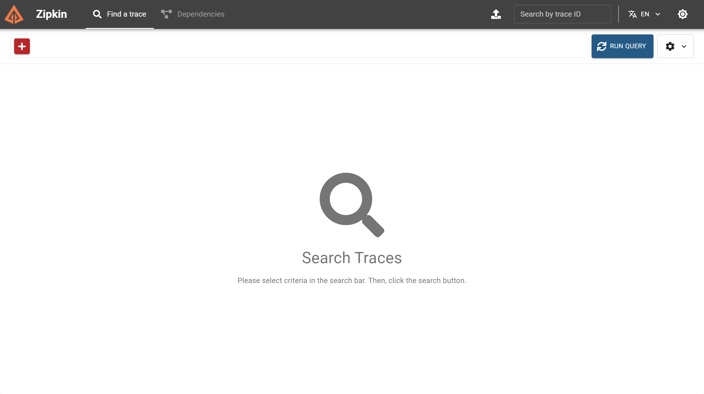

# 02. Enable CoreDNS trace with Zipkin

이 실습은 Zipkin server를 배포하고, AKS의 `coredns-custom` ConfigMap을 통해 CoreDNS `trace` 플러그인을 활성화한다.

## 목표

- Zipkin server를 `trace-lab` namespace에 배포한다.
- Zipkin ClusterIP를 사용해 CoreDNS trace endpoint를 구성한다.
- `coredns-custom`에 `trace.override`를 merge patch로 추가한다.
- CoreDNS를 rolling restart하고 DNS 정상 동작을 확인한다.

## 0. 변수 확인

이전 단계에서 만든 값을 그대로 사용한다. 새 터미널이면 다시 설정한다.

```bash
cd /home/cheolhuikim/studyspace/dev-knowledge/aks/coredns-trace/labs

export LAB_NS=trace-lab
export LAB_ARTIFACT_DIR='<01 단계에서 만든 artifacts 디렉터리 경로>'
export TRACE_EVERY=10
```

## 1. Zipkin 배포

```bash
kubectl apply -f spec/01-zipkin.yaml
kubectl -n "$LAB_NS" rollout status deployment/zipkin --timeout=5m
kubectl -n "$LAB_NS" get pods,svc -o wide
```

실행 결과 기록:

```text
NAME                         READY   STATUS    RESTARTS   AGE   IP            NODE                               NOMINATED NODE   READINESS GATES
pod/zipkin-96c9d86b7-l9b7s   1/1     Running   0          32s   10.244.2.61   aks-userpool-12452904-vmss000001   <none>           <none>

NAME             TYPE        CLUSTER-IP    EXTERNAL-IP   PORT(S)    AGE   SELECTOR
service/zipkin   ClusterIP   10.1.10.104   <none>        9411/TCP   32s   app=zipkin
```

## 2. Zipkin endpoint 변수 생성

CoreDNS process가 Zipkin Service 이름을 다시 CoreDNS로 질의하는 상황을 줄이기 위해, 이 lab에서는 Service DNS 이름 대신 Zipkin Service의 ClusterIP를 endpoint로 사용한다.

```bash
export ZIPKIN_CLUSTER_IP=$(kubectl -n "$LAB_NS" get service zipkin -o jsonpath='{.spec.clusterIP}')
export ZIPKIN_ENDPOINT="http://${ZIPKIN_CLUSTER_IP}:9411/api/v2/spans"

echo "$ZIPKIN_ENDPOINT"
```

실행 결과 기록:

```text
http://10.1.10.104:9411/api/v2/spans
```

## 3. coredns-custom ConfigMap 준비

`coredns-custom`이 없으면 빈 ConfigMap을 만든다. 이미 있으면 그대로 둔다.

```bash
kubectl -n kube-system get configmap coredns-custom

# kubectl -n kube-system create configmap coredns-custom

kubectl -n kube-system get configmap coredns-custom -o yaml
```

실행 결과 기록:

```text
apiVersion: v1
kind: ConfigMap
metadata:
  creationTimestamp: "2026-06-11T06:21:13Z"
  labels:
    addonmanager.kubernetes.io/mode: EnsureExists
    k8s-app: kube-dns
    kubernetes.io/cluster-service: "true"
  name: coredns-custom
  namespace: kube-system
  resourceVersion: "501"
  uid: 0eb2e49c-c368-4d1b-9250-25ec1c9389dd
```

## 4. trace.override patch 생성

```bash
envsubst < spec/02-coredns-custom-trace.patch.json.tmpl \
  | tee "$LAB_ARTIFACT_DIR/coredns-custom-trace-zipkin.patch.json" >/dev/null

cat "$LAB_ARTIFACT_DIR/coredns-custom-trace-zipkin.patch.json"
```

생성되는 설정의 핵심은 다음과 같다.

```text
trace zipkin http://<zipkin-cluster-ip>:9411/api/v2/spans {
  every <TRACE_EVERY>
  service aks-coredns
}
```

실행 결과 기록:

```text
{
  "data": {
    "trace.override": "trace zipkin http://10.1.10.104:9411/api/v2/spans {\n  every 10\n  service aks-coredns\n}\n"
  }
}
```

## 5. trace.override 적용

```bash
kubectl -n kube-system patch configmap coredns-custom \
  --type merge \
  --patch-file "$LAB_ARTIFACT_DIR/coredns-custom-trace-zipkin.patch.json"

kubectl -n kube-system get configmap coredns-custom -o yaml \
  | tee "$LAB_ARTIFACT_DIR/coredns-custom-after-trace.yaml"
```

실행 결과 기록:

```text
apiVersion: v1
data:
  trace.override: |
    trace zipkin http://10.1.10.104:9411/api/v2/spans {
      every 10
      service aks-coredns
    }
kind: ConfigMap
metadata:
  creationTimestamp: "2026-06-11T06:21:13Z"
  labels:
    addonmanager.kubernetes.io/mode: EnsureExists
    k8s-app: kube-dns
    kubernetes.io/cluster-service: "true"
  name: coredns-custom
  namespace: kube-system
  resourceVersion: "431247"
  uid: 0eb2e49c-c368-4d1b-9250-25ec1c9389dd
```

## 6. CoreDNS rolling restart

```bash
kubectl -n kube-system rollout restart deployment/coredns
kubectl -n kube-system rollout status deployment/coredns --timeout=5m
kubectl -n kube-system get pods -l k8s-app=kube-dns -o wide
```

실행 결과 기록:

```text
deployment "coredns" successfully rolled out
NAME                       READY   STATUS        RESTARTS   AGE   IP             NODE                                NOMINATED NODE   READINESS GATES
coredns-7dd97f65c5-hsbsc   1/1     Running       0          4s    10.244.4.77    aks-agentpool-12452904-vmss000000   <none>           <none>
coredns-7dd97f65c5-ncjlh   1/1     Running       0          4s    10.244.0.108   aks-agentpool-12452904-vmss000001   <none>           <none>
coredns-97979b585-2v5wh    1/1     Terminating   0          19h   10.244.5.94    aks-userpool-12452904-vmss000000    <none>           <none>
coredns-97979b585-c6pcs    1/1     Terminating   0          19h   10.244.0.254   aks-agentpool-12452904-vmss000001   <none>           <none>
```

## 7. CoreDNS log와 DNS smoke test 확인

```bash
kubectl -n kube-system logs deployment/coredns --since=5m \
  | tee "$LAB_ARTIFACT_DIR/coredns-after-trace.log"

kubectl run coredns-trace-smoke \
  --rm -i --restart=Never \
  --image=busybox:1.36 \
  -- nslookup kubernetes.default.svc.cluster.local
```

CoreDNS log에서 Corefile parse error, Zipkin 연결 실패, panic이 없어야 한다.

실행 결과 기록:

```text
Found 2 pods, using pod/coredns-7dd97f65c5-ncjlh
maxprocs: Honoring GOMAXPROCS="3" as set in environment
[WARNING] No files matching import glob pattern: custom/*.server
.:53
[WARNING] No files matching import glob pattern: custom/*.server
[INFO] plugin/reload: Running configuration SHA512 = 42716556a37ab4fc92fce54ddabfb533e2b35b9f2cb466066229051bd2056cd72eab403337a58042d61ed22ee54bd69b86bf700c3068d6646c1825dcceeee15f
CoreDNS-1.13.1
linux/amd64, go1.26.2, 1db4568df6aaacda6ebbce87717156bd855f8103
[WARNING] No files matching import glob pattern: custom/*.server
```

## 8. Zipkin UI 접속

별도 터미널에서 실행한다.

```bash
kubectl -n "$LAB_NS" port-forward service/zipkin 9411:9411
```

브라우저에서 `http://127.0.0.1:9411/zipkin/`을 연다.

실행 결과 기록:



## 체크포인트

| 항목                  | 결과 |
| --------------------- | ---- |
| Zipkin 배포 성공      | 정상 |
| Zipkin endpoint 확인  | 정상 |
| `trace.override` 적용 | 정상 |
| CoreDNS rollout 성공  | 정상 |
| DNS smoke test 성공   | 정상 |
| Zipkin UI 접속 가능   | 정상 |

다음 단계: [03-generate-query-and-inspect-trace.md](03-generate-query-and-inspect-trace.md)
