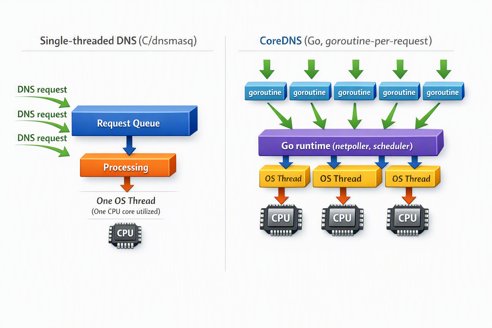
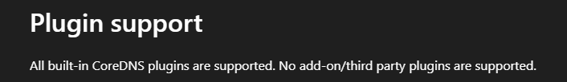

# CoreDNS

## Overview

1. CoreDNS가 Kubernetes에서 어떤 역할을 하는가
   - Kubernetes DNS
   - Service와 Pod에 대한 DNS Record를 만들고, kubelet이 각 Pod의 /etc/resolv.conf를 구성
   - Record 생성 경로에 대해서 설명
2. CoreDNS 구조와 특성
   - Go로 작성된 DNS 서버. Go의 특징.
   - 거의 모든 기능을 Plugin으로 구성 → Plugin-chain 기반 구조
   - 동시성 모델과 DNS query 처리 방식
3. Corefile과 주요 plugin들
   - CoreDNS Corefile 구조
   - AKS의 `coredns`, `coredns-custom` ConfigMap 구조
   - 주요 plugin 설명
   - plugin 실행 순서
4. K8s 내부 DNS query flow
   - Pod → /etc/resolv.conf → kube-dns Service IP → CoreDNS Pod → plugin chain → kubernetes plugin or upstream forward 순서로 설명
   - Application 자체의 DNS? Container나 VM 수준의 DNS가 존재하는지, 개입하는지?
   - Linux OS 자체의 DNS 서버가 개입하나?
   - Service 이름 조회, 외부 도메인 조회, ndots가 query flow에 끼어드는 위치
5. CoreDNS의 Metric, Log, Trace
   - 각각을 어떻게 노출하고 있는지?
   - 어떤 metric이 노출되는지?
   - trace
     - 해보니까 Application Trace와 correlation이 안됨
     - eBPF trace, bpftrace로는 가능한가?
6. 트러블슈팅/시나리오 기반 설정
   - 특정 도메인을 별도 DNS 서버로 conditional forward하는 방법
   - DNS 응답 지연 또는 timeout 발생 시 CoreDNS replica scaling과 autoscaler 구조
   - ndots로 인해 DNS query가 불필요하게 늘어나는 경우
   - TTL 만료 시 upstream resolution으로 생기는 latency를 cache/prefetch로 줄이는 방법

## 1. Kubernetes에서 CoreDNS의 역할

Kubernetes 클러스터 내에서 DNS resolver 역할을 수행.

- kube-dns라는 service 이름을 가지고 있고, 일반적으로 별도의 노드에 2개(scaling 가능)의 replicas를 가짐.
- CoreDNS 이전에는 KubeDNS를 사용했었는데, 이것과의 호환성을 위해 kube-dns라는 이름을 사용

모든 Pod가 시작할 때, kubelet이 Pod의 /etc/resolv.conf 파일에 다음과 같은 정보를 넣음.

```yaml
search <namespace>.svc.cluster.local svc.cluster.local cluster.local
nameserver <CoreDNS Service ClusterIP>
options ndots:5
```

그래서 Pod가 이 정보를 통해 CoreDNS SVC ClusterIP로 DNS Query를 날리는 것.

**CoreDNS의 3가지 역할**

1. (방금 얘기했던) Kubernetes Service name(또는 FQDN)을 ClusterIP로 resolving하는 것
   - CoreDNS는 API server를 watching함으로써 Service, EndpointSlice, Namespace, Pod에 대해서 지속적으로 동기화함.
   - 예를 들어서, 새로운 Service가 생성되면 CoreDNS가 그걸 수초 내에 확인해서 해당하는 DNS record를 생성한다.
2. Cluster Resource를 위해 Reverse DNS를 서빙하는 것.
   - Pod IP나 Service ClusterIP를 넣었을 때, CoreDNS가 그 IP에 대응되는 Kubernetes DNS name을 PTR record로 돌려주는 것
   - 언제 쓰는데?
     - 네트워크 디버깅
       - `connection from 10.96.20.30` 이런 로그가 찍혔다고 했을 때
       - `dig -x 10.96.20.30`을 실행해서 `api.default.svc.cluster.local`를 알아낼 수 있음
3. Non-cluster DNS Query를 Upstream Resolvers로 Forwarding하는 것.
   - 뒤에 언급할 Corefile에는 kubernetes zone을 벗어나고 cache hit가 안되는 fqdn에 대해서는 upstream DNS로 forwarding을 수행함.

## 2. CoreDNS 구조와 특성

### (1) Plugin-chain 기반 구조

CoreDNS는 여러 Plugin이 chain처럼 엮어서 동작하는 구조를 가지고 있음.

→ `CoreDNS is powered by plugins`

- 예를 들어, metrics이나 cache plugins이 존재하고, kubernetes와 통신하는 Kubernetes plugin도 존재
- default로 30개의 plugins이 포함되는데, functionality를 확장하기 위한 external plugin들도 다수 존재
  - file이나 db를 백엔드로 사용한다거나
- 플러그인을 작성하는 것 자체도 어렵지는 않다고 하는데, Go언어를 알아야 하고 DNS의 특성을 잘 알아야함

### (2) Go의 Concurrency(동시성) 모델



- (요약) CoreDNS는 Go 언어로 작성되었고, Go 언어는 동시성 모델(goroutine)이 내장되어 있어 I/O가 많은 DNS 트래픽 처리에 좋은 성능을 보여준다.
- goroutine: Go 런타임이 관리하는 가벼운 실행 단위
  - OS thread와 비슷해 보이지만 훨씬 가볍다
  - Go 프로그램은 수천, 수만 개의 goroutine을 만들 수 있고, Go 런타임이 이 goroutine들을 실제 OS thread 위에 효율적으로 스케줄링한다.
  - CoreDNS가 DNS 요청을 받을 때마다 무거운 OS thread를 새로 만드는 구조가 아님
- 하나의 DNS 요청은 대략 이런 흐름을 탄다.

  ```markdown
  Pod
  ↓ DNS Query
  CoreDNS
  ↓
  plugin chain 실행
  ↓
  kubernetes plugin / cache plugin / forward plugin 등
  ↓
  DNS Response 반환
  ```

  - 각 요청 하나하나는 CPU보다는 I/O 성격이 강함
    - 메모리 조회, 캐시 조회, upstream DNS 질의 등
  - Go의 goroutine은 이런 workload에 적합
  - 각 goroutine은 독립적으로 plugin chain을 따라가며 DNS response를 만들 수 있고, 하나의 요청이 I/O 작업으로 대기 중인 동안 다른 요청들이 계속 처리될 수 있다.

- DNS 요청은 I/O 중심인 경우가 많기 때문에 I/O block 상황에서도 goroutine을 통해 다른 요청을 계속해서 처리할 수 있어 K8s 클러스터 내부의 대량 DNS 트래픽 처리에 유리하다.
- 동시에 다중 요청을 처리할 수 있으며, 한 플러그인 인스턴스가 여러 고루틴에 의해 동시에 호출될 수 있으므로, 플러그인 코드가 thread-safe해야 한다.
  - 그래서 각 plugin들은 동시에 호출될 수 있다는 가정 하에 plugin 코드들이 작성됨
- 코어 자체는 Event Loop 없이 고루틴으로 요청을 처리하므로, 요청이 많을 경우 CPU 코어 수에 따라 병렬로 처리된다.

## 3. Corefile과 주요 plugin들

### (1) 관여하는 파일들

- CoreDNS는 일반적으로 kube-system 네임스페이스의 `coredns` ConfigMap에 Corefile 구성을 저장
  - 다만 이 `coredns` ConfigMap 직접 수정하게 되면, AKS Control Plane에서 재조정(Reconcile) 작업이 실행됨.
  - 대신 `coredns-custom` ConfigMap을 통해 default Corefile에 주입되는 구조로 이해하면 된다.
- CoreDNS deployment의 spec을 보면, Pod filesystem의 `/etc/coredns`와 `/etc/coredns/custom`에 각각 ConfigMap `coredns`와 `coredns-custom`이 volumeMount된 것을 확인할 수 있음.
- (여기서 demo로 가볍게 보여주기)

### (2) 기본 구조와 예시

어떤 DNS 요청을 이 서버 블록이 처리할지를 정의하는 구조

```yaml
[SCHEME://]ZONE [:PORT] {
    PLUGIN [ARGUMENTS]
}
```

- `ZONE`
  - 이 서버 블록이 담당할 DNS 이름 영역

    ```yaml
    # 예시 1
    example.org {
        whoami
    }

    # 예시 2
    . {
    		...
    }
    ```

  - 예시 1) CoreDNS가 `example.org` Zone에 대한 DNS 요청을 처리한다는 뜻
  - 예시 2) Zone이 “.”인 경우, DNS root zone을 의미한다.
    - DNS 이름 체계에서 모든 도메인은 사실 마지막에 “.”이 붙어 있음
      - `microsoft.com.`
    - 사실상 모든 DNS 질의를 처리하는 서버 블록

- `SCHEME`
  - 어떤 프로토콜로 DNS 요청을 받을지를 의미
  - 기본값(생략시)은 UDP/TCP 기반 DNS

    ```yaml
    # 예시 1
    dns://.:53{
    		...
    }

    # 예시 2
    .:53 {
        ...
    }

    # 예시 3: DNS-over-HTTP
    https://.:443 {
        ...
    }
    ```

- `PORT`
  - CoreDNS가 listen할 포트 넘버
  - 기본값(생략시)은 53인데, 보통 명시함

```yaml
# AKS의 Default CoreDNS Corefile
.:53 { # 53번 포트로 수신하는 모든 DNS 질의를 처리
        errors
        ready
        health {
          lameduck 5s
        }
        # kubernetes 플러그인이 authoritative하게 처리할 DNS zone을 정의
        kubernetes cluster.local in-addr.arpa ip6.arpa {
          pods insecure
          fallthrough in-addr.arpa ip6.arpa
          ttl 30
        }
        prometheus :9153
        forward . /etc/resolv.conf  # 노드의 기본 /etc/resolv.conf 내 상위 DNS 주소를 읽어와 사용한다는 의미
        cache 30
        loop
        reload
        loadbalance
        import custom/*.override
        template ANY ANY internal.cloudapp.net {
          match "^(?:[^.]+\.){4,}internal\.cloudapp\.net\.$"
          rcode NXDOMAIN
          fallthrough
        }
        template ANY ANY reddog.microsoft.com {
          rcode NXDOMAIN
        }
    }
    import custom/*.server
```

- AKS에서는 CoreDNS Corefile을 직접 수정하는 대신, 전용 ConfigMap으로 기본 설정을 Override하는 방식을 사용
  - AKS가 CoreDNS의 업그레이드 및 가용성을 관리
    - 기본적으로 다른 노드에 스케줄되어 이중화
    - AKS 클러스터 업그레이드 시 CoreDNS도 함께 최신 버전으로 관리
  - Built-in 플러그인 외에 External 플러그인 사용은 제한
    

### (3) 주요 플러그인

1. kubernetes
   - Kubernetes 서비스 검색 지원
   - cluster.local 및 클러스터 도메인에 대한 Authoritative DNS 데이터 제공
   - Kubernetes API를 watch하여 Service, EndpointSlice, Pod, Namespace 리소스를 캐시에 유지하고 DNS 레코드로 응답
2. forward
   - 클러스터 외부 도메인의 이름을 상위 DNS 서버에 recursive query하여 non-authoritative 응답을 반환하는 Proxy/Forwarding 플러그인.
   - UDP, TCP, DNS-over-TLS 지원
3. cache
   - 응답 캐싱을 수행하는 플러그인
   - 기본 설정에서는 약 9984개 엔트리까지 메모리 캐시 유지 및 최대 30초 동안 결과 저장
4. loop
   - DNS Forwarding Loop 감지 및 서버 정지를 수행하는 플러그인
     - CoreDNS → systemd-resolved → back to CoreDNS
   - CoreDNS가 자신을 참조하는 무한 루프가 감지될 경우 프로세스를 종료하여 루프 현상 차단
5. reload
   - Corefile 변경사항 감지 시 자동 재적용(Hot-reload)하는 플러그인
   - 약 30초마다 ConfigMap(Corefile)의 SHA512 해시를 점검하여 변경이 있으면 코어 서버를 재시작하지 않고 새로운 플러그인 체인을 로드하여 설정을 적용
6. health, ready
   - health: 상태 확인(liveness)을 위해 HTTP 8080 포트에서 `/health` 엔드포인트를 제공하여 CoreDNS 프로세스의 전체적인 정상 동작 상태 확인
   - ready: 준비 상태 체크용 플러그인. HTTP 8181 포트에서 `/ready` 엔드포인트 제공하여 플러그인이 모두 준비된 상태가 되면 HTTP 200 OK 응답. 하나라도 준비가 안되면 503 반환하면서 준비가 되지 않은 플러그인 노출
7. prometheus
   - CoreDNS 및 플러그인의 metric을 HTTP 9153 포트 `/metrics`로 Prometheus 형식으로 노출
   - coredns_requests_total, coredns_request_duration_seconds, coredns_cache_hits_total 등의 메트릭을 제공
8. errors
   - error response 로그를 stdout로 출력
9. log
   - Query logging 플러그인
   - 쿼리명을 비롯해 응답 코드, 응답 시간 등을 stdout으로 기록
   - 설정을 통해 출력 형식이나 필터링 제어 가능
   - 쿼리 로그 활성화 시 성능 오버헤드가 발생하므로, 디버깅 목적 외에는 상시 활성화 비권장
10. hosts
    - 정적 Hosts 파일 기반 DNS 제공
    - Linux의 /etc/hosts와 동일한 형식의 고정 매핑을 CoreDNS를 통해 클러스터 차원에서 서비스할 수 있음
    - 지정된 hosts 파일을 5초마다 모니터링하여 변경 시 자동으로 업데이트된 IP-Domain 매핑을 제공

전체 플러그인 리스트

```bash
kubectl -n kube-system exec deployment/coredns -c coredns -- \
  coredns -plugins | tr ' ' '\n' | sort
# 출력
acl
any
auto
autopath
azure
bind
bufsize
cache
cancel
chaos
clouddns
debug
dns64
dnssec
dnstap
erratic
errors
etcd
file
forward
geoip
grpc
header
health
hosts
k8s_external
kubernetes
loadbalance
local
log
loop
metadata
minimal
multisocket
nomad
nsid
on
pprof
prometheus
quic
ready
reload
rewrite
root
route53
secondary
sign
template
timeouts
tls
trace
transfer
tsig
view
whoami
```

### (4) 실행 순서

- `Corefile` 상에서 플러그인 나열 순서는 실행 순서에 영향을 주지 않는다.
- CoreDNS `plugin.cfg` 파일에 순서가 정의되어 컴파일 시 고정된다.
  - [plugin.cfg](https://github.com/coredns/coredns/blob/master/plugin.cfg)
- 각 plugin은 response를 생성해서 chain을 멈추거나 다음 plugin을 호출할 수 있음
  - 근데 response 생성 없이 끝까지 가면 `SERVFAIL`이 반환됨

## 4. K8s 내부 DNS query flow

Pod에서 DNS query가 발생하면 일반적으로 다음 흐름을 탄다.

```text
Application
  -> language runtime / libc resolver
  -> Pod /etc/resolv.conf
  -> kube-dns Service ClusterIP
  -> CoreDNS Pod
  -> CoreDNS plugin chain
  -> kubernetes plugin 또는 forward plugin
  -> DNS response
```

### (1) Application에서 resolver까지

애플리케이션은 보통 직접 DNS packet을 만들지 않고, 언어 runtime 또는 libc resolver를 통해 이름을 조회한다.

예시:

- Go: `net.Resolver`
- Java: JVM DNS resolver/cache
- Python: `socket.getaddrinfo()`
- Node.js: libuv/c-ares 또는 OS resolver 경로

대부분의 경우 resolver는 Pod 안의 `/etc/resolv.conf`를 읽어 nameserver, search domain, `ndots` 옵션을 확인한다.

```text
search <namespace>.svc.cluster.local svc.cluster.local cluster.local
nameserver <CoreDNS Service ClusterIP>
options ndots:5
```

중요한 점:

- Container 안에 별도 DNS 서버가 떠 있는 것은 아니다.
- Linux OS가 recursive DNS 서버 역할을 하는 것도 아니다.
- 보통은 process 내부 resolver가 `/etc/resolv.conf`를 보고 CoreDNS로 query를 보낸다.
- 다만 일부 runtime은 자체 DNS cache나 resolver 구현을 갖고 있어 동작이 조금 다를 수 있다.

### (2) Pod resolv.conf는 누가 만드는가

Pod가 생성될 때 kubelet이 Pod의 DNS policy와 cluster DNS 설정을 바탕으로 `/etc/resolv.conf`를 구성한다.

기본값은 보통 `dnsPolicy: ClusterFirst`이다.

```yaml
spec:
  dnsPolicy: ClusterFirst
```

`ClusterFirst`에서는 Pod의 nameserver가 node의 일반 DNS가 아니라 kube-dns Service IP로 설정된다. 그래서 Pod의 DNS query는 먼저 CoreDNS로 간다.

예외적으로 다음 설정은 흐름을 바꿀 수 있다.

- `dnsPolicy: Default`: node의 DNS 설정을 사용
- `dnsPolicy: None`: 사용자가 `dnsConfig`로 직접 nameserver/search/options 지정
- `hostNetwork: true`: 기본 DNS policy가 달라질 수 있으므로 별도 확인 필요
- `dnsConfig.options.ndots`: Pod 단위로 `ndots` 값 override 가능

### (3) kube-dns Service에서 CoreDNS Pod까지

Pod의 `/etc/resolv.conf`에 보이는 nameserver는 보통 `kube-system/kube-dns` Service의 ClusterIP이다.

```bash
kubectl -n kube-system get service kube-dns
kubectl -n kube-system get endpointslice -l kubernetes.io/service-name=kube-dns
kubectl -n kube-system get pods -l k8s-app=kube-dns -o wide
```

흐름:

```text
Pod
  -> kube-dns Service ClusterIP:53
  -> kube-proxy / dataplane rules
  -> CoreDNS Pod IP:53
```

즉 애플리케이션은 CoreDNS Pod IP를 직접 알 필요가 없다. Kubernetes Service가 CoreDNS Pod들로 트래픽을 분산한다.

### (4) CoreDNS 내부 plugin chain

CoreDNS는 query를 받으면 컴파일 시 정해진 plugin chain 순서대로 처리한다. Corefile에 적힌 순서가 그대로 실행 순서가 되는 것은 아니다.

대표 흐름:

```text
CoreDNS
  -> cache hit 확인
  -> kubernetes zone 여부 확인
  -> cluster.local이면 kubernetes plugin에서 응답
  -> cluster domain 밖이면 forward plugin으로 upstream 전달
  -> response 반환
```

Kubernetes Service 조회 예시:

```text
backend.default.svc.cluster.local.
  -> kubernetes plugin
  -> Service / EndpointSlice cache 조회
  -> ClusterIP 또는 endpoint 관련 DNS record 응답
```

외부 도메인 조회 예시:

```text
www.microsoft.com.
  -> kubernetes plugin zone 밖
  -> cache miss면 forward plugin
  -> upstream resolver
  -> response cache 저장 후 반환
```

### (5) Service 이름 조회 케이스

같은 namespace의 Service를 짧은 이름으로 조회하는 경우:

```text
curl http://backend
```

Pod resolver는 `search` suffix를 붙여 다음 이름을 만들 수 있다.

```text
backend.<namespace>.svc.cluster.local.
```

이 query는 CoreDNS의 `kubernetes` plugin에서 처리되고, 해당 Service의 ClusterIP가 응답된다.

다른 namespace의 Service는 보통 다음처럼 조회한다.

```text
backend.payments
backend.payments.svc.cluster.local
```

### (6) 외부 도메인 조회 케이스

외부 도메인은 최종적으로 CoreDNS의 `forward` plugin을 통해 upstream resolver로 전달될 수 있다.

```text
api.github.com.
  -> CoreDNS
  -> cache miss
  -> forward . /etc/resolv.conf
  -> node 또는 cloud DNS 경로의 upstream resolver
```

여기서 CoreDNS의 `/etc/resolv.conf`는 CoreDNS Pod가 실행되는 node의 DNS 설정을 기반으로 한다. 반면 application Pod의 `/etc/resolv.conf`는 kubelet이 cluster DNS를 바라보도록 만든다. 두 파일의 역할이 다르다.

### (7) ndots가 query flow에 끼어드는 위치

`ndots`는 CoreDNS 내부 동작이 아니라 Pod resolver 단계에서 영향을 준다.

예를 들어 `ndots:5` 상태에서 `api.github.com`을 조회하면 resolver는 search suffix 후보를 먼저 만들 수 있다.

```text
api.github.com.<namespace>.svc.cluster.local.
api.github.com.svc.cluster.local.
api.github.com.cluster.local.
api.github.com.
```

즉 query flow상 query 수가 늘어나는 위치는 다음 부분이다.

```text
Application
  -> resolver가 search suffix 후보 여러 개 생성
  -> CoreDNS에 여러 query 전송
```

CoreDNS가 recursive하게 이름을 바꿔가며 다시 질의하는 것이 아니라, Pod resolver가 여러 후보 query를 만든다.

## 5. CoreDNS의 Metric, Log, Trace

### Metric

- prometheus 플러그인이 존재하여, prometheus format의 metrics을 9153 포트로 노출
  ```yaml
  .:53 {
  ...
  prometheus :9153
  ...
  }
  ```
- 다만, 기본적으로는 Azure Managed Prometheus에서 이걸 scraping을 안한다.
- 직접 enable 설정을 적용해줘야함. 적절한 ConfigMap 배포가 필요하다.
  - [https://learn.microsoft.com/ko-kr/azure/azure-monitor/containers/prometheus-metrics-scrape-configuration](https://learn.microsoft.com/ko-kr/azure/azure-monitor/containers/prometheus-metrics-scrape-configuration)
  - [https://github.com/Azure/prometheus-collector/blob/main/otelcollector/configmaps/ama-metrics-settings-configmap.yaml](https://github.com/Azure/prometheus-collector/blob/main/otelcollector/configmaps/ama-metrics-settings-configmap.yaml)
  - 아래 스크린샷을 보면, Deployment `ama-metrics`에는 `ama-metrics-settings-configmap`라는 이름의 ConfigMap이 Volume mount 설정되어 있음
    
  ```yaml
  apiVersion: v1
  kind: ConfigMap
  metadata:
    name: ama-metrics-settings-configmap
    namespace: kube-system
  data:
    cluster-metrics: |-
      default-targets-scrape-enabled: |-
        coredns = true
      minimal-ingestion-profile: |-
        enabled = true
    config-version: ver1
    controlplane-metrics: |-
      minimal-ingestion-profile: |-
        enabled = true
    prometheus-collector-settings: |-
      cluster_alias = ""
      debug-mode = false
      https_config = true
      secrets_access_namespaces = ""
    schema-version: v2
  ```
- 각 플러그인 별로 생성하는 metrics이 여러 개 있고, 이것들은 prometheus를 통해 노출되는 방식
  - 다만, Azure Monitor managed service for Prometheus의 기본 scrape target에서 `coredns`가 disabled 상태이다.
  - Azure Monitor managed Prometheus는 기본적으로 minimal ingestion profile이 켜져 있고, 이 경우 default target에서 수집하는 metric을 문서에 정의된 목록으로 제한한다.
    - [https://learn.microsoft.com/ko-kr/azure/azure-monitor/containers/prometheus-metrics-scrape-default#targets-scraped-by-default](https://learn.microsoft.com/ko-kr/azure/azure-monitor/containers/prometheus-metrics-scrape-default#targets-scraped-by-default)
- Metrics 종류 (minimal ingestion profile에 의해서 모든 metrics을 수집하지는 않음)
  - `coredns_build_info`
  - `coredns_panics_total`
  - `coredns_dns_responses_total`
  - `coredns_forward_responses_total`
  - `coredns_dns_request_duration_seconds` `coredns_dns_request_duration_seconds_bucket` `coredns_dns_request_duration_seconds_sum` `coredns_dns_request_duration_seconds_count`
  - `coredns_forward_request_duration_seconds` `coredns_forward_request_duration_seconds_bucket` `coredns_forward_request_duration_seconds_sum` `coredns_forward_request_duration_seconds_count`
  - `coredns_dns_requests_total`
  - `coredns_forward_requests_total`
  - `coredns_cache_hits_total`
  - `coredns_cache_misses_total`
  - `coredns_cache_entries`
  - `coredns_plugin_enabled`
  - `coredns_dns_request_size_bytes` `coredns_dns_request_size_bytes_bucket` `coredns_dns_request_size_bytes_sum` `coredns_dns_request_size_bytes_count`
  - `coredns_dns_response_size_bytes` `coredns_dns_response_size_bytes_bucket` `coredns_dns_response_size_bytes_sum` `coredns_dns_response_size_bytes_count`
  - `process_resident_memory_bytes`
  - `process_cpu_seconds_total`
  - `go_goroutines`
  - `kubernetes_build_info`
- Azure Portal Built-in Grafana에서 CoreDNS를 위한 Community Dashboard를 Import 해줘야 해당 metrics을 시각화 할 수 있음.

### Log

- log, error 플러그인이 존재하고, 각 plugin에서 발생시키는 로그도 존재함
- DNS 트래픽 및 오류 상태를 로깅
- 기본적으로는 log 플러그인이 비활성화되어 있음
  - ConfigMap `coredns`를 확인해보면 log 플러그인이 빠져있음
  - ConfigMap `coredns-custom`에 아래 내용을 추가하고 restart하면 정상적으로 Log 출력 시작
    ```yaml
    data:
    	log.override: |
    		log
    ```
- 다만 여기까지 해도 Container Insight가 활성화 되어있더라도 LAW에 로그가 수집되지는 않는다.
  - 대신 Live Logs는 볼 수 있음
- Container Insight를 켜도 default 세팅으로는 CoreDNS의 log가 LAW쪽으로 수집되지 않음.
  - Azure Monitor Container Insights가 기본적으로 kube-system 같은 system namespace의 container logs를 제외하기 때문
  - Log Analytics 비용 절감을 위함
  - 활성화 방법
    - [https://learn.microsoft.com/ko-kr/azure/azure-monitor/containers/kubernetes-data-collection-configmap](https://learn.microsoft.com/ko-kr/azure/azure-monitor/containers/kubernetes-data-collection-configmap)
    - 별도의 ConfigMap `container-azm-ms-agentconfig`를 배포해야함.
    - 아래 스크린샷을 보면, Deployment `ama-logs-rs`에는 `container-azm-ms-agentconfig`라는 이름의 ConfigMap이 이미 Volume mount 설정되어 있음
      
    - 아래와 같이 ConfigMap 배포

      ```yaml
      apiVersion: v1
      kind: ConfigMap
      metadata:
        name: container-azm-ms-agentconfig
        namespace: kube-system
      data:
        schema-version: "v1"
        config-version: "1.0.0"
        log-data-collection-settings: |-
          [log_collection_settings]
            [log_collection_settings.stdout]
              enabled = true
              collect_system_pod_logs = ["kube-system:coredns"]

            [log_collection_settings.stderr]
              enabled = true
              collect_system_pod_logs = ["kube-system:coredns"]
      ```

    - 배포 후 몇 분이 지나면 ama-log pod가 rollout restart됨.
      - restart가 안될 경우 직접 restart 수행
        

### Trace

- AKS CoreDNS 바이너리에 trace 플러그인이 이미 존재하지만 기본 설정에는 활성화되어 있지 않다.
- trace 플러그인
  - ConfigMap `coredns-custom`을 통해서 직접 trace 플러그인을 설정해주어야 한다.
    - [https://coredns.io/plugins/trace/](https://coredns.io/plugins/trace/)
  - trace telemetry에 대한 Endpoint-type은 `zipkin`과 `datadog`만 지원한다
  - 또한 OpenTelemetry가 아닌 OpenTracing 기반 tracing이다.
    - OpenTelemetry의 propagator는 W3C TraceContext 헤더(traceparent)를 사용한다
    - OpenTracing은 propagator에 강제 사항이 없으며, parent context를 extract하려는 쪽에서 traceparent를 추출할 수 있어야 OpenTelemetry와 OpenTracing의 correlation이 가능하다.
- trace 시도
  1. ZipKin 배포
  2. ZipKin endpoint와 함께 trace 플러그인 활성화 (ConfigMap `coredns-custom` 수정)
  3. 테스트 DNS query 생성

     ```bash
     kubectl apply -f spec/03-dns-tools.yaml
     kubectl -n trace-lab rollout status deployment/dns-tools --timeout=5m

     kubectl -n trace-lab exec deployment/dns-tools -- sh -c '
     for i in $(seq 1 30); do
       dig +short kubernetes.default.svc.cluster.local
       dig +short www.microsoft.com
       dig +short api.github.com
     done
     '
     ```

  4. 결과

     ```bash
     kubectl -n "$LAB_NS" port-forward service/zipkin 9411:9411
     ```

     

- Q. Application Tracing과 CoreDNS Tracing을 하나의 trace로 correlation이 가능한가?
  - CoreDNS의 trace 플러그인에 HTTP header에서 parent context를 extract하려는 코드는 있지만, 그 구현체가 Zipkin OpenTracing wrapper라서 기본 propagation은 W3C의 traceparent가 아님.
  - 결론적으로는 trace의 correlation은 불가
  - 또한 DNS 프로토콜의 경우 OpenTelemetry의 HTTP header를 통한 trace의 propagation와 같은 동작에 대한 표준이 없기 때문에 프로토콜 자체도 한계가 있다.
  - OpenTelemetry를 도입하려는 시도
    - [https://github.com/coredns/coredns/pull/5777](https://github.com/coredns/coredns/pull/5777) (2022말~2023초)
    - OpenTelemtry 전용 플러그인 PR이 올라왔으나, maintainer의 반대로 무산
    - 이 논의의 배경은 기존 CoreDNS의 trace plugin이 OpenTracing 기반이고, OpenTracing이 deprecated 되었기 때문에 OpenTelemetry 기반 tracing plugin으로 옮기자는 것
  - OpenTelemetry eBPF Instrumentation
    - Application process / socket / DNS packet을 eBPF로 관측
    - 해당 DNS lookup을 현재 application span과 runtime으로 correlation
      - socket/PID/trace key 기반으로 기반 client request trace를 찾을 수 있다는 조건 하에
    - application trace 안에 dns.resolve span이 추가됨
    - [https://github.com/open-telemetry/opentelemetry-ebpf-instrumentation/pull/793](https://github.com/open-telemetry/opentelemetry-ebpf-instrumentation/pull/793)
      - 이 PR에서 추가됨
    - (참고) packet이 propagation될 때 trace context를 packet에 주입하는 방식은 아님.
      - 때문에 W3C Trace Context 표준(traceparent를 carrier를 통해서 전파하는)도 아니고, OBI 자체가 아직 발전 단계.

## 6. 트러블슈팅/시나리오 기반 설정

### 1. 특정 도메인(e.g. 사내 도메인)을 별도 DNS 서버로 포워딩

사내 DNS zone을 AKS 기본 upstream이 아니라 별도 DNS 서버로 보내고 싶은 경우가 있다.

예시:

- `corp.example.com`은 사내 DNS 서버에서만 resolve된다.
- AKS VNet에서 사내 DNS 서버 `10.10.0.10`, `10.10.0.11`로 UDP/TCP 53 통신이 가능하다.
- Pod에서는 `api.corp.example.com` 같은 이름을 그대로 조회하고 싶다.

이 경우 AKS에서는 기본 `coredns` ConfigMap을 직접 수정하지 않고, `kube-system/coredns-custom` ConfigMap에 별도 server block을 추가한다. key 이름은 `.server`로 끝나야 AKS 기본 Corefile의 `import custom/*.server`에 의해 로드된다.

다른 방법으로 Azure DNS 레이어에서 처리할 수도 있다.

- 사내 도메인의 record를 Azure에서 관리할 수 있으면 Azure Private DNS Zone을 만들고 AKS VNet에 link한다.
- 사내 authoritative DNS 서버를 그대로 사용해야 하면 Azure DNS Private Resolver의 outbound endpoint와 DNS forwarding ruleset을 사용한다.
- 예를 들어 forwarding rule `corp.example.com` -> `10.10.0.10`, `10.10.0.11`을 만들고 ruleset을 AKS VNet에 link하면, CoreDNS custom 설정 없이 VNet DNS 경로에서 해당 zone을 사내 DNS로 보낼 수 있다.

여러 클러스터나 여러 VNet에서 같은 사내 DNS 정책을 공유해야 하면 Azure DNS Private Resolver 방식이 더 중앙집중적이고, 특정 AKS 클러스터에만 예외를 주고 싶으면 CoreDNS custom 방식이 단순하다.

ConfigMap 예시:

```yaml
apiVersion: v1
kind: ConfigMap
metadata:
  name: coredns-custom
  namespace: kube-system
data:
  corp-example-com.server: |
    corp.example.com:53 {
      errors
      forward . 10.10.0.10 10.10.0.11
    }
```

- `corp.example.com:53`: 이 zone에 대한 DNS query만 별도 server block에서 처리
- `corp-example-com.server`: AKS 기본 Corefile의 `import custom/*.server`에 의해 로드되는 custom server block key
- `forward . 10.10.0.10 10.10.0.11`: 해당 zone query를 사내 DNS 서버로 전달

주의사항:

- `forward` 대상은 DNS 이름보다 IP를 사용하는 것이 안전하다. DNS 이름을 쓰면 CoreDNS가 upstream 주소를 resolve하기 위해 다시 DNS가 필요한 bootstrap 문제가 생길 수 있다.
- AKS subnet에서 사내 DNS 서버까지 UDP/TCP 53이 열려 있어야 한다.
- 여러 사내 zone이 있으면 zone별로 `.server` key를 추가한다.
- 전체 DNS를 사내 DNS로 보내는 것과 특정 zone만 보내는 것은 다르다. 보통은 특정 사내 zone만 conditional forward하는 편이 안전하다.

롤백:

```bash
kubectl -n kube-system patch configmap coredns-custom \
  --type json \
  -p='[{"op":"remove","path":"/data/corp-example-com.server"}]'

kubectl -n kube-system rollout restart deployment/coredns
kubectl -n kube-system rollout status deployment/coredns --timeout=5m
```

### 2. DNS 응답 지연 또는 Timeout 현상

DNS 응답 지연은 크게 두 가지 경로에서 발생한다.

- CoreDNS 자체 처리량 부족: 높은 QPS, CPU throttling, cache miss 증가, 과도한 NXDOMAIN 등
- Upstream 지연: 외부 도메인 forward, upstream resolver 지연, 네트워크 이슈 등

#### 1차 대응: CoreDNS replica scaling

CoreDNS는 stateless DNS 서버이므로, 일반적으로는 **CPU limit을 먼저 키우는 것보다 replica 수를 늘려 수평 확장하는 방식이 더 흔한 대응**이다.

이유:

- DNS query는 여러 CoreDNS Pod로 분산될 수 있다.
- replica를 늘리면 Pod당 QPS와 CPU 사용량이 낮아진다.
- 특정 CoreDNS Pod 장애나 노드 장애에 대한 가용성도 좋아진다.
- AKS에는 CoreDNS replica를 cluster size에 맞춰 조정하는 `coredns-autoscaler`가 기본으로 존재한다.

다만 replica scaling이 모든 문제를 해결하지는 않는다.

- upstream resolver 자체가 느리면 CoreDNS replica를 늘려도 외부 resolution latency는 남는다.
- cache miss가 많거나 ndots로 query 수가 증폭되는 경우에는 원인 query를 줄이는 것이 더 중요할 수 있다.
- CoreDNS Pod별 CPU가 limit에 자주 닿거나 throttling이 보이면 CPU request/limit 조정도 검토한다.

#### CPU 증설이 필요한 경우

CPU 자원 증설은 다음 상황에서 검토한다.

- CoreDNS Pod의 CPU 사용률이 지속적으로 높다.
- CPU throttling이 관찰된다.
- replica를 늘렸는데도 Pod당 처리 시간이 줄지 않는다.
- log/trace/debug plugin 등으로 CoreDNS 자체 처리 비용이 증가했다.

#### AKS CoreDNS autoscaling 구조

AKS에는 일반적으로 `kube-system` 네임스페이스에 다음 리소스가 있다.

```bash
kubectl -n kube-system get deployment coredns coredns-autoscaler
kubectl -n kube-system get configmap coredns-autoscaler -o yaml
kubectl -n kube-system get deployment coredns-autoscaler -o yaml
```

구조:

```text
coredns-autoscaler Pod
  -> Kubernetes API에서 schedulable node/core 수 확인
  -> coredns-autoscaler ConfigMap의 scaling rule 확인
  -> deployment/coredns replica 수 조정
  -> Deployment controller가 CoreDNS Pod 수 유지
```

여기서 `coredns-autoscaler`는 Kubernetes HPA가 아니라 `cluster-proportional-autoscaler`이다. CPU 사용률이나 DNS latency를 직접 보고 scale out하는 closed-loop autoscaling이 아니다. 클러스터의 node/core 수에 비례해서 CoreDNS replica 수를 계산한다.

`coredns-autoscaler` Pod는 Kubernetes API를 주기적으로 polling한다. 기본 poll period는 10초이며, `--target=deployment/coredns`, `--configmap=coredns-autoscaler` 같은 실행 인자를 통해 어떤 Deployment를 조정하고 어떤 ConfigMap을 scaling rule로 사용할지 결정한다.

예시 ConfigMap 형태:

```yaml
apiVersion: v1
kind: ConfigMap
metadata:
  name: coredns-autoscaler
  namespace: kube-system
data:
  ladder: '{"coresToReplicas":[[1,2],[512,3],[1024,4],[2048,5]],"nodesToReplicas":[[1,2],[8,3],[16,4],[32,5]]}'
```

`ladder` mode는 node 수와 core 수를 각각 기준표에 대입한 뒤, 더 큰 replica 값을 target으로 사용한다.

예시:

- node 1개 이상이면 최소 2 replicas
- node 8개 이상이면 3 replicas
- node 16개 이상이면 4 replicas
- node 32개 이상이면 5 replicas
- core 기준도 별도로 계산하고, node 기준과 core 기준 중 더 큰 값을 선택

중요한 점:

- scale 기준은 DNS QPS가 아니라 cluster size이다.
- 트래픽 폭증만으로 자동 scale out되지 않을 수 있다.
- 큰 클러스터에서 기본 replica 수를 보장하는 데 유용하지만, 특정 워크로드의 DNS 폭증에는 별도 튜닝이 필요할 수 있다.

#### 관찰 지표

- `coredns_dns_requests_total`: 전체 DNS query 수
- `coredns_dns_request_duration_seconds`: CoreDNS request latency
- `coredns_dns_responses_total`: 응답 코드별 수. `NXDOMAIN`, `SERVFAIL` 증가 확인
- `coredns_forward_requests_total`: upstream으로 전달된 query 수
- `coredns_forward_request_duration_seconds`: upstream forward latency
- `coredns_cache_hits_total`, `coredns_cache_requests_total`: cache 효율
- CoreDNS Pod CPU usage / throttling / restart count

#### 보조 대안

NodeLocal DNSCache나 LocalDNS는 노드 로컬 캐시를 두어 Pod -> CoreDNS 중앙 경로의 부하와 latency를 줄이는 방식이다. 다만 이 섹션의 1차 대응은 CoreDNS replica scaling과 CPU 병목 해소로 보고, 노드 로컬 캐시는 DNS QPS가 매우 높거나 node-local cache hit 이점이 큰 경우에 별도 검토한다.

### 3. ndots로 인해 DNS Query가 불필요하게 늘어나는 경우

Kubernetes Pod의 `/etc/resolv.conf`에는 일반적으로 다음과 같은 설정이 들어간다.

```text
search <namespace>.svc.cluster.local svc.cluster.local cluster.local
nameserver <CoreDNS Service ClusterIP>
options ndots:5
```

`ndots:5`는 조회하려는 이름에 포함된 점(`.`)의 개수가 5개보다 적으면, resolver가 먼저 `search` suffix를 붙여 조회한다는 의미이다.

Kubernetes가 기본값으로 `ndots:5`를 사용하는 데에는 이유가 있다. Kubernetes Service의 SRV record는 예를 들어 `_http._tcp.my-service.default.svc`처럼 점이 여러 개 포함될 수 있다. `ndots` 값을 너무 낮게 잡으면 이런 이름을 search domain 확장 전에 absolute name처럼 먼저 처리할 수 있어, cluster 내부 service discovery 패턴과 어긋날 수 있다. 즉 `ndots:5`는 내부 DNS 편의성을 위해 선택된 기본값이지만, 외부 도메인을 많이 조회하는 workload에서는 부작용이 커질 수 있다.

#### 핵심 현상

- 애플리케이션은 하나의 이름만 조회했다고 생각한다.
- 하지만 Pod 안의 resolver는 search suffix 후보를 여러 개 만들어 CoreDNS에 순차적으로 질의한다.
- CoreDNS는 여러 개의 독립적인 DNS query를 받은 것으로 기록한다.
- 존재하지 않는 후보 이름들은 대부분 `NXDOMAIN`으로 끝나고, query volume과 latency를 늘릴 수 있다.

#### 중요한 구분: search expansion과 recursive resolution

`ndots` 이슈에서 여러 query를 만드는 주체는 CoreDNS가 아니라 Pod 안의 DNS client resolver이다.

```text
application
  -> libc / resolver
  -> /etc/resolv.conf 확인
  -> search suffix 후보 이름 생성
  -> CoreDNS에 후보 query를 하나씩 전송
  -> NXDOMAIN이면 다음 후보 query 전송
```

이것은 **client-side search expansion**에 가깝다. CoreDNS가 이름을 바꿔가며 recursive하게 다시 질의하는 것이 아니다.

Recursive resolution은 별도 개념이다. CoreDNS가 자신이 authoritative하게 처리하지 않는 외부 도메인을 `forward` plugin을 통해 upstream resolver로 넘기고, upstream resolver가 인터넷 DNS 계층을 따라가며 이름을 푸는 것이 일반적인 recursive resolution이다.

#### Lab에서 확인한 예시

외부 도메인에서도 같은 패턴이 나타난다. 예를 들어 `api.github.com`은 점이 2개뿐이므로 `ndots:5` 기준에서는 search suffix 후보가 먼저 생성될 수 있다.

```text
api.github.com.<namespace>.svc.cluster.local.
api.github.com.svc.cluster.local.
api.github.com.cluster.local.
api.github.com.<cloud-internal-domain>.
api.github.com.
```

앞의 후보들은 대부분 `NXDOMAIN`으로 끝나고, 마지막 absolute query에서 성공한다. 외부 API를 많이 호출하는 workload라면 애플리케이션 입장에서는 하나의 hostname을 조회했을 뿐인데 CoreDNS 입장에서는 여러 개의 query를 받은 것처럼 보인다. 예를 들어 외부 hostname lookup이 초당 100번 발생하고, 각 lookup마다 성공 전 4개의 search suffix query가 추가되면 초당 400개 이상의 불필요한 DNS query가 생길 수 있다.

`ndots-target.ndots-lab.svc.cluster.local`을 trailing dot 없이 조회했을 때 다음 query들이 발생했다.

```text
ndots-target.ndots-lab.svc.cluster.local.ndots-lab.svc.cluster.local.
ndots-target.ndots-lab.svc.cluster.local.svc.cluster.local.
ndots-target.ndots-lab.svc.cluster.local.cluster.local.
ndots-target.ndots-lab.svc.cluster.local.<azure-internal-domain>.
ndots-target.ndots-lab.svc.cluster.local.
```

마지막 query만 실제 Service FQDN이고, 앞의 query들은 search suffix 때문에 만들어진 허수 query이다. AKS에서는 Kubernetes 기본 suffix 외에 Azure internal search domain도 Pod search list에 포함될 수 있어 query가 더 늘어날 수 있다.

#### 완화 방법

- 외부 도메인 또는 긴 FQDN을 자주 조회하는 Pod에는 `dnsConfig.options.ndots` 값을 낮추는 방식을 검토한다.
- trailing dot을 붙이면 search suffix 확장을 건너뛸 수 있지만, 애플리케이션과 TLS hostname 처리 방식에 따라 적용 가능성을 확인해야 한다.
- CoreDNS log, `coredns_dns_requests_total`, `coredns_dns_responses_total`, NXDOMAIN 비율, forward latency를 함께 관찰한다.
- DNS query가 많은 워크로드에서는 connection reuse, keep-alive, application-level DNS cache도 같이 점검한다.

`ndots` 값을 낮출 때는 trade-off가 있다. 예를 들어 `ndots:2`로 낮추면 `api.github.com`처럼 점이 2개 이상인 외부 도메인은 처음부터 absolute name으로 먼저 조회되어 query 증폭이 줄어든다. 반면 내부 service 이름이나 SRV record lookup이 search domain 확장에 의존하고 있다면 동작 차이가 생길 수 있으므로, cluster-wide로 바꾸기보다 외부 API 호출이 많은 특정 Pod에서 `dnsConfig.options.ndots`로 제한적으로 검증하는 편이 안전하다.

```yaml
spec:
  dnsPolicy: ClusterFirst
  dnsConfig:
    options:
      - name: ndots
        value: "2"
```

#### Lab 결론

- `ndots:5` + trailing dot 없음: search suffix query가 실제로 발생한다.
- trailing dot 있음: 실제 Service FQDN만 조회된다.
- `ndots:1` + trailing dot 없음: 실제 Service FQDN만 조회된다.

### 4. TTL 만료 시 upstream resolution으로 생기는 latency를 줄이고 싶다.

CoreDNS의 `cache` 플러그인은 upstream, database, Kubernetes API 등 backend 조회 비용이 있는 응답을 일정 시간 메모리에 저장한다.

- 기본 문법: `cache [TTL] [ZONES...]`
- TTL을 지정하지 않으면 positive response는 최대 3600초, denial response는 최대 1800초까지 캐시 가능
- AKS 기본 Corefile에는 보통 `cache 30`이 포함되어 있어 최대 30초 캐시로 동작

#### 왜 TTL 만료가 latency를 만들 수 있는가

- 캐시가 hit되면 CoreDNS가 메모리에서 바로 응답한다.
- 캐시가 miss되거나 TTL이 만료되면 CoreDNS가 다시 backend 또는 upstream resolver로 질의한다.
- 외부 도메인처럼 `forward` plugin을 타는 query는 upstream resolver 왕복 시간이 latency로 붙을 수 있다.
- 인기 hostname의 TTL이 짧고 QPS가 높으면, TTL 만료 시점마다 여러 client가 동시에 upstream resolution을 유발할 수 있다.

#### prefetch

인기 query는 TTL이 끝나기 전에 CoreDNS가 미리 갱신하도록 할 수 있다.

```text
cache {
  prefetch AMOUNT [DURATION] [PERCENTAGE%]
}
```

- `AMOUNT`: popular query로 판단하기 위한 최소 query 횟수
- `DURATION`: query 사이에 이 시간보다 긴 gap이 없으면 popular로 간주. 기본값은 `1m`
- `PERCENTAGE`: TTL이 이 비율 아래로 떨어지면 prefetch 수행. 기본값은 `10%`
- 예를 들어 `prefetch 5 1m 10%`는 1분 이상 끊기지 않고 5번 이상 조회된 항목을 TTL 하위 10% 시점에 미리 갱신한다는 의미

효과:

- 자주 조회되는 hostname의 cache miss를 줄일 수 있다.
- TTL 만료 직후 첫 요청이 upstream resolution latency를 맞는 상황을 줄일 수 있다.
- `coredns_cache_prefetch_total` metric으로 동작 여부를 확인할 수 있다.

#### 관찰 지표

- `coredns_cache_hits_total`: cache hit 수
- `coredns_cache_requests_total`: cache 대상 request 수
- `coredns_cache_prefetch_total`: prefetch 수행 횟수
- `coredns_forward_request_duration_seconds`: upstream forward latency
- `coredns_forward_requests_total`: upstream으로 전달된 query 수

### 5. Pod 내부에서 DNS 기본 진단 순서를 돌리고 싶다.

DNS 문제는 클러스터 밖에서 먼저 보기보다, 실제 Pod가 사용하는 resolver 설정과 동일한 위치에서 확인하는 것이 좋다. 먼저 debug Pod를 띄워서 Pod 내부의 `/etc/resolv.conf`, 내부 DNS, 외부 DNS를 순서대로 확인한다.

debug Pod 예시:

```bash
kubectl run dns-test --rm -it --restart=Never \
  --image=nicolaka/netshoot -- bash
```

또는 Kubernetes 공식 dnsutils Pod를 사용할 수 있다.

```bash
kubectl apply -f https://k8s.io/examples/admin/dns/dnsutils.yaml
kubectl exec -it dnsutils -- sh
```

기본 확인 순서:

```bash
cat /etc/resolv.conf
nslookup kubernetes.default
nslookup google.com

kubectl get pods -n kube-system -l k8s-app=kube-dns
kubectl get endpointslice -l kubernetes.io/service-name=kube-dns -n kube-system
kubectl logs -n kube-system -l k8s-app=kube-dns --tail=100
```

확인 포인트:

- `/etc/resolv.conf`의 `nameserver`가 kube-dns Service ClusterIP를 가리키는지 확인한다.
  - `127.0.0.53`, node DNS, 비어 있는 nameserver가 보이면 `dnsPolicy`, `dnsConfig`, hostNetwork 설정을 먼저 의심한다.
- `nslookup kubernetes.default`는 cluster 내부 DNS와 CoreDNS `kubernetes` plugin 경로를 확인한다.
- `nslookup google.com`은 외부 DNS와 CoreDNS `forward` plugin / upstream resolver 경로를 확인한다.
- kube-dns EndpointSlice가 비어 있으면 CoreDNS Pod가 readiness를 통과하지 못했거나 Service endpoint로 잡히지 않는 상태일 수 있다.
- CoreDNS log에서 crash, SERVFAIL, timeout, forwarding loop, upstream connection error가 있는지 확인한다.

내부 DNS와 외부 DNS 결과를 조합하면 원인 범위를 빠르게 좁힐 수 있다.

| 내부 DNS (`kubernetes.default`) | 외부 DNS (`google.com`) | 의심 원인                                                                            |
| ------------------------------- | ----------------------- | ------------------------------------------------------------------------------------ |
| 실패                            | 실패                    | CoreDNS 자체가 down/unreachable, NetworkPolicy, 잘못된 `dnsPolicy` 또는 Pod DNS 설정 |
| 실패                            | 성공                    | CoreDNS `kubernetes` plugin 문제 또는 API server 연결 문제                           |
| 성공                            | 실패                    | upstream resolver, `forward` plugin, node/cloud DNS 경로 문제                        |
| 성공                            | 성공                    | DNS 자체 문제보다는 애플리케이션, 네트워크, TLS, 대상 서비스 문제 가능성             |

이 진단은 이후 상세 분석의 출발점이다. 내부 DNS가 실패하면 CoreDNS 상태와 Kubernetes API 연동을 먼저 보고, 외부 DNS만 실패하면 `forward . /etc/resolv.conf`, upstream resolver, 방화벽/UDR/NetworkPolicy를 확인한다.

참고: [Kubernetes DNS troubleshooting: CoreDNS failures and resolution issues](https://jorijn.com/en/knowledge-base/kubernetes/troubleshooting/kubernetes-dns-troubleshooting-coredns/)
