<div class="eyebrow">Internal Study Session</div>

# CoreDNS on AKS<br>Query가 어디서 늘고, 어디서 느려지는가

<p class="subtitle">Kubernetes DNS를 “그냥 되는 기본 기능”이 아니라 관측하고 판단할 수 있는 경로로 다시 본다.</p>

<div class="path-band">
  <span>App</span><span>Resolver</span><span>resolv.conf</span><span>kube-dns</span><span>CoreDNS</span><span>Upstream</span>
</div>

<div class="footer-note">source of truth: aks/coredns/README.md</div>

<!--
오늘 발표의 주제는 CoreDNS 자체를 외우는 것이 아니라 query가 지나가는 경로를 손에 익히는 것입니다. 장애 때는 “DNS가 느리다”가 아니라 resolver, Service routing, CoreDNS plugin chain, upstream 중 어디가 문제인지 잘라내야 합니다.
-->

---

# 왜 CoreDNS를 알아야 하나

<div class="grid-3">
  <div class="card">
    <h3>DNS는 모든 요청 앞에 있다</h3>
    <p>Service 호출, 외부 API 호출, bootstrap, sidecar 통신 대부분이 이름 조회에서 시작된다.</p>
  </div>
  <div class="card warning">
    <h3>작은 지연이 큰 장애가 된다</h3>
    <p>lookup timeout은 app timeout, retry 폭증, connection churn으로 이어질 수 있다.</p>
  </div>
  <div class="card blue">
    <h3>증상은 app에서 보인다</h3>
    <p>원인은 Pod resolver, kube-dns Service, CoreDNS, upstream resolver 중 어디든 있을 수 있다.</p>
  </div>
</div>

<div class="big-statement">오늘의 목표: CoreDNS를 “설정 파일”이 아니라 AKS에서 관측 가능한 query 처리 시스템으로 이해한다.</div>

<!--
오프닝에서는 DNS 장애가 실제로는 애플리케이션 장애처럼 보인다는 점을 강조합니다. 오늘은 운영자가 어떤 지표와 명령어로 판단할 수 있는지까지 연결합니다.
-->

---

# 오늘 얻어갈 것

<v-clicks>

- Pod의 `/etc/resolv.conf`가 어떻게 만들어지고 CoreDNS로 이어지는지 설명할 수 있다.
- CoreDNS의 plugin chain이 `kubernetes`, `forward`, `cache`를 통해 어떻게 응답을 만드는지 이해한다.
- AKS에서 `coredns`와 `coredns-custom` ConfigMap을 구분해서 변경할 수 있다.
- metrics, logs, trace를 켜고 한계를 설명할 수 있다.
- latency/timeout을 CoreDNS 처리량, upstream 지연, `ndots` 증폭, cache miss로 분류한다.

</v-clicks>

<!--
여기서는 발표 범위를 명확히 합니다. 단순 개념 소개가 아니라 실제 AKS에서 확인하고 튜닝하는 흐름까지 갑니다.
-->

---

layout: section
class: section-slide

---

# 1. Kubernetes에서 CoreDNS의 역할

<p>kube-dns라는 Service 이름, Pod resolver 설정, Kubernetes record 생성 흐름을 먼저 고정한다.</p>

<!--
첫 섹션의 핵심은 “Pod는 CoreDNS Pod IP를 아는 것이 아니라 kube-dns Service IP를 nameserver로 본다”입니다.
-->

---

# kube-dns Service 이름을 쓰는 이유

<div class="grid-2">
  <div class="callout">
    <h3>현재 구현은 CoreDNS</h3>
    <p>AKS/Kubernetes 클러스터 DNS resolver는 보통 CoreDNS Deployment가 담당한다.</p>
  </div>
  <div class="card">
    <h3>Service 이름은 kube-dns</h3>
    <p>CoreDNS 이전 KubeDNS와의 호환성을 위해 `kube-system/kube-dns` Service 이름을 유지한다.</p>
  </div>
</div>

```bash
kubectl -n kube-system get service kube-dns
kubectl -n kube-system get pods -l k8s-app=kube-dns -o wide
```

<div class="note-box warning">애플리케이션 Pod는 CoreDNS Pod IP를 직접 바라보지 않는다. 보통 kube-dns Service ClusterIP를 nameserver로 사용한다.</div>

<!--
이름은 kube-dns지만 구현은 CoreDNS라는 혼동을 먼저 제거합니다. 장애 분석 때 Service와 EndpointSlice를 같이 봐야 한다는 복선을 깔아둡니다.
-->

---

# Pod `/etc/resolv.conf`가 첫 분기점이다

```text
search <namespace>.svc.cluster.local svc.cluster.local cluster.local
nameserver <CoreDNS Service ClusterIP>
options ndots:5
```

<div class="path-steps">
  <div><b>search</b>짧은 이름에 붙일 후보 suffix 목록</div>
  <div><b>nameserver</b>`kube-dns` Service ClusterIP</div>
  <div><b>ndots</b>몇 개의 dot부터 absolute name으로 먼저 볼지</div>
  <div><b>creator</b>Pod 생성 시 kubelet이 구성</div>
</div>

<!--
resolv.conf는 뒤에서 ndots 설명의 기반이 됩니다. CoreDNS가 query를 늘리는 것이 아니라 resolver가 이 파일을 보고 후보 query를 만든다는 점을 기억시킵니다.
-->

---

# Service/Pod DNS record 생성 흐름

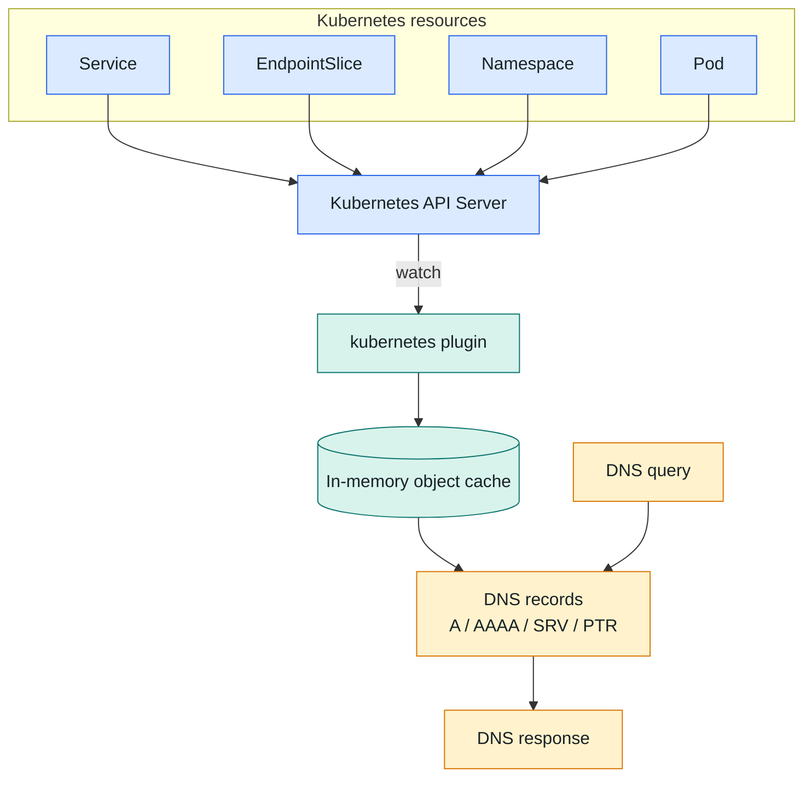

<!--
CoreDNS가 API server를 watch해서 Service, EndpointSlice, Namespace, Pod 정보를 캐시에 유지한다는 흐름입니다. 새 Service가 만들어지면 CoreDNS가 수초 내에 확인하고 DNS record로 응답할 수 있게 됩니다.
-->

---

# CoreDNS의 3가지 역할

<div class="grid-3">
  <div class="plugin-card">
    <h3>Service name resolving</h3>
    <p>`backend.default.svc.cluster.local` 같은 Kubernetes name을 ClusterIP 또는 endpoint record로 응답한다.</p>
  </div>
  <div class="plugin-card blue">
    <h3>Reverse DNS</h3>
    <p>Service ClusterIP나 Pod IP에 대해 PTR record를 제공한다. `dig -x 10.96.20.30`이 예시다.</p>
  </div>
  <div class="plugin-card warning">
    <h3>Non-cluster forwarding</h3>
    <p>cluster zone 밖이고 cache hit가 아니면 upstream resolver로 forward한다.</p>
  </div>
</div>

```bash
dig -x 10.96.20.30
# api.default.svc.cluster.local 같은 이름을 찾는 디버깅에 사용
```

<!--
역방향 DNS는 자주 잊히지만 네트워크 로그에서 IP만 보일 때 유용합니다. 세 번째 역할은 외부 도메인 지연 분석의 핵심입니다.
-->

---

layout: section
class: section-slide

---

# 2. CoreDNS 구조와 특징

<p>Go runtime, goroutine, plugin-chain, thread-safe plugin이라는 운영 관점의 특성을 본다.</p>

<!--
이 섹션은 CoreDNS 내부 구현을 깊게 파는 것이 아니라 왜 동시에 많은 DNS query를 처리할 수 있고, plugin이 어떤 계약을 지켜야 하는지를 설명합니다.
-->

---

# Go 기반 DNS 서버

<div class="grid-2">
  <div>
    
    <p class="caption">README의 Go concurrency 설명 이미지</p>
  </div>
  <div class="compact-list">
    <ul>
      <li>CoreDNS는 Go로 작성된 DNS server다.</li>
      <li>DNS request마다 무거운 OS thread를 새로 만드는 구조가 아니다.</li>
      <li>goroutine은 Go runtime이 관리하는 가벼운 실행 단위다.</li>
      <li>DNS workload는 cache, memory, upstream I/O 대기가 많아 goroutine 모델과 잘 맞는다.</li>
    </ul>
  </div>
</div>

<!--
이미지는 원본 README 자산을 그대로 사용합니다. 발표에서는 “I/O 대기 중에도 다른 query를 계속 처리할 수 있다”는 점에 집중합니다.
-->

---

# DNS request 하나의 내부 흐름

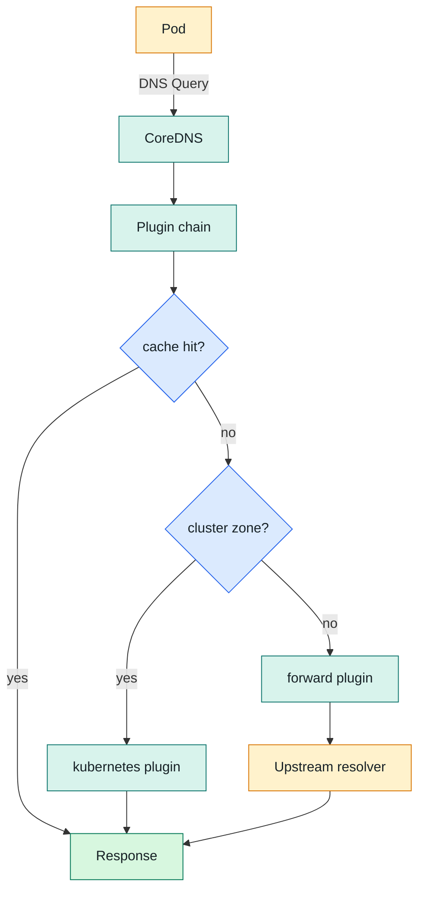

<!--
여기서는 실제 plugin order는 뒤에서 다시 다룹니다. 우선 운영자가 머릿속에 넣을 high-level chain을 보여줍니다.
-->

---

# Plugin-chain 기반 구조

<div class="grid-2">
  <div class="callout">
    <h3>CoreDNS is powered by plugins</h3>
    <p>`metrics`, `cache`, `kubernetes`, `forward`, `log`, `trace` 같은 기능이 plugin으로 붙는다.</p>
  </div>
  <div class="card">
    <h3>기본 plugin + external plugin</h3>
    <p>CoreDNS 자체는 확장성이 높지만, AKS에서는 built-in plugin 외 external plugin 사용이 제한될 수 있다.</p>
  </div>
</div>

<div class="big-statement">각 query는 chain을 따라가다가 어떤 plugin이 response를 만들면 거기서 멈출 수 있다.</div>

<!--
Plugin chain은 middleware처럼 이해하면 됩니다. 다만 HTTP middleware와 달리 DNS 특성, cache, authoritative zone 판단을 같이 봐야 합니다.
-->

---

# 동시성에서 중요한 plugin 계약

<div class="grid-2">
  <div class="card blue">
    <h3>동시에 호출된다</h3>
    <p>여러 DNS query가 각자의 goroutine에서 같은 plugin instance를 동시에 통과할 수 있다.</p>
  </div>
  <div class="card danger">
    <h3>thread-safe해야 한다</h3>
    <p>plugin 내부 state, cache, upstream connection handling은 동시 호출을 전제로 작성되어야 한다.</p>
  </div>
</div>

```text
Query A goroutine -> plugin chain -> cache/kubernetes/forward
Query B goroutine -> plugin chain -> cache/kubernetes/forward
Query C goroutine -> plugin chain -> cache/kubernetes/forward
```

<!--
플러그인 개발을 할 일은 드물지만, log/trace/debug를 켰을 때 처리 비용이 query마다 붙는다는 점은 운영상 중요합니다.
-->

---

layout: section
class: section-slide

---

# 3. Corefile과 AKS 구성

<p>기본 Corefile, `coredns-custom`, `.override`, `.server` import 구조를 구분한다.</p>

<!--
AKS에서는 기본 coredns ConfigMap을 직접 고치는 대신 coredns-custom을 통해 주입하는 모델을 강조합니다.
-->

---

# Corefile server block 문법

```yaml
[SCHEME://]ZONE [:PORT] {
    PLUGIN [ARGUMENTS]
}
```

<div class="grid-3">
  <div class="card">
    <h3>ZONE</h3>
    <p>`example.org` 또는 root zone `.`처럼 어떤 이름 영역을 처리할지 정한다.</p>
  </div>
  <div class="card blue">
    <h3>SCHEME</h3>
    <p>생략 시 일반 DNS UDP/TCP. `dns://`, `https://` 같은 형태도 가능하다.</p>
  </div>
  <div class="card warning">
    <h3>PORT</h3>
    <p>기본값은 53이지만 Kubernetes CoreDNS는 보통 `.:53`으로 명시한다.</p>
  </div>
</div>

<!--
여기서는 Corefile이 “어떤 zone을 어떤 plugin chain으로 처리할지” 선언하는 파일이라는 점만 잡습니다.
-->

---

# Server block 예시

```yaml {1-3|6-8|11-13}
# example.org zone만 처리
example.org {
    whoami
}

# DNS root zone: 사실상 모든 query
. {
    ...
}

# 명시적 protocol과 port
dns://.:53 {
    ...
}
```

<div class="note-box">DNS 이름 체계에서 모든 도메인은 실제로 마지막에 root dot이 붙는다. `microsoft.com.`처럼 보는 것이 정확하다.</div>

<!--
다음 기본 Corefile을 읽기 위한 준비 슬라이드입니다. root zone인 점 하나가 왜 모든 질의를 받는지 설명합니다.
-->

---

# AKS 기본 Corefile: server block 상단

```yaml {1|2-5|6-11|12|13|14-16}{maxHeight:'430px'}
.:53 {
errors
ready
health {
lameduck 5s
}
kubernetes cluster.local in-addr.arpa ip6.arpa {
pods insecure
fallthrough in-addr.arpa ip6.arpa
ttl 30
}
prometheus :9153
forward . /etc/resolv.conf
cache 30
loop
reload
```

<!--
상단은 health/readiness, kubernetes authoritative zone, prometheus, forward, cache, loop, reload의 핵심이 한 번에 들어 있습니다. forward가 CoreDNS Pod의 /etc/resolv.conf를 읽는다는 점도 짚습니다.
-->

---

# AKS 기본 Corefile: AKS import와 template

```yaml {1|2|3-7|8-10|12}{maxHeight:'430px'}
loadbalance
import custom/*.override
template ANY ANY internal.cloudapp.net {
match "^(?:[^.]+\.){4,}internal\.cloudapp\.net\.$"
rcode NXDOMAIN
fallthrough
}
template ANY ANY reddog.microsoft.com {
rcode NXDOMAIN
}
}
import custom/*.server
```

<div class="note-box warning">`.override`는 기본 `.:53` server block 내부에, `.server`는 별도 server block으로 import된다.</div>

<!--
AKS custom 설정에서 가장 중요한 두 줄입니다. .override와 .server의 위치가 다르기 때문에 query 처리 범위도 달라집니다.
-->

---

# `coredns` vs `coredns-custom`

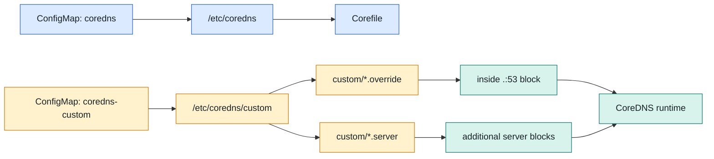

<!--
README에서 설명한 volumeMount 구조를 다이어그램으로 바꾼 슬라이드입니다. 실제 demo에서는 deployment/coredns yaml에서 mount path를 확인하면 좋습니다.
-->

---

# AKS에서 기본 Corefile 직접 수정이 조심스러운 이유

<div class="grid-2">
  <div class="card warning">
    <h3>AKS control plane reconcile</h3>
    <p>`kube-system/coredns` ConfigMap을 직접 수정하면 AKS 관리/업그레이드/reconcile 영향권에 들어갈 수 있다.</p>
  </div>
  <div class="card blue">
    <h3>전용 확장 지점</h3>
    <p>AKS는 `coredns-custom` ConfigMap을 통해 기본 Corefile에 설정을 주입하는 구조를 제공한다.</p>
  </div>
</div>


<!--
스크린샷은 README의 AKS 플러그인/구성 제약 관련 이미지입니다. 운영에서는 default를 직접 건드리는 대신 custom에 최소 변경을 넣는 방식을 기본값으로 둡니다.
-->

---

# `.override`와 `.server`를 언제 쓰나

<div class="grid-2">
  <div class="callout">
    <h3>`*.override`</h3>
    <p>기본 `.:53` server block 내부에 plugin을 더한다. 예: 일시적인 query log 활성화.</p>
  </div>
  <div class="card warning">
    <h3>`*.server`</h3>
    <p>별도 zone server block을 만든다. 예: `corp.example.com:53` conditional forwarding.</p>
  </div>
</div>

```yaml {2-3|6-10}
data:
  log.override: |
    log

  corp-example-com.server: |
    corp.example.com:53 {
      errors
      forward . 10.10.0.10 10.10.0.11
    }
```

<!--
두 타입의 차이를 한 장에 정리합니다. 이 뒤 plugin 설명과 troubleshooting conditional forwarding에서 다시 사용합니다.
-->

---

# 주요 plugin: Kubernetes path

<div class="plugin-grid">
  <div class="plugin-card">
    <h3>kubernetes</h3>
    <p>Service, EndpointSlice, Pod, Namespace를 watch하고 cluster.local에 authoritative 응답을 제공한다.</p>
  </div>
  <div class="plugin-card blue">
    <h3>cache</h3>
    <p>응답을 메모리에 저장한다. AKS 기본 Corefile은 보통 `cache 30`으로 최대 30초 캐시한다.</p>
  </div>
  <div class="plugin-card warning">
    <h3>forward</h3>
    <p>cluster zone 밖 query를 upstream resolver로 전달한다. UDP, TCP, DNS-over-TLS를 지원한다.</p>
  </div>
  <div class="plugin-card">
    <h3>loop</h3>
    <p>CoreDNS가 자기 자신을 다시 참조하는 forwarding loop를 감지하면 프로세스를 종료한다.</p>
  </div>
  <div class="plugin-card blue">
    <h3>reload</h3>
    <p>Corefile hash를 주기적으로 확인하고 변경 시 hot-reload로 새 chain을 적용한다.</p>
  </div>
  <div class="plugin-card warning">
    <h3>loadbalance</h3>
    <p>응답 record 순서를 조정해 단순한 부하 분산 효과를 제공한다.</p>
  </div>
</div>

<!--
README의 주요 plugin 중 query path에 직접 관여하는 것들을 먼저 묶었습니다. forward와 cache는 뒤 latency 분석에서 계속 등장합니다.
-->

---

# 주요 plugin: 운영과 디버깅

<div class="plugin-grid">
  <div class="plugin-card">
    <h3>health / ready</h3>
    <p>`/health`는 liveness, `/ready`는 plugin 준비 상태를 확인한다. ready 실패 시 준비되지 않은 plugin을 노출한다.</p>
  </div>
  <div class="plugin-card blue">
    <h3>prometheus</h3>
    <p>`:9153/metrics`에서 CoreDNS와 plugin metrics를 Prometheus format으로 노출한다.</p>
  </div>
  <div class="plugin-card warning">
    <h3>errors / log</h3>
    <p>`errors`는 error response를 stdout에 남기고, `log`는 query name, rcode, latency를 기록한다.</p>
  </div>
  <div class="plugin-card">
    <h3>hosts</h3>
    <p>`/etc/hosts` 형식의 static mapping을 CoreDNS 차원에서 제공하고 변경을 주기적으로 반영한다.</p>
  </div>
  <div class="plugin-card blue">
    <h3>trace</h3>
    <p>AKS 바이너리에 존재하지만 기본 활성화되지 않는다. Zipkin/Datadog endpoint 중심이다.</p>
  </div>
  <div class="plugin-card warning">
    <h3>template</h3>
    <p>AKS 기본 Corefile은 특정 Azure internal domain에 NXDOMAIN template을 사용한다.</p>
  </div>
</div>

<!--
log는 디버깅에는 유용하지만 overhead가 있으므로 상시 활성화하지 않는다는 점도 말합니다.
-->

---

# plugin 실행 순서: Corefile 순서가 아니다

<div class="grid-2">
  <div class="danger card">
    <h3>오해</h3>
    <p>Corefile에 적힌 plugin 나열 순서대로 실행된다.</p>
  </div>
  <div class="callout">
    <h3>실제</h3>
    <p>CoreDNS `plugin.cfg`에 정의된 순서가 컴파일 시 고정된다.</p>
  </div>
</div>

```bash
kubectl -n kube-system exec deployment/coredns -c coredns -- \
  coredns -plugins | tr ' ' '\n' | sort
```

<div class="note-box">어떤 plugin은 response를 만들고 chain을 멈춘다. response 없이 끝까지 가면 `SERVFAIL`이 반환될 수 있다.</div>

<!--
Corefile 순서와 실행 순서를 혼동하지 않게 강조합니다. sort는 README의 출력 확인용 명령이므로 실제 실행 순서를 보여주는 명령은 아니라는 점도 말하면 좋습니다.
-->

---

# AKS CoreDNS binary plugin 목록 확인

```text {*}{maxHeight:'450px'}
acl
any
auto
autopath
azure
bind
bufsize
cache
cancel
chaos
clouddns
debug
dns64
dnssec
dnstap
erratic
errors
etcd
file
forward
geoip
grpc
header
health
hosts
k8s_external
kubernetes
loadbalance
local
log
loop
metadata
minimal
multisocket
nomad
nsid
on
pprof
prometheus
quic
ready
reload
rewrite
root
route53
secondary
sign
template
timeouts
tls
trace
transfer
tsig
view
whoami
```

<!--
README의 전체 plugin 출력입니다. 다 외우는 목적이 아니라 “trace가 binary에는 있다”, “log도 있다”, “external plugin은 별도 고려가 필요하다”는 확인 포인트입니다.
-->

---

# Demo / 확인 명령어: Corefile과 mount

```bash {*}{maxHeight:'420px'}
kubectl -n kube-system get configmap coredns -o yaml
kubectl -n kube-system get configmap coredns-custom -o yaml

kubectl -n kube-system get deployment coredns -o yaml | \
  grep -A6 -E 'coredns-custom|/etc/coredns|/etc/coredns/custom'

kubectl -n kube-system exec deployment/coredns -c coredns -- \
  coredns -plugins | tr ' ' '\n' | sort
```

<div class="note-box blue">발표 중에는 `import custom/*.override`, `import custom/*.server`, volumeMount path를 직접 확인한다.</div>

<!--
첫 데모 지점입니다. cluster 접근이 가능하면 실제 ConfigMap과 Deployment mount를 보여주면 됩니다.
-->

---

layout: section
class: section-slide

---

# 4. K8s 내부 DNS query flow

<p>Application부터 upstream resolver까지, query가 어디서 생성되고 어디서 분기되는지 따라간다.</p>

<!--
이 섹션의 핵심은 “CoreDNS가 query를 증폭시키는 것이 아니라 Pod resolver가 search expansion을 한다”입니다.
-->

---

## class: flow-page

# Pod DNS query flow

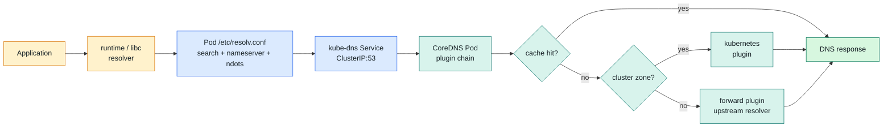

<!--
이 다이어그램은 발표 내내 돌아오는 기준점입니다. 어떤 이슈든 이 경로 위 어느 지점인지 묻습니다.
-->

---

# Application / Container / Linux OS DNS 오해 정리

<div class="decision-list">
  <div>
    <b>Application</b>
    보통 직접 DNS packet을 만들지 않고 runtime 또는 libc resolver를 호출한다.
  </div>
  <div>
    <b>Container</b>
    일반적으로 컨테이너 안에 별도 DNS 서버가 떠 있는 것은 아니다.
  </div>
  <div>
    <b>Linux OS</b>
    보통 Linux 자체가 recursive DNS server로 개입하는 것이 아니다.
  </div>
</div>

```text
Go:     net.Resolver
Java:   JVM DNS resolver/cache
Python: socket.getaddrinfo()
Node.js: libuv/c-ares 또는 OS resolver 경로
```

<!--
물론 runtime별 cache나 resolver 구현 차이는 있습니다. 하지만 기본 mental model은 process resolver가 resolv.conf를 읽고 CoreDNS로 query를 보낸다는 것입니다.
-->

---

# kubelet이 Pod resolv.conf를 만든다

<div class="grid-2">
  <div>

```yaml
spec:
  dnsPolicy: ClusterFirst
```

  </div>
  <div class="callout">
    <h3>ClusterFirst</h3>
    <p>Pod의 nameserver는 node DNS가 아니라 kube-dns Service IP가 된다.</p>
  </div>
</div>

<div class="path-steps">
  <div><b>Default</b>node의 DNS 설정을 사용</div>
  <div><b>None</b>`dnsConfig`로 nameserver/search/options 직접 지정</div>
  <div><b>hostNetwork</b>기본 policy가 달라질 수 있어 별도 확인</div>
  <div><b>dnsConfig</b>Pod 단위 `ndots` override 가능</div>
</div>

<!--
ClusterFirst의 의미는 “먼저 cluster DNS로 간다”입니다. Default/None/hostNetwork는 flow를 바꿀 수 있으므로 DNS 장애 때 spec을 확인해야 합니다.
-->

---

# kube-dns Service에서 CoreDNS Pod까지

```bash
kubectl -n kube-system get service kube-dns
kubectl -n kube-system get endpointslice -l kubernetes.io/service-name=kube-dns
kubectl -n kube-system get pods -l k8s-app=kube-dns -o wide
```

```text
Pod
  -> kube-dns Service ClusterIP:53
  -> kube-proxy / dataplane rules
  -> CoreDNS Pod IP:53
```

<div class="note-box">Service가 CoreDNS Pod들로 트래픽을 분산한다. 특정 CoreDNS Pod 장애는 EndpointSlice와 Pod 상태를 같이 봐야 한다.</div>

<!--
여기서는 Service abstraction이 DNS에도 그대로 적용된다는 점을 강조합니다. Pod는 Service IP만 알고, dataplane이 endpoint로 보냅니다.
-->

---

# CoreDNS 내부 분기: cluster name vs external name

<div class="grid-2">
  <div class="callout">
    <h3>Service FQDN</h3>
    <p>`backend.default.svc.cluster.local.`</p>
    <p>`kubernetes` plugin이 Service/EndpointSlice cache에서 응답한다.</p>
  </div>
  <div class="card warning">
    <h3>External FQDN</h3>
    <p>`www.microsoft.com.`</p>
    <p>cluster zone 밖이고 cache miss이면 `forward` plugin이 upstream으로 전달한다.</p>
  </div>
</div>

```text
CoreDNS -> cache hit 확인 -> kubernetes zone 확인 -> kubernetes 또는 forward -> response
```

<!--
실제 plugin 실행 순서는 컴파일된 chain이지만, 운영 mental model은 cache/kubernetes/forward로 나누면 충분히 강력합니다.
-->

---

# Service 짧은 이름 조회

<div class="grid-2">
  <div>

```bash
curl http://backend
```

```text
backend.<namespace>.svc.cluster.local.
```

  </div>
  <div class="compact-list">
    <ul>
      <li>같은 namespace의 Service는 짧은 이름으로 조회할 수 있다.</li>
      <li>resolver가 search suffix를 붙여 FQDN 후보를 만든다.</li>
      <li>다른 namespace는 `backend.payments` 또는 FQDN을 사용한다.</li>
    </ul>
  </div>
</div>

```text
backend.payments
backend.payments.svc.cluster.local
```

<!--
짧은 이름은 편하지만 resolver가 후보를 만든다는 사실은 ndots에서 중요해집니다.
-->

---

# 외부 도메인 조회

```text
api.github.com.
  -> CoreDNS
  -> cache miss
  -> forward . /etc/resolv.conf
  -> node 또는 cloud DNS 경로의 upstream resolver
```

<div class="grid-2">
  <div class="card">
    <h3>Application Pod `/etc/resolv.conf`</h3>
    <p>kubelet이 cluster DNS를 보도록 만든다.</p>
  </div>
  <div class="card warning">
    <h3>CoreDNS Pod `/etc/resolv.conf`</h3>
    <p>`forward . /etc/resolv.conf`가 upstream resolver 주소를 읽는 대상이다.</p>
  </div>
</div>

<!--
두 resolv.conf의 역할이 다릅니다. 외부 도메인 지연을 볼 때 CoreDNS Pod의 upstream 경로를 확인해야 합니다.
-->

---

# `ndots`는 CoreDNS 내부가 아니라 Pod resolver 단계다

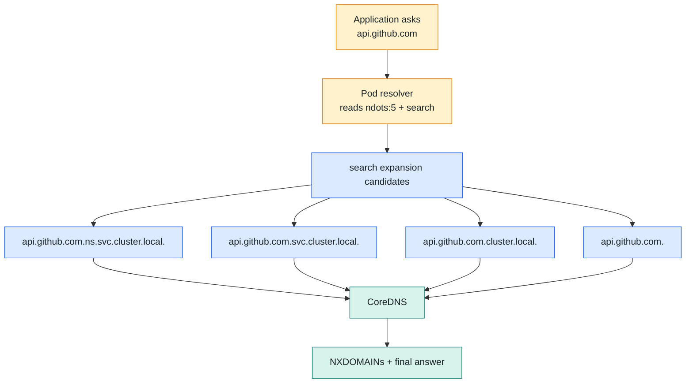

<!--
여기서 오해를 강하게 교정합니다. CoreDNS가 이름을 바꿔 recursive하게 질의하는 것이 아니라, resolver가 후보 query를 여러 개 보냅니다.
-->

---

# ndots search expansion 예시

```text {1-4|6-10|12-14}{maxHeight:'430px'}
# ndots:5 상태에서 api.github.com 조회
api.github.com.<namespace>.svc.cluster.local.
api.github.com.svc.cluster.local.
api.github.com.cluster.local.
api.github.com.

# Lab에서 관찰한 긴 Service FQDN 조회
ndots-target.ndots-lab.svc.cluster.local.ndots-lab.svc.cluster.local.
ndots-target.ndots-lab.svc.cluster.local.svc.cluster.local.
ndots-target.ndots-lab.svc.cluster.local.cluster.local.
ndots-target.ndots-lab.svc.cluster.local.<azure-internal-domain>.
ndots-target.ndots-lab.svc.cluster.local.

# 결론
trailing dot 있음 또는 ndots:1이면 실제 FQDN만 조회될 수 있다.
```

<!--
README의 lab 결론을 그대로 살립니다. AKS에서는 Azure internal search domain이 추가될 수 있어 query 수가 더 늘어날 수 있습니다.
-->

---

# Demo / 확인 명령어: query flow

```bash {*}{maxHeight:'430px'}
kubectl run dns-check --rm -it --image=busybox:1.36 --restart=Never -- sh

cat /etc/resolv.conf
nslookup kubernetes.default.svc.cluster.local
nslookup api.github.com

kubectl -n kube-system get service kube-dns
kubectl -n kube-system get endpointslice -l kubernetes.io/service-name=kube-dns
kubectl -n kube-system get pods -l k8s-app=kube-dns -o wide
```

<div class="note-box blue">데모 포인트: Pod resolver 설정, kube-dns Service, EndpointSlice, CoreDNS Pod가 한 경로로 연결되는지 확인한다.</div>

<!--
busybox 환경에 따라 nslookup/dig 지원이 다를 수 있습니다. 실제 세션에서는 dnsutils 이미지를 써도 됩니다.
-->

---

layout: section
class: section-slide

---

# 5. Metrics / Log / Trace

<p>관측은 기본적으로 모두 켜져 있지 않다. Prometheus, Container Insights, trace plugin의 활성화 지점을 구분한다.</p>

<!--
이 섹션의 핵심은 “CoreDNS는 metrics를 노출하지만 Azure Managed Prometheus가 기본으로 다 긁는 것은 아니다”입니다.
-->

---

# Metrics: prometheus plugin과 `:9153/metrics`

```yaml
.:53 {
...
prometheus :9153
...
}
```

<div class="grid-2">
  <div class="callout">
    <h3>CoreDNS 쪽</h3>
    <p>`prometheus` plugin이 `/metrics`를 Prometheus format으로 노출한다.</p>
  </div>
  <div class="card warning">
    <h3>Azure Managed Prometheus 쪽</h3>
    <p>CoreDNS scraping은 기본 target에서 disabled일 수 있어 ConfigMap으로 enable해야 한다.</p>
  </div>
</div>

<!--
노출과 수집은 다릅니다. CoreDNS가 9153을 열어도 Managed Prometheus가 자동으로 수집하지 않을 수 있습니다.
-->

---

# Managed Prometheus에서 CoreDNS scraping enable

<div class="grid-2">
  <div>

```yaml {1-8|9-13|14-22}{maxHeight:'390px'}
apiVersion: v1
kind: ConfigMap
metadata:
  name: ama-metrics-settings-configmap
  namespace: kube-system
data:
  cluster-metrics: |-
    default-targets-scrape-enabled: |-
      coredns = true
    minimal-ingestion-profile: |-
      enabled = true
  config-version: ver1
  controlplane-metrics: |-
    minimal-ingestion-profile: |-
      enabled = true
  prometheus-collector-settings: |-
    cluster_alias = ""
    debug-mode = false
    https_config = true
    secrets_access_namespaces = ""
  schema-version: v2
```

  </div>
  <div>
    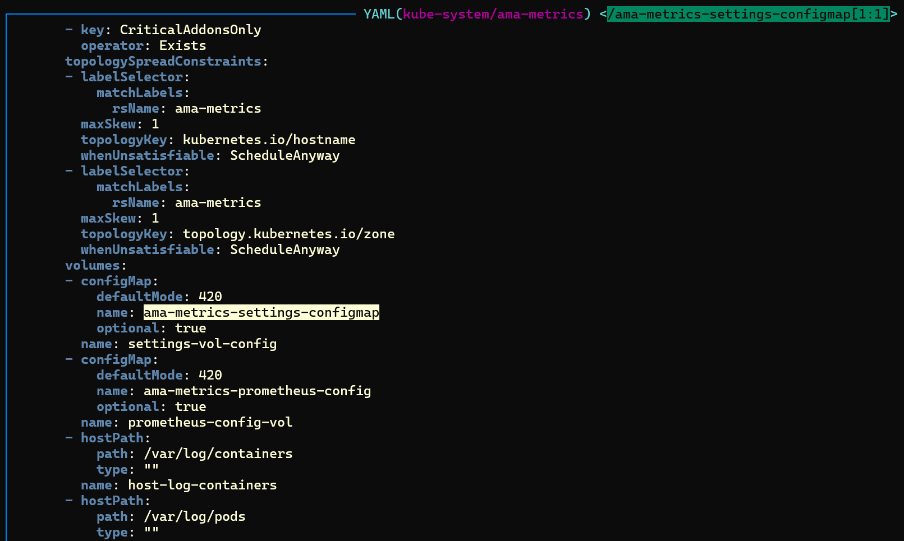
    <p class="caption">`ama-metrics` Deployment에 settings ConfigMap이 mount된 모습</p>
  </div>
</div>

<!--
README의 ConfigMap 예시와 스크린샷을 함께 보여줍니다. minimal ingestion profile에서는 수집 metric이 문서 목록으로 제한될 수 있습니다.
-->

---

# 주요 metric 이름과 용도

<div class="metric-grid">
  <div class="metric-chip"><code>coredns_dns_requests_total</code><span>전체 DNS query volume</span></div>
  <div class="metric-chip"><code>coredns_dns_responses_total</code><span>rcode별 응답 수, NXDOMAIN/SERVFAIL 확인</span></div>
  <div class="metric-chip"><code>coredns_dns_request_duration_seconds</code><span>CoreDNS request latency histogram</span></div>
  <div class="metric-chip"><code>coredns_forward_requests_total</code><span>upstream으로 넘어간 query 수</span></div>
  <div class="metric-chip"><code>coredns_forward_responses_total</code><span>upstream 응답 상태 분포</span></div>
  <div class="metric-chip"><code>coredns_forward_request_duration_seconds</code><span>upstream forward latency</span></div>
  <div class="metric-chip"><code>coredns_cache_hits_total</code><span>cache hit 수</span></div>
  <div class="metric-chip"><code>coredns_cache_misses_total</code><span>cache miss 수</span></div>
  <div class="metric-chip"><code>coredns_cache_entries</code><span>cache entry 규모</span></div>
</div>

<!--
여기서는 troubleshooting에서 바로 쓸 metric만 먼저 잡습니다. 다음 슬라이드에서 나머지 runtime/size metric을 이어서 보여줍니다.
-->

---

# Metric inventory: runtime, size, build

<div class="metric-grid">
  <div class="metric-chip"><code>coredns_build_info</code><span>CoreDNS build/version 정보</span></div>
  <div class="metric-chip"><code>kubernetes_build_info</code><span>kubernetes plugin build 정보</span></div>
  <div class="metric-chip"><code>coredns_plugin_enabled</code><span>활성 plugin 확인</span></div>
  <div class="metric-chip"><code>coredns_panics_total</code><span>panic 발생 여부</span></div>
  <div class="metric-chip"><code>coredns_dns_request_size_bytes</code><span>DNS request size histogram</span></div>
  <div class="metric-chip"><code>coredns_dns_response_size_bytes</code><span>DNS response size histogram</span></div>
  <div class="metric-chip"><code>process_resident_memory_bytes</code><span>CoreDNS process memory</span></div>
  <div class="metric-chip"><code>process_cpu_seconds_total</code><span>process CPU 누적 사용량</span></div>
  <div class="metric-chip"><code>go_goroutines</code><span>goroutine 수 관찰</span></div>
</div>

<p class="caption">Azure Portal Built-in Grafana에서는 CoreDNS community dashboard import가 필요할 수 있다.</p>

<!--
README의 metric 이름을 누락하지 않기 위한 inventory 슬라이드입니다. size metric은 평소에는 우선순위가 낮지만 abnormal packet이나 workload 특성 확인에 쓸 수 있습니다.
-->

---

# Log plugin 활성화

<div class="grid-2">
  <div>

```yaml {1|2-3}{maxHeight:'220px'}
data:
  log.override: |
    log
```

```bash
kubectl -n kube-system rollout restart deployment/coredns
kubectl -n kube-system rollout status deployment/coredns --timeout=5m
```

  </div>
  <div class="compact-list">
    <ul>
      <li>`log` plugin은 기본 Corefile에 보통 빠져 있다.</li>
      <li>query name, response code, response time 등을 stdout에 기록한다.</li>
      <li>성능 overhead가 있으므로 디버깅 목적 외 상시 활성화는 피한다.</li>
      <li>Live Logs에서는 보여도 Log Analytics Workspace에는 기본 수집되지 않을 수 있다.</li>
    </ul>
  </div>
</div>

<!--
log plugin은 문제 재현 중 잠깐 켜는 도구입니다. 켰으면 끄는 절차도 같이 준비해야 합니다.
-->

---

# Container Insights: system namespace 로그 수집 제한

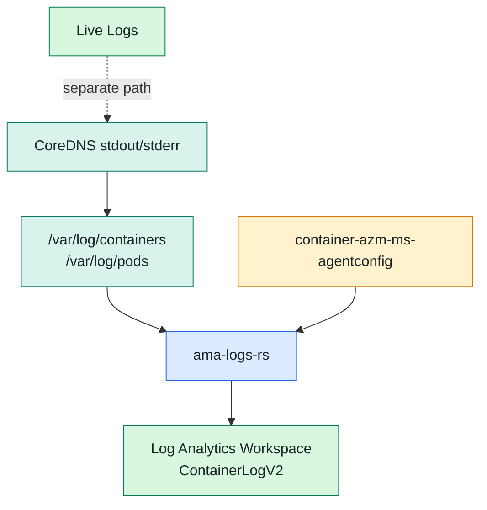

<div class="note-box warning">Container Insights는 비용 절감을 위해 kube-system 같은 system namespace container logs를 기본 제외할 수 있다.</div>

<!--
로그가 Live Logs에는 보이는데 LAW에 없다는 혼동을 줄입니다. agent ConfigMap으로 system pod log 수집을 명시해야 합니다.
-->

---

# `container-azm-ms-agentconfig` 예시

<div class="grid-2">
  <div>

```yaml {1-7|8-13|15-20}{maxHeight:'390px'}
apiVersion: v1
kind: ConfigMap
metadata:
  name: container-azm-ms-agentconfig
  namespace: kube-system
data:
  schema-version: "v1"
  config-version: "1.0.0"
  log-data-collection-settings: |-
    [log_collection_settings]
      [log_collection_settings.stdout]
        enabled = true
        collect_system_pod_logs = ["kube-system:coredns"]

      [log_collection_settings.stderr]
        enabled = true
        collect_system_pod_logs = ["kube-system:coredns"]
```

  </div>
  <div>
    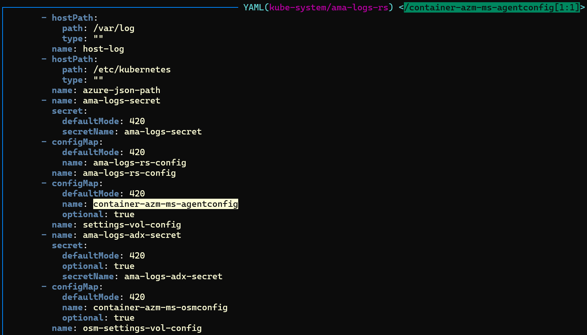
    <p class="caption">`ama-logs-rs` Deployment에 agent config가 mount된 모습</p>
  </div>
</div>

<!--
repo에 있는 container-azm-ms-agentconfig.yaml에는 exclude_namespaces도 포함되어 있습니다. 발표에서는 핵심 설정인 collect_system_pod_logs를 강조합니다.
-->

---

# LAW에서 CoreDNS log 확인

<div class="grid-2">
  <div>
    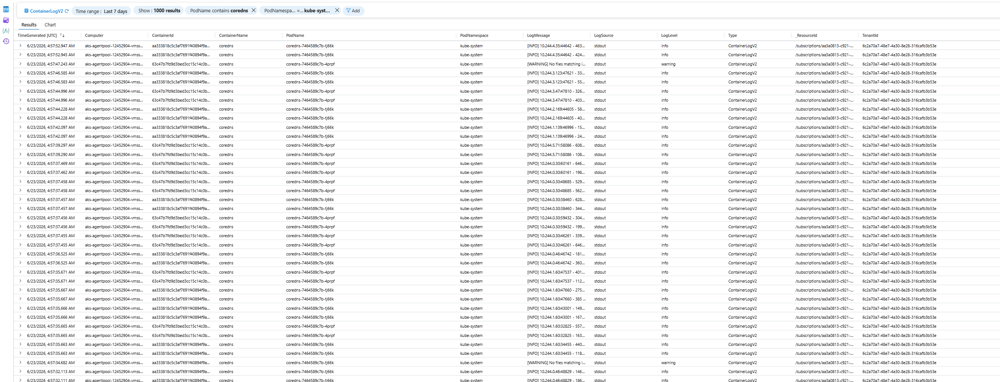
    <p class="caption">ContainerLogV2에서 PodName contains coredns 조건으로 확인</p>
  </div>
  <div class="compact-list">
    <ul>
      <li>ConfigMap 배포 후 몇 분 뒤 `ama-logs` Pod가 restart될 수 있다.</li>
      <li>restart가 되지 않으면 직접 rollout restart를 검토한다.</li>
      <li>수집 후 `ContainerLogV2`에서 `PodName`, `PodNamespace`, `LogMessage`를 확인한다.</li>
    </ul>
  </div>
</div>

<!--
README의 실제 Portal 캡처입니다. 로그가 어디에 보이는지 시각적으로 확인시키는 슬라이드입니다.
-->

---

# Trace plugin: 가능하지만 correlation은 어렵다

<div class="grid-2">
  <div class="card blue">
    <h3>지원 방식</h3>
    <p>AKS CoreDNS binary에는 `trace` plugin이 있지만 기본 Corefile에서는 비활성이다. endpoint type은 `zipkin`, `datadog` 중심이다.</p>
  </div>
  <div class="card warning">
    <h3>기술 기반</h3>
    <p>OpenTelemetry가 아니라 OpenTracing 기반이다. W3C `traceparent` propagation과 기본적으로 맞물리지 않는다.</p>
  </div>
</div>

```bash {*}{maxHeight:'280px'}
kubectl apply -f spec/03-dns-tools.yaml
kubectl -n trace-lab rollout status deployment/dns-tools --timeout=5m

kubectl -n trace-lab exec deployment/dns-tools -- sh -c '
for i in $(seq 1 30); do
  dig +short kubernetes.default.svc.cluster.local
  dig +short www.microsoft.com
  dig +short api.github.com
done
'

kubectl -n "$LAB_NS" port-forward service/zipkin 9411:9411
```

<!--
README의 trace 시도 명령을 포함합니다. spec 경로는 README 기준이며 실제 데모에서는 lab 파일 위치를 확인해야 합니다.
-->

---

# Zipkin에서 본 CoreDNS trace

<div class="grid-2">
  <div>
    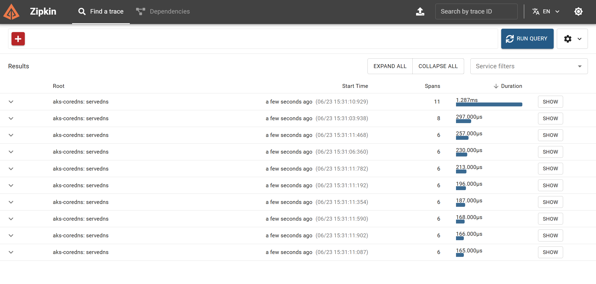
    <p class="caption">`aks-coredns: servedns` spans</p>
  </div>
  <div class="compact-list">
    <ul>
      <li>CoreDNS query 처리 span은 볼 수 있다.</li>
      <li>Application trace와 같은 trace tree로 자연스럽게 연결되지는 않는다.</li>
      <li>DNS protocol 자체에 HTTP header propagation 같은 표준 carrier가 없다.</li>
    </ul>
  </div>
</div>

<!--
trace는 demo로 흥미롭지만 운영 관점의 첫 번째 도구는 metrics/log입니다. correlation 한계를 명확히 말합니다.
-->

---

# Application trace와 CoreDNS trace correlation 한계

<div class="grid-2">
  <div class="danger card">
    <h3>기본 결론</h3>
    <p>CoreDNS trace plugin의 Zipkin OpenTracing wrapper는 W3C `traceparent` 기반 correlation을 기본 제공하지 않는다.</p>
  </div>
  <div class="callout">
    <h3>eBPF 가능성</h3>
    <p>Application process/socket/DNS packet을 eBPF로 관측해 `dns.resolve` span을 붙이는 접근은 가능성이 있다.</p>
  </div>
</div>

<div class="note-box warning">eBPF instrumentation도 packet에 trace context를 주입하는 방식은 아니다. socket/PID/trace key로 client request trace를 찾을 수 있어야 하며 아직 발전 중인 영역이다.</div>

<!--
OpenTelemetry 전용 CoreDNS plugin PR이 무산된 배경도 짧게 언급합니다. 다만 발표 목표는 “correlation이 기본적으로 어렵다”를 이해하는 것입니다.
-->

---

# Demo / 확인 명령어: observability

```bash {*}{maxHeight:'430px'}
# Metrics endpoint 확인
kubectl -n kube-system port-forward deployment/coredns 9153:9153
curl -s localhost:9153/metrics | grep '^coredns_' | head

# Managed Prometheus 설정 확인
kubectl -n kube-system get configmap ama-metrics-settings-configmap -o yaml

# Log collection 설정 확인
kubectl -n kube-system get configmap container-azm-ms-agentconfig -o yaml
kubectl -n kube-system logs deployment/coredns -c coredns --tail=50
```

<div class="note-box blue">관측 체크는 “노출되는가”, “수집되는가”, “대시보드나 LAW에서 보이는가”를 분리해서 확인한다.</div>

<!--
이 명령 묶음은 섹션 요약용 데모입니다. curl은 포트포워드 중 별도 터미널에서 실행합니다.
-->

---

layout: section
class: section-slide

---

# 6. Troubleshooting scenarios

<p>conditional forwarding, latency/timeout, autoscaling, ndots, TTL/cache를 실제 판단 흐름으로 묶는다.</p>

<!--
마지막 실전 섹션입니다. 이제 앞에서 본 query path와 metric을 사용해 분류합니다.
-->

---

# 특정 사내 도메인 conditional forwarding

<div class="grid-2">
  <div class="compact-list">
    <ul>
      <li>`corp.example.com`은 사내 DNS에서만 resolve된다.</li>
      <li>AKS VNet에서 `10.10.0.10`, `10.10.0.11` UDP/TCP 53 통신이 가능하다.</li>
      <li>Pod는 `api.corp.example.com`을 그대로 조회하고 싶다.</li>
      <li>AKS에서는 `coredns-custom`에 `.server` key를 추가한다.</li>
    </ul>
  </div>
  <div>

```yaml {1-6|7-11}{maxHeight:'390px'}
apiVersion: v1
kind: ConfigMap
metadata:
  name: coredns-custom
  namespace: kube-system
data:
  corp-example-com.server: |
    corp.example.com:53 {
      errors
      forward . 10.10.0.10 10.10.0.11
    }
```

  </div>
</div>

<!--
forward target은 DNS 이름보다 IP가 안전합니다. upstream 주소를 resolve하기 위해 다시 DNS가 필요한 bootstrap 문제를 피하기 위해서입니다.
-->

---

# CoreDNS custom vs Azure DNS Private Resolver

<div class="grid-2">
  <div class="callout">
    <h3>CoreDNS `.server`</h3>
    <p>특정 AKS 클러스터에만 예외를 넣기 쉽다. zone별 key를 추가하고 CoreDNS rollout으로 적용한다.</p>
  </div>
  <div class="card blue">
    <h3>Azure DNS Private Resolver</h3>
    <p>여러 VNet/클러스터에 공통 사내 DNS 정책을 적용하기 좋다. outbound endpoint와 forwarding ruleset을 사용한다.</p>
  </div>
</div>

<div class="note-box warning">전체 DNS를 사내 DNS로 보내는 것과 특정 zone만 conditional forward하는 것은 다르다. 보통 특정 사내 zone만 보내는 편이 안전하다.</div>

```bash
kubectl -n kube-system rollout restart deployment/coredns
kubectl -n kube-system rollout status deployment/coredns --timeout=5m
```

<!--
클러스터 국소 예외는 CoreDNS, 조직 공통 정책은 Private Resolver가 더 자연스럽다는 비교입니다.
-->

---

# Rollback: custom server block 제거

```bash
kubectl -n kube-system patch configmap coredns-custom \
  --type json \
  -p='[{"op":"remove","path":"/data/corp-example-com.server"}]'

kubectl -n kube-system rollout restart deployment/coredns
kubectl -n kube-system rollout status deployment/coredns --timeout=5m
```

<div class="note-box">운영 변경은 적용 명령만큼 rollback 명령도 같이 준비한다. 특히 DNS는 bootstrap 경로에 가까워 작은 실수가 넓게 퍼질 수 있다.</div>

<!--
README의 rollback 명령입니다. 발표에서는 conditional forwarding을 만들 때 검증과 rollback을 같은 change ticket에 넣는다고 말하면 좋습니다.
-->

---

# DNS latency / timeout 원인 분류

<div class="decision-list">
  <div v-click>
    <b>CoreDNS 처리량 부족</b>
    높은 QPS, CPU throttling, cache miss 증가, 과도한 NXDOMAIN, log/trace overhead
  </div>
  <div v-click>
    <b>Upstream 지연</b>
    외부 도메인 forward, upstream resolver latency, 네트워크 경로 문제
  </div>
  <div v-click>
    <b>Client-side 증폭</b>
    `ndots`, search suffix, connection churn, app-level DNS cache 부재
  </div>
</div>

<div v-click class="big-statement">먼저 물어볼 것: CoreDNS가 느린가, upstream이 느린가, 아니면 query 수가 늘어난 것인가?</div>

<!--
이 슬라이드는 incremental reveal을 사용합니다. 문제를 세 범주로 나눈 뒤, metric으로 구분하는 다음 슬라이드로 넘어갑니다.
-->

---

# Metric으로 분기하기

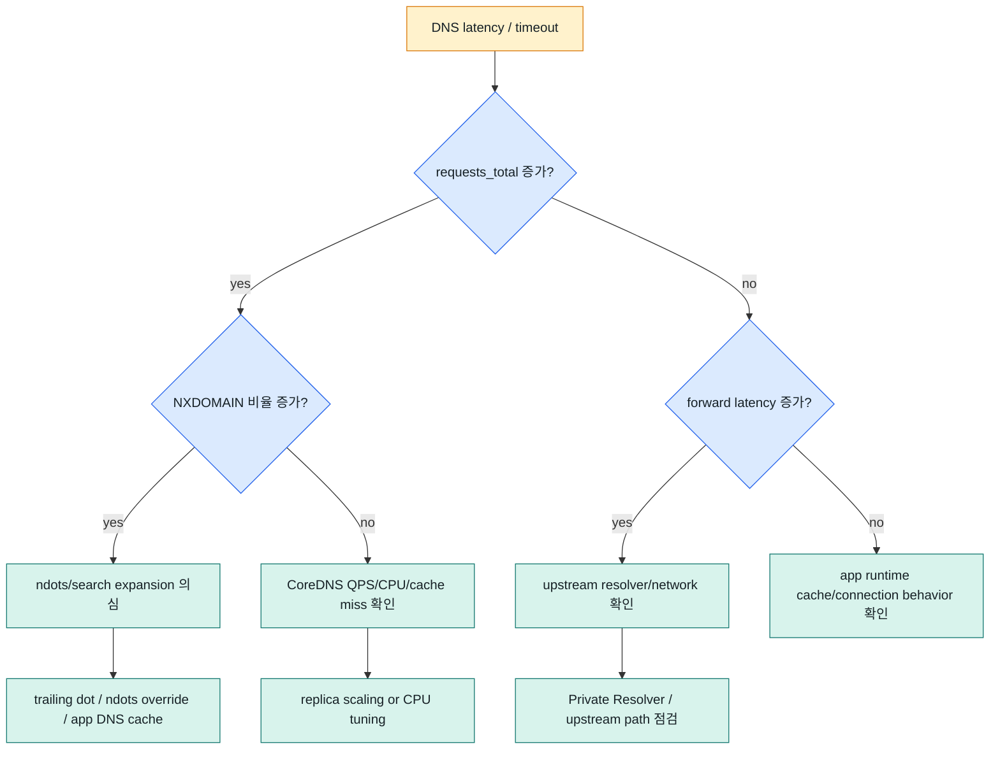

<!--
이 플로우는 발표 마무리 checklist와 연결됩니다. DNS 문제를 보면 query volume, rcode, forward latency, cache, CPU를 한 번에 봅니다.
-->

---

# CoreDNS replica scaling: 1차 대응과 한계

<div class="grid-2">
  <div class="callout">
    <h3>왜 replica를 먼저 늘리나</h3>
    <p>CoreDNS는 stateless DNS server라 Pod당 QPS와 CPU 사용량을 낮추기 쉽고 가용성도 좋아진다.</p>
  </div>
  <div class="card warning">
    <h3>해결하지 못하는 경우</h3>
    <p>upstream resolver 자체가 느리거나 `ndots`로 query가 증폭되면 replica만 늘려도 근본 latency가 남는다.</p>
  </div>
</div>

<div class="note-box">CPU throttling, 지속적인 CPU 고사용률, replica 증가 후에도 처리 시간이 줄지 않는 경우에는 CPU request/limit도 검토한다.</div>

<!--
README의 관점을 반영해 CPU limit 증설보다 replica scaling이 흔한 1차 대응이라는 점을 설명합니다. 하지만 원인 제거가 더 중요할 수 있음을 바로 붙입니다.
-->

---

# AKS `coredns-autoscaler` 구조

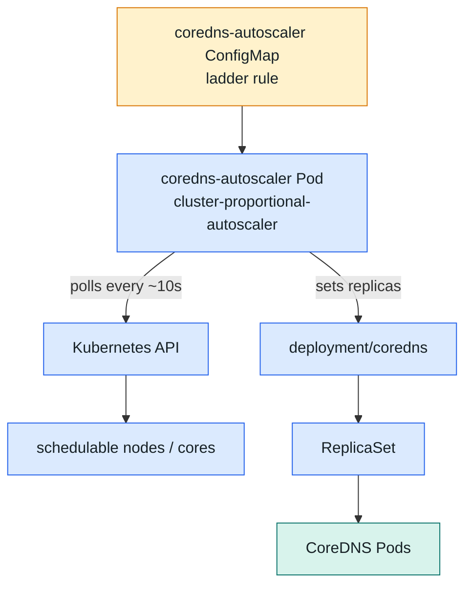

<!--
중요한 말: 이것은 HPA가 아닙니다. DNS latency나 CPU를 직접 보고 closed-loop scale out하지 않고 node/core 수에 비례해 replica를 계산합니다.
-->

---

# `cluster-proportional-autoscaler`는 HPA가 아니다

```bash
kubectl -n kube-system get deployment coredns coredns-autoscaler
kubectl -n kube-system get configmap coredns-autoscaler -o yaml
kubectl -n kube-system get deployment coredns-autoscaler -o yaml
```

```yaml {1-6|7}{maxHeight:'250px'}
apiVersion: v1
kind: ConfigMap
metadata:
  name: coredns-autoscaler
  namespace: kube-system
data:
  ladder: '{"coresToReplicas":[[1,2],[512,3],[1024,4],[2048,5]],"nodesToReplicas":[[1,2],[8,3],[16,4],[32,5]]}'
```

<div class="note-box warning">scale 기준은 DNS QPS가 아니라 cluster size다. 특정 workload의 DNS 폭증은 자동 scale out되지 않을 수 있다.</div>

<!--
node 기준과 core 기준 중 더 큰 replica 값을 target으로 사용한다는 ladder mode 설명을 붙입니다.
-->

---

# ndots로 인한 query 증가 완화

<div class="grid-3">
  <div class="card">
    <h3>Trailing dot</h3>
    <p>`api.github.com.`처럼 absolute name으로 조회해 search suffix 확장을 건너뛸 수 있다.</p>
  </div>
  <div class="card blue">
    <h3>`dnsConfig.options.ndots`</h3>
    <p>외부 도메인 또는 긴 FQDN을 자주 조회하는 Pod에서 낮은 값을 검토한다.</p>
  </div>
  <div class="card warning">
    <h3>Application-level cache</h3>
    <p>connection reuse, keep-alive, runtime DNS cache를 함께 확인한다.</p>
  </div>
</div>

```yaml
spec:
  dnsConfig:
    options:
      - name: ndots
        value: "1"
```

<!--
trailing dot은 TLS hostname 처리나 애플리케이션 라이브러리 동작과 맞는지 확인해야 합니다. ndots 변경은 workload 단위 영향도를 보고 적용합니다.
-->

---

# TTL 만료와 upstream latency: cache / prefetch

<div class="grid-2">
  <div>

```text {1-2|4-6|8-11}{maxHeight:'370px'}
cache [TTL] [ZONES...]

# AKS 기본 예시
cache 30

# popular query를 TTL 만료 전에 갱신
cache {
  prefetch AMOUNT [DURATION] [PERCENTAGE%]
}

# 예: 1분 내 5번 이상 조회, TTL 하위 10%에서 갱신
prefetch 5 1m 10%
```

  </div>
  <div class="compact-list">
    <ul>
      <li>cache hit이면 CoreDNS가 메모리에서 바로 응답한다.</li>
      <li>TTL 만료 또는 cache miss이면 backend/upstream 왕복 latency가 붙는다.</li>
      <li>인기 hostname은 prefetch로 첫 요청 latency를 줄일 수 있다.</li>
      <li>`coredns_cache_prefetch_total`로 동작 여부를 확인한다.</li>
    </ul>
  </div>
</div>

<!--
README 마지막 시나리오입니다. TTL이 짧고 QPS가 높은 hostname은 만료 시점마다 동시에 upstream resolution을 유발할 수 있습니다.
-->

---

# Troubleshooting metric set

<div class="metric-grid">
  <div class="metric-chip"><code>coredns_dns_requests_total</code><span>query volume 증가 여부</span></div>
  <div class="metric-chip"><code>coredns_dns_responses_total</code><span>NXDOMAIN/SERVFAIL 증가 여부</span></div>
  <div class="metric-chip"><code>coredns_dns_request_duration_seconds</code><span>CoreDNS 처리 latency</span></div>
  <div class="metric-chip"><code>coredns_forward_requests_total</code><span>upstream 전달량</span></div>
  <div class="metric-chip"><code>coredns_forward_request_duration_seconds</code><span>upstream latency</span></div>
  <div class="metric-chip"><code>coredns_cache_hits_total</code><span>cache hit</span></div>
  <div class="metric-chip"><code>coredns_cache_requests_total</code><span>cache 대상 request 수</span></div>
  <div class="metric-chip"><code>coredns_cache_prefetch_total</code><span>prefetch 수행 횟수</span></div>
  <div class="metric-chip"><code>CPU throttling / restart count</code><span>Pod resource pressure</span></div>
</div>

<!--
README의 troubleshooting 관찰 지표를 발표용으로 묶었습니다. 일부 metric은 환경의 ingestion profile에 따라 수집되지 않을 수 있으므로 수집 설정을 같이 확인해야 합니다.
-->

---

# Demo / 확인 명령어: troubleshooting pack

```bash {*}{maxHeight:'430px'}
# kube-dns routing surface
kubectl -n kube-system get svc kube-dns -o wide
kubectl -n kube-system get endpointslice -l kubernetes.io/service-name=kube-dns
kubectl -n kube-system get pods -l k8s-app=kube-dns -o wide

# CoreDNS autoscaler
kubectl -n kube-system get deployment coredns coredns-autoscaler
kubectl -n kube-system get configmap coredns-autoscaler -o yaml
kubectl -n kube-system get deployment coredns-autoscaler -o yaml

# CoreDNS logs and metrics
kubectl -n kube-system logs deployment/coredns -c coredns --tail=100
kubectl -n kube-system top pods -l k8s-app=kube-dns
```

<!--
데모 마지막 묶음입니다. 실제 환경에 metrics stack이 있으면 PromQL도 함께 보여주면 좋습니다.
-->

---

# 핵심 mental model

<div class="grid-3">
  <div class="card">
    <h3>Query 생성 위치</h3>
    <p>`ndots`와 search suffix는 Pod resolver 단계에서 query 수를 늘린다.</p>
  </div>
  <div class="card blue">
    <h3>Query 처리 위치</h3>
    <p>CoreDNS plugin chain은 cache, kubernetes, forward 경로로 응답을 만든다.</p>
  </div>
  <div class="card warning">
    <h3>Latency 위치</h3>
    <p>CoreDNS 처리량 문제인지 upstream resolver 왕복인지 metric으로 나눠 본다.</p>
  </div>
</div>

<div class="big-statement">DNS troubleshooting은 “어디서 query가 늘었는가”와 “어디서 기다렸는가”를 분리하는 일이다.</div>

<!--
마무리 전 요약입니다. 이 문장을 발표 후반부에 다시 말해 주면 전체 흐름이 단단해집니다.
-->

---

# AKS CoreDNS 체크리스트

<v-clicks>

- Pod spec: `dnsPolicy`, `dnsConfig.options.ndots`, `hostNetwork`를 확인한다.
- Pod `/etc/resolv.conf`: nameserver가 `kube-dns` Service IP인지 본다.
- kube-dns Service: Service, EndpointSlice, CoreDNS Pod 상태를 같이 본다.
- Corefile: 기본 `coredns`와 custom `.override` / `.server`를 구분한다.
- Metrics: requests, responses, request latency, forward latency, cache hit/miss를 본다.
- Logs: `log` plugin과 Container Insights system namespace 수집 여부를 분리한다.
- Scaling: `coredns-autoscaler`는 HPA가 아니라 node/core 기반임을 기억한다.
- Upstream: conditional forwarding, Private Resolver, network path를 확인한다.

</v-clicks>

<!--
최종 체크리스트입니다. 발표 후 실제 장애 대응 때 이 순서대로 보면 됩니다.
-->

---

layout: end
class: end-slide

---

# 판단 프레임

<div class="big-statement">1. 어디서 query가 늘어났는가?<br>2. CoreDNS가 느린가, upstream이 느린가?<br>3. 관측이 켜져 있는가?</div>

<p class="subtitle">이 세 질문으로 Kubernetes DNS 문제를 “느낌”이 아니라 경로와 지표로 다룬다.</p>

<!--
마지막 슬라이드는 세 질문만 남깁니다. 질문을 반복해서 기억에 남기는 것이 목적입니다.
-->
