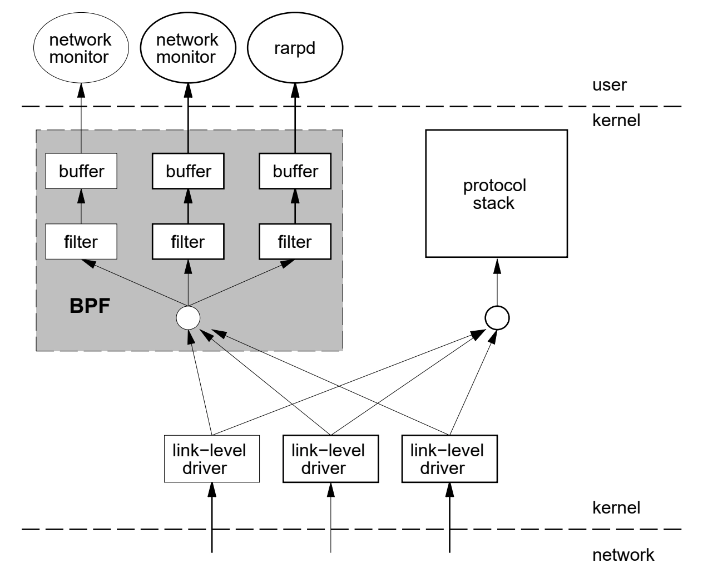
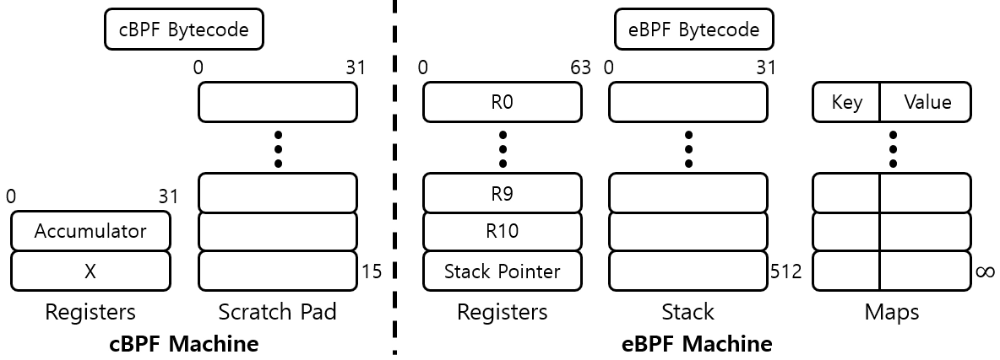
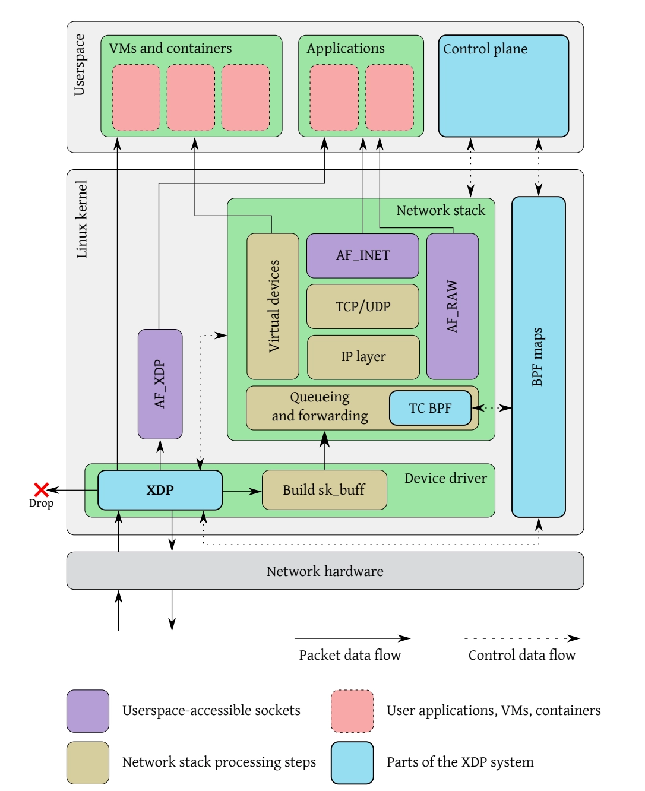
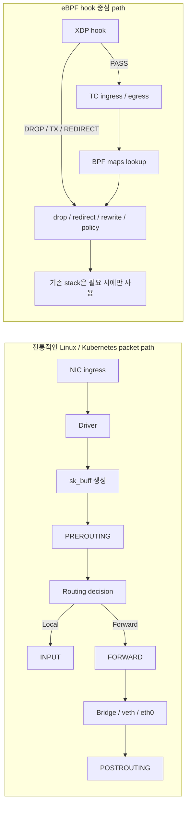
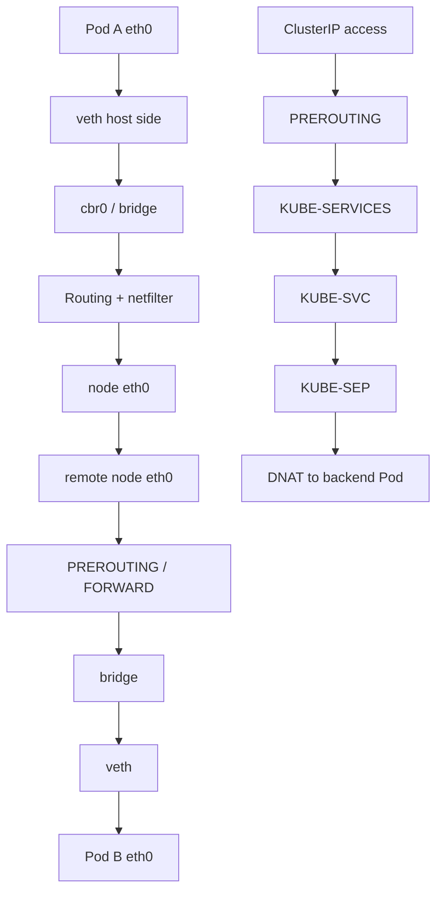
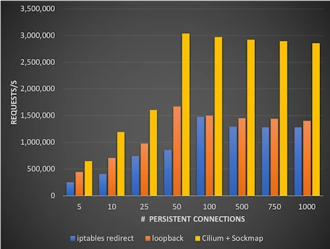
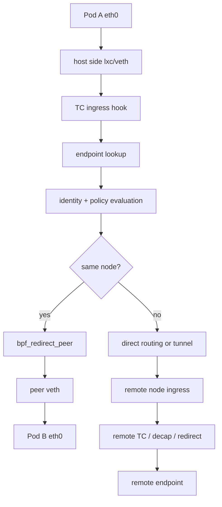
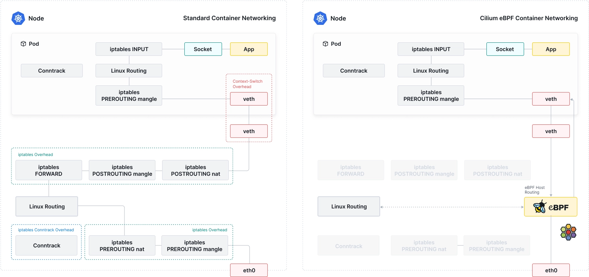
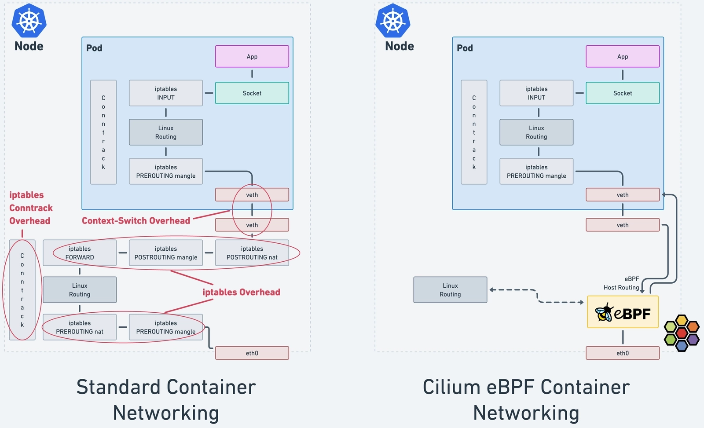
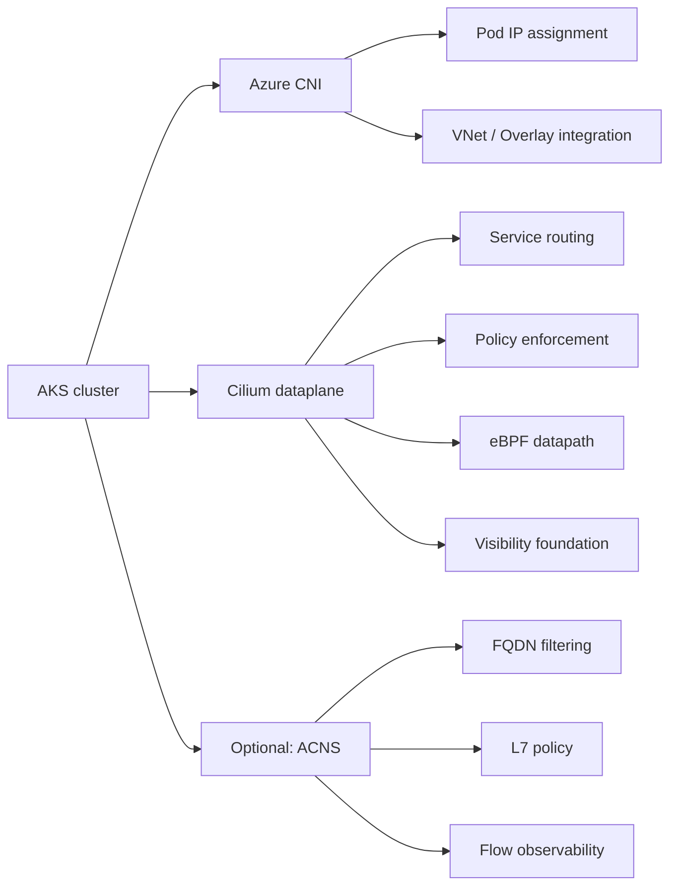

# Cilium 45분 세션 문서

## 전체 구성

| 구간                      | 시간 | 핵심 질문                                       | 핵심 답변                                   |
| ------------------------- | ---: | ----------------------------------------------- | ------------------------------------------- |
| 1. 오프닝                 |  2분 | 오늘 이 세션에서 무엇을 볼 것인가               | 제품 소개보다 패킷 처리 path를 본다         |
| 2. 배경 설명              |  3분 | 왜 Cilium을 진지하게 볼 가치가 있는가           | eBPF, Cilium, Isovalent, CNCF, Cisco 맥락   |
| 3. Networking Path 비교   |  7분 | 전통적인 path와 eBPF path는 무엇이 다른가       | hook 위치와 lookup 방식이 다르다            |
| 4. 기존 CNI의 트래픽 처리 |  8분 | Kubernetes는 전통 path 위에서 어떻게 돌아가는가 | veth, bridge, netfilter, kube-proxy가 핵심  |
| 5. 기존 구조의 문제점     |  4분 | 왜 이 구조가 운영상 부담이 되는가               | O(n) rule traversal, conntrack, 낮은 가시성 |
| 6. Cilium의 트래픽 처리   | 12분 | Cilium은 같은 문제를 어떻게 처리하는가          | TC/XDP, eBPF maps, identity 기반 정책       |
| 7. AKS에서의 Cilium       |  5분 | AKS에서는 누가 무엇을 담당하는가                | Azure CNI는 IPAM, Cilium은 dataplane        |
| 8. 실습                   |  2분 | 무엇을 보여줘야 하는가                          | eBPF map, 정책, Hubble의 연결               |
| 9. Q&A                    |  2분 | 어떤 질문이 나올 것인가                         | 도입 효과, 제약사항, 운영 포인트            |

## 1. 오프닝

오늘 세션은 Kubernetes 네트워킹의 내부 동작을 다룬다.

- 기존 Linux/Kubernetes packet path와 eBPF 기반 packet path의 차이를 본다.
- 그 위에서 기존 CNI/kube-proxy와 Cilium이 각각 어떻게 동작하는지 비교한다.
- AKS에서 Cilium을 사용할 때 Azure CNI와 Cilium의 역할 분리를 이해한다.

## 2. 배경 설명

### 2-1. eBPF


eBPF는 커널 소스 코드를 수정하거나 별도 커널 모듈을 적재하지 않고도, 커널 내부의 정해진 hook 지점에 안전하게 프로그램을 주입할 수 있게 해주는 메커니즘이다.

중요한 포인트는 세 가지다.

- 커널 안에서 동작한다.
- verifier를 거쳐 안전성이 검증된다.
- 다양한 hook 지점에서 패킷 처리, 관찰, 정책 적용, tracing을 수행할 수 있다.

여기서 verifier 내부 알고리즘, instruction set, tail call 같은 세부 구현까지 들어갈 필요는 없다. 세션의 목적상 중요한 것은 "어디에 붙을 수 있는가"와 "커널 path를 얼마나 앞단에서 바꿀 수 있는가"다.

자세한 내용은 [ebpf.io 공식 사이트](https://ebpf.io/what-is-ebpf/)를 참고한다.

### 2-2. Cilium


Cilium은 eBPF를 기반으로 Kubernetes 환경에서 네트워킹, 보안, observability를 제공하는 CNCF Graduated 프로젝트다. 핵심은 eBPF를 직접 사용자에게 노출하지 않고, Kubernetes의 workload, service, policy, flow visibility 문제를 해결하는 형태로 추상화했다는 점이다.

> Cilium은 eBPF를 보여주는 프로젝트가 아니라, eBPF를 이용해서 Kubernetes 네트워킹의 병목과 운영 복잡도를 줄이는 프로젝트다.

- [Cilium GitHub](https://github.com/cilium/cilium)
- [Cilium 공식 사이트](https://cilium.io/)

### 2-3. Isovalent와 Cisco

|                                                                                                                     |                                                                                                                                  |
| ------------------------------------------------------------------------------------------------------------------- | -------------------------------------------------------------------------------------------------------------------------------- |
|  |  |

Isovalent의 About 페이지 기준으로 Isovalent는 Cilium과 eBPF의 creators/maintainers가 만든 회사이며, Thomas Graf와 Dan Wendlandt가 창업했다. Isovalent는 Cilium, eBPF, Tetragon을 기반으로 한 오픈소스와 상용 플랫폼을 발전시켜 왔고, **2024년 4월 Cisco의 일부가 되었다**.

이 배경을 세션에서 짚는 이유는 단순한 회사 소개가 아니라, Cilium이 커널 네트워킹과 오픈소스 생태계에 깊게 연결된 프로젝트라는 점을 보여주기 위해서다. Cisco라는 전통적 네트워크 장비 기업이 Cilium/eBPF 생태계에 투자했다는 점 자체가, 이 기술의 위치를 말해준다.

**참고 링크:**

- [Isovalent About 페이지](https://isovalent.com/about-us/) — 창업자 및 오픈소스 배경
- [Isovalent 공식 발표: Cisco Acquires Isovalent](https://isovalent.com/blog/post/cisco-acquires-isovalent/) — 인수 공식 발표

### 2-4. CNCF


CNCF 프로젝트 페이지 기준으로 Cilium은 2021년 10월 13일 Incubating으로 들어갔고, 2023년 10월 11일 Graduated로 올라갔다.

참고로 GKE Dataplane V2, AKS Azure CNI Powered by Cilium, EKS Anywhere 등 주요 managed Kubernetes가 공식 지원하고 있다.

**참고 링크:**

- [CNCF Cilium 프로젝트 페이지](https://www.cncf.io/projects/cilium/)
- [Cilium GitHub](https://github.com/cilium/cilium) — 20,000+ GitHub stars

### 시각 자료

#### BPF 구조 — Driver와 Application 간 관계도 (출처: 1992, Steven McCanne)

BPF의 원래 구조를 보여주는 그림이다. Network Tap과 Packet Filter가 커널 안에서 드라이버와 Protocol Stack 사이에 위치한다. 이 구조가 이후 eBPF로 확장된다.



> BPF 구조 (BPF와 Driver/Application 간 관계도)

#### cBPF와 eBPF의 아키텍처 차이 (출처: ssup2.github.io)

cBPF Machine은 Accumulator와 X 레지스터, 15 word Scratch Pad로 구성되지만, eBPF Machine은 R0~R10 레지스터, 512 byte Stack, 그리고 Key-Value 기반의 Maps를 갖는다. 이 확장이 eBPF를 범용 커널 프로그래밍 플랫폼으로 만든 핵심이다.



> 첨부 이미지: BPF와 eBPF의 레지스터 확장 및 메모리 구조 변화

#### eBPF 구조도 — Use Cases, Projects, SDKs, Kernel Runtime (출처: ebpf.io)

eBPF 생태계 전체를 한 장으로 보여주는 그림이다. 상단에 Networking, Security, Observability & Tracing 같은 Use Case가 있고, 그 아래에 Cilium, bcc, Falco 같은 프로젝트, SDK 계층, 그리고 커널 안의 Verifier & JIT, Maps, Helper API가 위치한다.


> eBPF 구조도

#### eBPF 프로그램 개발 및 운영 개략도 (출처: ebpf.io)

C source → clang -target bpf → bytecode → Go Library → Syscall → Verifier → JIT Compiler → 커널 실행까지의 전체 흐름이다. 오른쪽의 Process에서 sendmsg()/recvmsg()를 통해 eBPF가 Socket/TCP/IP path에 개입하는 모습도 보인다.


> eBPF 프로그램 개발 및 운영 개략도

## 3. Networking Path 비교

### 3-1. 전통적인 Linux networking path

전통적인 Linux networking path에서는 패킷이 NIC에 도착한 뒤 드라이버를 거쳐 커널 네트워크 스택 안으로 들어온다. 이 과정에서 sk_buff가 생성되고, netfilter hook이 여러 시점에 개입한다.

핵심적으로 보여줘야 하는 지점은 다음이다.

- NIC ingress
- 드라이버 처리
- sk_buff 생성
- PREROUTING
- 라우팅 결정
- INPUT 또는 FORWARD
- POSTROUTING

이 path는 범용적이고 강력하지만, 네트워크 정책과 service NAT를 전부 이 경로에 얹기 시작하면 경로가 길어지고, 룩업과 상태 추적 비용이 커진다.

### 3-2. eBPF 기반 networking path

eBPF 기반 path의 핵심은 "기존 네트워크 스택을 전부 대체한다"가 아니라, "기존 스택 안의 더 앞단 혹은 더 적절한 지점에서 개입한다"는 점이다.

대표적인 attach point는 다음과 같다.

- XDP: NIC 드라이버 수준, sk_buff 생성 전
- TC ingress/egress: 인터페이스 수준, sk_buff 생성 후
- cgroup/socket 계열 hook: socket 관점 제어

즉, eBPF는 패킷이 커널 스택 안쪽으로 깊게 들어가기 전에 drop, redirect, rewrite, policy check, map lookup을 수행할 수 있다. 이 차이가 곧 성능과 운영성 차이로 이어진다.

#### XDP가 추가된 Linux Network Stack (출처: The eXpress Data Path, 2018 ACM CoNEXT paper)

이 그림은 XDP가 Device driver 레벨에서 sk_buff 생성 전에 위치하고, TC BPF가 Queueing and forwarding 계층에 위치하는 것을 보여준다. XDP에서 바로 Drop하거나 TX/Redirect할 수 있고, PASS하면 sk_buff가 생성되어 일반 Network Stack으로 올라간다.



> XDP가 추가된 Linux Network Stack. Ingress Packet만 표시.

### 3-3. path 비교의 의미

이 비교를 먼저 해두면 이후 설명이 단순해진다.

- 기존 CNI는 전통적인 kernel path 위의 Kubernetes 구현이다.
- Cilium은 eBPF hook 중심 path 위의 Kubernetes 구현이다.

### Diagram: 전통 path vs eBPF path



### 시각 자료

#### Linux 환경에서의 Packet 처리 흐름 — Netfilter hooks와 XDP 위치 (출처: Wikipedia)


이 그림에서 왼쪽 상단의 "Network Level"에 XDP가 NIC ingress 직후에 위치하는 것을 볼 수 있다. 기존 netfilter hook들(PREROUTING, INPUT, FORWARD, OUTPUT, POSTROUTING)이 모두 그 이후에 등장한다.

#### eBPF 프로그램 동작 원리 — Hook (출처: ebpf.io)

eBPF 프로그램은 이벤트 기반으로 동작한다. 커널 내부에 미리 정의된 hook 지점에서 트리거되며, syscall, 함수 진입/탈출, tracepoint, 네트워크 이벤트 등에 위치한다.


> eBPF 프로그램 동작 원리 - Hook. Syscall → Kernel → eBPF 프로그램이 개입하는 구조.

#### eBPF hook attach point 개요 (출처: ebpf.io)


eBPF가 붙을 수 있는 다양한 attach point를 한눈에 보여준다. 네트워킹뿐 아니라 syscall, tracing, cgroup 등에도 붙을 수 있지만, 여기서는 XDP와 TC에 집중한다.

#### eBPF 프로그램 동작 원리 — Verification과 Loading (출처: ebpf.io)

bpf() syscall로 bytecode가 커널에 로드되면, Verifier가 안전성을 검증하고, 통과하면 JIT Compiler가 native 명령으로 변환한다.


> eBPF 프로그램 동작 원리 - Verification과 Loading

## 4. 기존 CNI의 트래픽 처리

### 4-1. Pod 네트워크 셋업

Pod가 스케줄되면 kubelet은 CNI plugin을 호출한다. 이때 보편적으로 일어나는 일은 다음과 같다.

- Pod용 network namespace 생성
- veth pair 생성
- Pod 쪽 인터페이스를 eth0로 배치
- host 쪽 veth를 bridge에 연결
- Pod IP와 라우팅/NAT 규칙 구성

핵심은 Pod 네트워크가 마법처럼 생기는 것이 아니라, 결국 host network namespace 안의 veth와 bridge, routing table, iptables로 구현된다는 점이다.

### 4-2. Same-node Pod-to-Pod

같은 노드 안에서 Pod A가 Pod B로 패킷을 보낼 때의 기본 그림은 다음과 같다.

- Pod A의 eth0에서 패킷이 나간다.
- veth pair를 통해 host namespace의 host-side veth로 올라온다.
- bridge가 FDB를 보고 어느 포트로 내보낼지 결정한다.
- 대상 Pod의 host-side veth로 보낸 뒤 Pod B의 eth0로 들어간다.

이 경로는 단순해 보이지만, 실제로는 bridge와 netfilter 연동, conntrack, 정책 체인 개입이 붙으면서 생각보다 무거워질 수 있다.

### 4-3. Cross-node Pod-to-Pod

다른 노드로 가는 순간 경로는 더 길어진다.

- Pod A -> veth -> bridge
- host routing 결정
- FORWARD와 관련 체인 통과
- node eth0로 송신
- 반대편 노드 ingress
- PREROUTING, routing, FORWARD
- bridge, veth를 거쳐 Pod B 도달

이 경로에서 노드 간 forwarding, NAT, conntrack, service 처리까지 엮이면 디버깅 복잡도가 빠르게 올라간다.

### 4-4. Service 처리와 kube-proxy

기존 kube-proxy iptables 모드에서는 ClusterIP로 들어온 패킷이 여러 chain을 지난다.

- PREROUTING
- KUBE-SERVICES
- KUBE-SVC-xxxx
- KUBE-SEP-xxxx
- DNAT

이 방식의 본질은 "rule chain을 따라가며 match가 되는 규칙을 찾는다"는 것이다. Service와 Endpoint가 늘어나면 chain도 길어진다.

IPVS 모드는 lookup 자체를 더 효율적으로 만들지만, 여기서는 깊게 들어가지 않는다. 중요한 건 많은 환경에서 여전히 netfilter, conntrack, kube-proxy model에 대한 이해가 필요하다는 점이다.

### Diagram: 기존 CNI 및 kube-proxy path



### 시각 자료

#### Netfilter Hook과 iptables chain 대응 표

| Netfilter hook     | iptables chain | Trigger Timing                                               |
| ------------------ | -------------- | ------------------------------------------------------------ |
| NF_IP_PRE_ROUTING  | PREROUTING     | 외부로부터 Packet이 도착                                     |
| NF_IP_LOCAL_IN     | INPUT          | Packet의 Destination이 이 시스템일 때                        |
| NF_IP_FORWARD      | FORWARD        | 이 시스템이 다른 시스템을 대신하여 Routing하는 Packet이 도달 |
| NF_IP_LOCAL_OUT    | OUTPUT         | 로컬 시스템에서 생성된 Packet이 System을 떠날 때             |
| NF_IP_POST_ROUTING | POSTROUTING    | Packet이 이 시스템을 떠날 때                                 |

이 표를 Netfilter packet flow 그림과 함께 보면, 각 hook이 어느 시점에 개입하는지 시각적으로 연결된다.

## 5. 기존 구조의 문제점

### 5-1. O(n) rule traversal

iptables 기반 service 처리는 결국 rule chain traversal이다. rule 수가 늘어날수록 lookup path가 길어진다. 패킷 수가 많고 서비스 수가 많은 클러스터일수록 비용이 커진다.

### 5-2. conntrack 의존성

conntrack은 강력하지만, 대규모 환경에서는 state table 관리가 곧 운영 포인트가 된다. table 포화, timeout 튜닝, NAT와의 상호작용이 문제가 되기 시작하면 네트워크 문제는 단순한 애플리케이션 장애가 아니라 node-level 운영 이슈가 된다.

### 5-3. 규칙 갱신 비용

Endpoint가 흔들리고 rollout이 잦은 환경에서는 kube-proxy가 관리하는 규칙의 갱신 비용이 무시되지 않는다. 규모가 커질수록 "현재 패킷을 빨리 처리하는 문제"와 "규칙을 최신 상태로 유지하는 문제"가 동시에 부담이 된다.

### 5-4. 낮은 observability

어떤 패킷이 왜 drop되었는지, 어떤 서비스가 어떤 backend로 번역되었는지, 어떤 workload 간 통신이 일어났는지를 직관적으로 보기 어렵다. 결국 tcpdump, conntrack, iptables, kube-proxy 로그를 모두 뒤져야 하는 경우가 많다.

### 5-5. IP 중심 사고

마이크로서비스 환경에서 workload는 지속적으로 바뀌고, Pod IP는 workload identity를 대표하기에 너무 휘발적이다. 그런데 정책과 추적이 IP 중심으로 짜여 있으면 모델과 실제 운영 대상을 계속 맞춰줘야 한다.

### 한 줄 요약

> 기존 구조의 문제는 iptables가 나빠서가 아니라, Kubernetes의 동적인 서비스 모델을 netfilter/conntrack 중심 path 위에 계속 쌓아 올린 데서 온다.

### 시각 자료: Container ↔ Local Proxy 간 통신 성능 비교 (출처: KubeCon)

아래 벤치마크 차트는 Persistent Connection 수에 따른 requests/s를 iptables redirect, loopback, Cilium + Sockmap 세 가지 방식으로 비교한다.

- iptables redirect (파란색)는 connection 수가 늘어날수록 약 130만 req/s 부근에서 정체된다.
- loopback (주황색)은 그보다 약간 높지만 비슷한 패턴이다.
- Cilium + Sockmap (노란색)은 connection 100개 이상에서 약 300만 req/s로, iptables 대비 약 2배 이상의 처리량을 보여준다.

이 차이는 eBPF/Sockmap이 Network Stack을 우회하고 Socket 레벨에서 직접 데이터를 전달하기 때문에 발생한다. 앞서 설명한 O(n) rule traversal, conntrack 비용, context switching 비용이 실제 throughput에 어떤 영향을 주는지를 숫자로 보여주는 근거다.



## 6. Cilium의 트래픽 처리

### 구성 요소 개괄

Cilium 공식 component overview 기준으로 세션에서 설명할 구성 요소는 이 정도면 충분하다.

- `cilium-agent`: 각 노드에서 동작하며 endpoint, service, policy, visibility 요구를 받아 eBPF 프로그램과 map을 관리한다.
- `cilium-cni`: Pod 생성과 종료 시 호출되어 필요한 datapath 구성을 트리거한다.
- `cilium-operator`: 클러스터 단위로 한 번만 처리하면 되는 작업을 담당한다. forwarding critical path에는 없다.
- Hubble server / relay / UI: eBPF 기반 flow visibility를 제공한다.
- Data store: 기본적으로 Kubernetes CRD를 사용해 상태를 전파한다.

### 6-1. Pod 네트워크 셋업

Cilium도 Pod에 veth pair를 만든다. 여기서 많은 청중이 오해하는데, Cilium이 veth 자체를 없애는 것이 아니다. 차이는 host side 인터페이스에 붙는 처리 로직이다.

기존 구조가 bridge와 iptables를 중심으로 packet을 흘려보낸다면, Cilium은 host side 인터페이스에서 TC hook을 이용해 eBPF 프로그램을 실행하고, endpoint identity와 policy, service lookup을 그 자리에서 처리하려고 한다.

### 6-2. Same-node Pod-to-Pod

같은 노드 통신에서 보여줘야 할 핵심은 다음이다.

- Pod A에서 나온 패킷이 host side 인터페이스에 도달한다.
- TC ingress hook에서 eBPF가 실행된다.
- destination endpoint를 찾고, identity와 policy를 검사한다.
- 적절하다면 `bpf_redirect_peer()` 같은 메커니즘으로 peer veth로 직접 전달한다.

즉, host networking stack과 iptables chain을 통째로 다 타는 것이 아니라, 훨씬 짧은 경로에서 endpoint-aware 처리를 해버린다.

### 6-3. Cross-node Pod-to-Pod

Cilium은 cross-node 통신에서도 같은 철학을 유지한다.

- source endpoint에서 policy와 routing 판단을 한다.
- direct routing이면 host FIB를 활용해 바로 내보낸다.
- tunnel 모드면 encapsulation을 추가한다.
- 수신 노드에서도 eBPF 프로그램이 decap, endpoint lookup, policy 판단, redirect를 이어서 수행한다.

이 파트에서 중요한 것은 "터널을 쓰느냐 마느냐"보다, 양 끝 노드에서 eBPF가 endpoint-aware forwarding을 수행한다는 점이다.

### 6-4. Service 처리

Cilium의 service 처리는 "kube-proxy chain을 짧게 만든다"가 아니라, lookup 모델 자체를 바꾼다.

- service key를 BPF map에서 lookup한다.
- backend를 선택한다.
- eBPF program 안에서 rewrite와 redirect를 수행한다.

즉, kube-proxy iptables처럼 chain traversal로 backend를 찾는 방식이 아니라, map lookup 중심으로 바뀐다. 이 차이는 O(n) 대 O(1) lookup으로 이해할 수 있다.

### 6-5. XDP와 TC의 역할 구분

세션에서 반드시 분리해서 설명해야 하는 포인트다.

- XDP는 NIC 드라이버 레벨에서 가장 앞단에 붙는다.
- TC는 인터페이스 ingress/egress에서 packet을 다룬다.

XDP는 NodePort acceleration, early drop, DDoS mitigation처럼 아주 앞단에서 빠르게 걸러야 하는 use case에 강하다. 반면 Cilium이 endpoint-aware policy, redirect, service translation 같은 대부분의 Kubernetes datapath를 구현할 때는 TC path가 중심이다.

즉, XDP가 더 빠르다는 식의 단순 비교로 가면 안 된다. attach point와 available context가 다르기 때문이다.

### 6-6. Identity와 observability

Cilium이 강조하는 또 하나의 차별점은 identity 기반 모델이다.

- IP가 아니라 label 기반 identity를 사용한다.
- Pod가 재스케줄되어 IP가 바뀌더라도, 정책의 대상은 workload identity로 유지된다.
- Hubble은 이 datapath에서 발생하는 flow를 이용해 L3/L4/L7 관찰성을 제공한다.

Hubble은 단순한 UI가 아니라, Cilium datapath가 이미 알고 있는 flow와 policy context를 사람이 읽을 수 있는 형태로 끌어올리는 계층이다.

### Diagram: Cilium datapath



### 시각 자료

#### Standard Container Networking vs Cilium eBPF Container Networking (출처: Cilium)

아래 두 그림은 같은 비교를 다른 레이아웃으로 보여준다. 좌측이 기존 iptables 기반 path, 우측이 Cilium eBPF 기반 path다.

기존 path에서는 패킷이 Pod에서 나와 veth를 지나는 순간부터 iptables PREROUTING mangle → FORWARD → POSTROUTING mangle/nat → Conntrack → 다시 PREROUTING nat/mangle 순으로 겹겹이 netfilter chain을 통과한다. 그림에서 빨간 점선으로 표시된 "iptables Overhead", "iptables Conntrack Overhead", "Context-Switch Overhead" 영역이 이 비용을 시각적으로 강조한다.

반면 우측 Cilium path에서는 같은 구간에서 eBPF Host Routing이 netfilter chain을 대부분 우회하고, veth에서 바로 eBPF 프로그램으로 처리가 넘어간다. 동일한 iptables 블록들이 회색(비활성)으로 표시되어 있어, 어느 계층이 생략되는지 직관적으로 대비된다.





이 두 그림은 이 세션에서 가장 임팩트가 큰 시각 자료다. 기존 path의 복잡도와 Cilium path의 shortcut을 한 장으로 보여줄 수 있다.

#### Cilium + Hubble 구성요소 (출처: Cilium 공식 문서)


## 7. AKS에서의 Cilium

### 7-1. Azure CNI Powered by Cilium의 구조

Azure CNI Powered by Cilium은 Azure CNI의 control plane/IPAM과 Cilium의 dataplane을 결합한 모델이다.

- Azure CNI: Pod IP 할당 방식과 Azure 네트워크 자원 연결을 담당한다.
- Cilium: service routing, network policy enforcement, datapath 최적화, observability의 핵심을 담당한다.

즉, Azure CNI Powered by Cilium은 "Azure CNI를 버리고 Cilium만 쓰는 것"이 아니라, Azure 쪽은 Azure가 잘하는 IPAM과 네트워크 통합을 맡고, packet handling dataplane은 Cilium이 맡는 구조다.

### 7-2. IPAM 모델

Azure 문서 기준으로 IPAM은 크게 세 가지 방식으로 볼 수 있다.

- overlay network에서 Pod IP를 할당하는 방식
- VNet 기반으로 Pod subnet을 두고 할당하는 방식
- node subnet 기반 방식

AKS에서도 IP 할당 전략은 Azure 네트워크 모델에 맞춰 유지되지만, dataplane은 Cilium으로 바꾴다.

### 7-3. Azure CNI Overlay와의 관계

AKS에서 이 부분을 짧게라도 분리해서 설명하는 편이 좋다.

- Azure CNI Overlay는 Pod IP를 VNet 주소 공간과 분리해 관리한다.
- Azure CNI Powered by Cilium은 이 overlay 모델 위에서도 동작할 수 있다.
- 즉, overlay냐 아니냐는 주로 IPAM과 네트워크 주소 모델의 문제이고, Cilium이 가져오는 dataplane 변화와는 별도의 축이다.

Overlay는 주소 관리 전략이고, Cilium은 패킷 처리 전략이다. AKS에서는 이 둘을 조합할 수 있다.

### 7-4. 운영상 장점

Azure 문서와 앞선 Cilium 설명을 합치면, AKS에서 설명할 장점은 이 정도가 적당하다.

- improved service routing
- more efficient network policy enforcement
- better observability of cluster traffic
- larger clusters에 대한 확장성 향상
- kube-proxy를 쓰지 않는 운영 모델

특히 Azure 문서 FAQ 기준으로 Cilium dataplane을 사용하는 AKS 클러스터는 kube-proxy를 사용하지 않는다.

### 7-5. ACNS와 고급 기능

Azure 문서 기준으로 FQDN filtering, L7 policy, container network observability, eBPF host routing 같은 고급 기능은 Advanced Container Networking Services와 함께 설명하는 것이 맞다.

이 부분은 세션에서 다음처럼 정리하면 좋다.

- 기본 Azure CNI Powered by Cilium만으로도 dataplane과 policy engine은 바뀐다.
- 하지만 AKS에서 FQDN filtering, L7 policy, 더 풍부한 observability를 운영 기능으로 활용하려면 ACNS를 함께 봐야 한다.

### 7-6. 제약사항과 전환 시 유의점

세션에서 꼭 짚을 만한 제약사항은 다음 정도다.

- Linux only, Windows 미지원
- hostNetwork Pod에는 일반 Pod처럼 정책이 적용되지 않는다
- `ipBlock`만으로 pod/node IP 허용을 표현하는 데 제약이 있다
- AKS managed Cilium 구성은 사용자가 세세하게 커스터마이즈하기 어렵다

여기에 하나 더 붙이면 좋다.

- 기존 클러스터에서의 전환 가능 범위는 현재 네트워크 모델과 배포 방식에 따라 다르므로, "그대로 Cilium으로 바꾼다"고 단순화하면 안 된다

특히 AKS에서는 Azure CNI Overlay나 Azure CNI with dynamic IP allocation과의 업그레이드/전환 경로가 문서화되어 있지만, self-managed Calico나 BYO CNI 관점의 마이그레이션과는 성격이 다르다. 그래서 운영 현장에서는 새 클러스터 전환이 필요한지, 정책 호환성은 어떤지, kube-proxy 제거와 hostNetwork 제약이 어떤 영향을 주는지를 먼저 검토해야 한다.

여기에 Spark처럼 high-churn workload에서 identity 수가 빠르게 늘 수 있다는 제약도 Azure 문서에 있다.

### Diagram: AKS responsibility split



### 시각 자료

AKS 파트에는 별도의 아키텍처 다이어그램이 공식으로 제공되진 않지만, 위 Mermaid 다이어그램으로 역할 분리를 충분히 이해할 수 있다.

## 8. 실습

### 8-1. 실습 목표

- Cilium이 service/backend 관계를 map으로 관리한다는 점을 보여준다.
- endpoint와 identity가 실제로 존재한다는 점을 보여준다.
- policy 적용 시 drop과 flow visibility가 어떻게 보이는지 보여준다.

### 8-2. 권장 시나리오

1. frontend와 backend 두 개의 간단한 workload를 배포해 둔다.
2. `cilium bpf lb list`로 service -> backend 관계를 보여준다.
3. `cilium bpf endpoint list`로 endpoint와 identity를 보여준다.
4. 단순한 L4 또는 L7 정책을 적용한다.
5. `hubble observe` 또는 `cilium monitor`로 허용/차단 결과를 보여준다.

### 8-3. 권장 명령

```bash
kubectl -n kube-system exec ds/cilium -- cilium bpf lb list
kubectl -n kube-system exec ds/cilium -- cilium bpf endpoint list
hubble observe --namespace default --verdict DROPPED -f
```

## 9. 마무리

오늘의 핵심은 Cilium이 새로운 기능 몇 개를 추가한 프로젝트라는 점이 아니다. Kubernetes 네트워킹의 packet path와 lookup 모델을 eBPF 중심으로 다시 짜서, 성능, 운영성, 가시성을 같이 가져가려는 시도라는 점이다. 그리고 AKS에서는 그 시도를 Azure CNI와 역할 분리된 형태로 받아들일 수 있다.

## 참고 자료

- 사용자 제공 Notion 문서: BPF / eBPF & XDP
- 사용자 제공 Notion 문서: Cilium
- Cilium 공식 문서: Component Overview
- Azure 공식 문서: Azure CNI Powered by Cilium in AKS
- CNCF 프로젝트 페이지: Cilium
- Isovalent About 페이지
