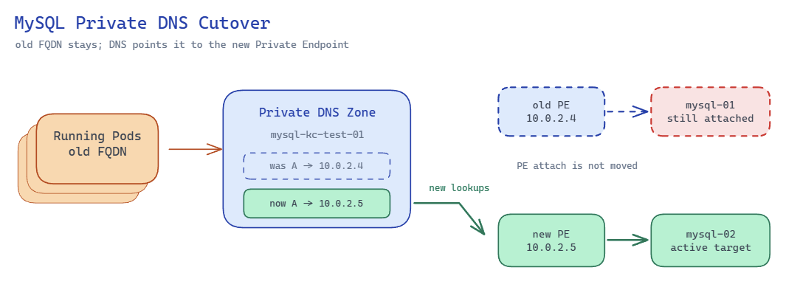

# MySQL Private DNS 기반 AKS DB 전환 테스트 정리

작성일: 2026-05-14

## 1. 문제 상황

AKS에서 실행 중인 Pod가 Azure Database for MySQL Flexible Server에 연결되어 있다. MySQL 서버 접근은 Private Endpoint를 통해 이루어지며, Pod는 MySQL 서버의 일반 FQDN을 connection string으로 사용한다.

기존 MySQL 서버를 직접 버전 업그레이드하면 DB downtime이 발생한다. 이를 피하기 위해 기존 MySQL 서버와 동기화된 신규 MySQL 서버를 만들고, 애플리케이션 트래픽을 신규 MySQL 서버로 전환하는 방안을 검토했다.

문제는 기존 Pod들이 이미 기존 MySQL 서버 FQDN을 들고 실행 중이라는 점이다. Pod 수가 많아 전체 재기동 시간이 길고, 한 번에 재기동하면 서비스 downtime이 발생할 수 있다. 카나리 방식으로 일부 Pod씩 재기동하더라도, 전환 중에는 기존 FQDN을 들고 있는 Pod와 신규 FQDN을 들고 있는 Pod가 섞인다.

따라서 이번 테스트의 핵심 질문은 다음과 같다.

- 기존 MySQL 서버 FQDN의 Private DNS A record를 신규 MySQL 서버 Private Endpoint IP로 바꾸면 기존 Pod가 재기동 없이 신규 DB로 연결될 수 있는가
- 기존 FQDN과 신규 FQDN이 모두 신규 Private Endpoint IP를 가리키도록 하면, Pod를 카나리 방식으로 천천히 재기동해도 모든 Pod가 신규 DB로 수렴할 수 있는가
- 이 방식에서 주의해야 할 운영 리스크는 무엇인가

## 2. 테스트에서 검증한 해결 방안

테스트한 방식은 Private Endpoint 자체를 옮기는 방식이 아니다. 기존 MySQL 서버 FQDN에 해당하는 Private DNS Zone A record를 신규 MySQL 서버의 Private Endpoint IP로 변경하는 방식이다.

기존 상태는 다음과 같다.

```text
mysql-kc-test-01.mysql.database.azure.com
  -> mysql-kc-test-01.privatelink.mysql.database.azure.com
  -> 10.0.2.4
```

전환 후 의도한 상태는 다음과 같다.

```text
mysql-kc-test-01.mysql.database.azure.com
  -> mysql-kc-test-01.privatelink.mysql.database.azure.com
  -> 10.0.2.5
```

이때 `10.0.2.5`는 신규 MySQL 서버 `mysql-kc-test-02`의 Private Endpoint IP이다.

이 구성을 만들면 기존 FQDN을 들고 있는 Pod도 새 DNS lookup 이후 신규 MySQL 서버로 연결된다. 이후 Pod를 카나리 방식으로 재기동하면서 connection string을 신규 MySQL 서버 FQDN으로 바꿔도, 기존 FQDN과 신규 FQDN이 모두 신규 Private Endpoint IP를 가리키므로 전환 중 혼재 구간을 줄일 수 있다.



위 그림은 이번 테스트의 핵심 구조를 나타낸다. Pod는 기존 MySQL FQDN을 계속 사용하지만, Private DNS Zone의 A record를 신규 MySQL Private Endpoint IP로 바꾸면 새 DNS lookup과 새 DB connection은 신규 MySQL 서버로 향한다. Private Endpoint attach 자체가 이동하는 것은 아니며, 트래픽 경로만 DNS record를 통해 바뀐다.

## 3. 구성 환경

| 구분             | 이름                                   | 비고                                 |
| ---------------- | -------------------------------------- | ------------------------------------ |
| Resource Group   | `rg-kc-test`                           | 테스트 리소스 그룹                   |
| VNet             | `vnet-kc-test-01`                      | AKS와 Private Endpoint가 연결된 VNet |
| AKS              | `aks-kc-test-01`                       | Pod에서 MySQL 접근 테스트 수행       |
| 기존 MySQL       | `mysql-kc-test-01`                     | 기존 애플리케이션이 사용하던 DB      |
| 신규 MySQL       | `mysql-kc-test-02`                     | 버전 업그레이드 목적의 신규 DB       |
| Private DNS Zone | `privatelink.mysql.database.azure.com` | MySQL Private Endpoint용 DNS Zone    |

### Private Endpoint 구성

| Private Endpoint | 연결 대상          | Private IP | 상태     |
| ---------------- | ------------------ | ---------- | -------- |
| `pe-kc-test-01`  | `mysql-kc-test-01` | `10.0.2.4` | Approved |
| `pe-kc-test-02`  | `mysql-kc-test-02` | `10.0.2.5` | Approved |

Private Endpoint NIC 기준으로도 다음이 확인됐다.

- `pe-kc-test-01-nic`: `10.0.2.4`, FQDN metadata는 `mysql-kc-test-01.mysql.database.azure.com`
- `pe-kc-test-02-nic`: `10.0.2.5`, FQDN metadata는 `mysql-kc-test-02.mysql.database.azure.com`

### Private DNS 구성

초기 DNS record는 다음 구성이었다.

| Record set         | IP         | TTL |
| ------------------ | ---------- | --- |
| `mysql-kc-test-01` | `10.0.2.4` | 10  |
| `mysql-kc-test-02` | `10.0.2.5` | 10  |

테스트 중 기존 MySQL 서버 record를 신규 MySQL 서버 PE IP로 변경했다.

| Record set         | IP         | TTL |
| ------------------ | ---------- | --- |
| `mysql-kc-test-01` | `10.0.2.5` | 10  |
| `mysql-kc-test-02` | `10.0.2.5` | 10  |

현재 확인 시점의 실제 Private DNS Zone record도 위와 같이 두 record 모두 `10.0.2.5`를 가리킨다.

중요한 점은 Private DNS Zone record를 바꾸더라도 Private Endpoint attach 대상은 바뀌지 않는다는 것이다. `pe-kc-test-01`은 여전히 `mysql-kc-test-01`에 연결되어 있고, `pe-kc-test-02`는 여전히 `mysql-kc-test-02`에 연결되어 있다.

## 4. 테스트 데이터 구성

두 MySQL 서버에 동일한 테스트 DB와 테이블을 만들고, 서버를 구분할 수 있는 row를 넣었다.

```sql
CREATE DATABASE IF NOT EXISTS testdb;

CREATE TABLE IF NOT EXISTS testdb.test_table (
  id INT AUTO_INCREMENT PRIMARY KEY,
  server_name VARCHAR(100) NOT NULL,
  marker VARCHAR(100) NOT NULL,
  created_at TIMESTAMP DEFAULT CURRENT_TIMESTAMP
);
```

각 서버에는 다음 값이 들어 있다.

| 서버               | `server_name`      | `marker`           |
| ------------------ | ------------------ | ------------------ |
| `mysql-kc-test-01` | `mysql-kc-test-01` | `fqdn-change-test` |
| `mysql-kc-test-02` | `mysql-kc-test-02` | `fqdn-change-test` |

현재 시점에 Private Endpoint IP로 직접 확인한 결과도 정상이다.

| 접속 대상  | 조회 결과          |
| ---------- | ------------------ |
| `10.0.2.4` | `mysql-kc-test-01` |
| `10.0.2.5` | `mysql-kc-test-02` |

## 5. 실제 작업 내용

### 5.1 테스트 데이터 생성

로컬 환경에는 MySQL client가 없었고, passwordless sudo가 되지 않아 로컬 패키지 설치는 사용하지 않았다. 대신 AKS 내부에서 임시 MySQL client Pod를 실행해 두 MySQL 서버에 접속했다.

처음에는 Private DNS와 Private Endpoint 구성이 완성되지 않아 FQDN이 public IP로 해석됐다. 테스트 데이터 생성만을 위해 AKS Pod의 outbound public IP를 MySQL firewall에 임시 허용했고, 작업 완료 후 해당 firewall rule을 삭제했다.

작업 결과는 다음과 같다.

- `mysql-kc-test-01`에 `testdb.test_table` 생성 및 `mysql-kc-test-01` row 입력 완료
- `mysql-kc-test-02`에 `testdb.test_table` 생성 및 `mysql-kc-test-02` row 입력 완료
- 임시 firewall rule `allow-aks-egress-temp` 삭제 완료
- 최종적으로 두 MySQL 서버 모두 public firewall rule이 비어 있음을 확인

### 5.2 Private Endpoint 및 Private DNS 점검

AKS 내부에서 다음 DNS 해석을 확인했다.

```text
mysql-kc-test-01.mysql.database.azure.com
  -> mysql-kc-test-01.privatelink.mysql.database.azure.com
  -> 10.0.2.4

mysql-kc-test-02.mysql.database.azure.com
  -> mysql-kc-test-02.privatelink.mysql.database.azure.com
  -> 10.0.2.5
```

이 결과는 AKS Pod가 public endpoint가 아니라 Private Endpoint 경로로 MySQL에 접근할 준비가 되어 있음을 의미한다.

### 5.3 DNS record 변경 테스트

임시 Pod 안에서 기존 MySQL FQDN을 계속 조회하면서 DNS 결과와 MySQL 조회 결과를 관찰했다.

사용한 관찰 루프는 다음 형태이다.

```bash
export MYSQL_PWD='<MYSQL_PASSWORD>'

TARGET=mysql-kc-test-01.mysql.database.azure.com

while true; do
  printf "\n===== %s =====\n" "$(date '+%F %T')"

  echo "[DNS]"
  dig +short "$TARGET"

  echo "[MYSQL]"
  mysql --connect-timeout=5 --ssl-mode=REQUIRED \
    -h "$TARGET" \
    -P 3306 \
    -u myadmin \
    -N -B \
    -e "SELECT server_name FROM testdb.test_table WHERE marker='fqdn-change-test' LIMIT 1;" 2>&1

  sleep 2
done
```

비밀번호는 `MYSQL_PWD` 환경변수로 주입했다.

## 6. 테스트 결과

DNS record 변경 전에는 다음과 같이 기존 MySQL 서버로 연결됐다.

```text
[DNS]
mysql-kc-test-01.privatelink.mysql.database.azure.com.
10.0.2.4
[MYSQL]
mysql-kc-test-01
```

Private DNS Zone에서 `mysql-kc-test-01` record를 `10.0.2.5`로 변경한 뒤에는 다음과 같이 신규 MySQL 서버로 연결됐다.

```text
[DNS]
mysql-kc-test-01.privatelink.mysql.database.azure.com.
10.0.2.5
[MYSQL]
mysql-kc-test-02
```

실제 관찰 로그에서는 `07:39:26`에 DNS 결과가 `10.0.2.5`로 먼저 바뀌었고, `07:39:28`에 MySQL 조회 결과가 `mysql-kc-test-02`로 바뀌었다. 약 2초 간격의 관찰 루프 기준으로 매우 빠르게 반영됐다.

또한 테스트 중 record를 다시 `10.0.2.4`로 되돌리거나 여러 차례 변경하는 과정에서 다음과 같은 일시적인 불일치가 관찰됐다.

```text
[DNS]
10.0.2.5
[MYSQL]
mysql-kc-test-01
```

또는 반대로 다음과 같은 출력도 있었다.

```text
[DNS]
10.0.2.4
[MYSQL]
mysql-kc-test-02
```

이는 한 loop 안에서도 `dig`와 `mysql`이 별도 프로세스로 실행되고, 각각 별도 DNS lookup과 TCP 연결을 수행하기 때문이다. 두 명령 사이에 DNS record가 변경되거나, CoreDNS/상위 resolver 캐시 경계에 걸리면 같은 loop 출력 안에서도 DNS 결과와 MySQL 연결 결과가 순간적으로 어긋날 수 있다.

중요한 결론은 다음과 같다.

- 기존 FQDN의 Private DNS record를 신규 PE IP로 바꾸면 신규 MySQL 서버로 연결된다.
- TTL을 10초로 설정한 상태에서는 DNS 전환이 수 초 내로 관찰됐다.
- 하지만 DNS 전환은 새 DNS lookup과 새 TCP connection에만 영향을 준다.
- 이미 열려 있는 MySQL connection은 DNS record 변경만으로 자동 이동하지 않는다.

## 7. Private Endpoint와 DNS record의 관계

이번 테스트에서 확인한 중요한 사실은 다음과 같다.

Private DNS Zone record를 수동 수정해도 Private Endpoint의 attach 대상은 바뀌지 않는다.

현재 상태는 다음과 같은 구조이다.

```text
pe-kc-test-01 -> mysql-kc-test-01 -> 10.0.2.4
pe-kc-test-02 -> mysql-kc-test-02 -> 10.0.2.5

Private DNS Zone:
mysql-kc-test-01 -> 10.0.2.5
mysql-kc-test-02 -> 10.0.2.5
```

따라서 `mysql-kc-test-01` 이름으로 접속했을 때 신규 DB로 연결되는 이유는 `pe-kc-test-01`이 신규 DB로 옮겨졌기 때문이 아니다. 기존 FQDN의 DNS record가 신규 Private Endpoint IP를 가리키기 때문이다.

기존 Private Endpoint를 삭제하지 않고 기존 MySQL 서버에서 분리한 뒤 신규 MySQL 서버에 다시 연결하는 방식은 사실상 지원되지 않는다. Private Endpoint는 생성 시점에 특정 Private Link resource에 연결되며, target resource를 detach/attach 형태로 갈아끼우는 운영 모델이 아니다. 대상 리소스를 바꾸려면 일반적으로 Private Endpoint를 삭제하고 새로 만들어야 한다.

또한 두 Private Endpoint에는 `privateDnsZoneGroup/default`가 연결되어 있다. `pe-kc-test-01`의 DNS zone group은 여전히 `mysql-kc-test-01 -> 10.0.2.4`를 자신의 record set으로 알고 있다. 실제 Private DNS Zone record는 수동으로 `10.0.2.5`로 바꾼 상태이므로, 추후 Private Endpoint 또는 DNS zone group 변경 작업 시 수동 변경값이 되돌아가거나 record가 삭제될 가능성을 검증해야 한다.

## 8. 권장 작업 순서

실제 운영 전환은 다음 순서가 더 안전하다.

1. 기존 DB와 신규 DB의 동기화를 구성한다.
2. 기존 DB FQDN의 Private DNS A record TTL을 짧게 설정한다.
3. 애플리케이션 DB connection pool의 max lifetime과 idle timeout을 짧게 조정한다.
4. 기존 DB write를 freeze하거나 기존 DB를 read-only로 전환한다.
5. read-only 전환 이후 신규 DB가 마지막 변경분까지 따라왔는지 최종 확인한다.
6. 신규 DB를 write 가능한 최종 대상 DB로 확정한다.
7. 기존 DB FQDN의 Private DNS A record를 신규 DB Private Endpoint IP로 변경한다.
8. 기존 DB에 남아 있는 기존 connection을 drain하거나 강제 종료해 새 connection 생성을 유도한다.
9. Pod를 카나리 방식으로 재기동하면서 connection string을 신규 MySQL 서버 FQDN으로 변경한다.
10. 모든 Pod가 신규 FQDN을 사용하고 신규 DB 연결이 안정화됐는지 관찰한다.
11. 기존 DB 서버와 기존 Private Endpoint를 제거한다.

애플리케이션 connection string에는 일반 MySQL FQDN을 사용하는 편이 적절하다.

```text
mysql-kc-test-02.mysql.database.azure.com
```

`privatelink.mysql.database.azure.com` 이름을 애플리케이션 connection string에 직접 넣는 방식은 피하는 편이 좋다. Private Link 이름은 DNS 내부 해석 경로로 사용하고, 애플리케이션은 Azure MySQL의 일반 FQDN을 사용하는 구조가 TLS/SNI와 운영 관점에서 더 자연스럽다.

## 9. 고려해야 할 점

### 9.1 DB connection pool 유지 시간

가장 중요한 리스크는 DNS가 아니라 connection pool이다.

DNS record를 변경해도 이미 열려 있는 TCP/MySQL connection은 기존 DB에 계속 붙어 있을 수 있다. DNS lookup은 새 connection을 만들 때 수행된다. 따라서 기존 Pod 안의 connection pool이 오래 살아 있으면 다음 상태가 동시에 발생할 수 있다.

```text
기존 pooled connection -> mysql-kc-test-01
새로 생성된 connection -> mysql-kc-test-02
```

두 DB가 모두 writable인 상태에서 이 상황이 발생하면 데이터가 갈라질 수 있다. 그래서 cutover 전후로 다음 조치가 필요하다.

- connection max lifetime을 30~60초 수준으로 낮춘다.
- idle timeout을 짧게 낮춘다.
- pool validation 또는 pre-ping을 활성화한다.
- DNS 전환 후 기존 DB 세션을 kill하거나 drain한다.
- 기존 DB를 read-only로 전환해 write split을 막는다.

언어와 드라이버별 기본값은 다르다. 예를 들어 HikariCP는 `maxLifetime` 기본값이 30분이고, Go `database/sql`은 `ConnMaxLifetime` 기본값이 0이라 lifetime 제한이 없다. 이 값이 DNS TTL보다 훨씬 중요할 수 있다.

### 9.2 DNS TTL과 CoreDNS cache

이번 테스트의 Private DNS TTL은 10초였다. `dig`는 자체 캐시를 거의 사용하지 않고 매번 DNS 서버에 질의하므로 전환이 빠르게 보인다. CoreDNS가 캐시하더라도 TTL이 짧기 때문에 수 초 내 전환이 관찰될 수 있다.

그러나 애플리케이션은 `dig`처럼 동작하지 않을 수 있다. 런타임, DNS resolver, 드라이버, connection pool이 각각 캐시와 연결 재사용을 수행할 수 있다.

### 9.3 기존 PE 삭제 시 DNS record 영향

기존 PE를 삭제하면 Private DNS Zone record가 어떻게 변하는지 별도 확인이 필요하다. 특히 `pe-kc-test-01`의 DNS zone group이 `mysql-kc-test-01` record를 관리 대상으로 알고 있기 때문에, PE 삭제 시 `mysql-kc-test-01` record가 삭제되거나 변경될 수 있다.

기존 FQDN을 사용하는 Pod가 하나라도 남아 있다면 기존 PE 삭제는 위험할 수 있다. 모든 Pod가 신규 FQDN으로 전환된 뒤 삭제하거나, 삭제 직후 DNS record를 즉시 확인하고 필요하면 다시 생성하는 절차가 필요하다.

### 9.4 Rollback

Rollback은 DNS record를 다시 기존 PE IP로 돌리는 방식으로 가능하다.

```text
mysql-kc-test-01 -> 10.0.2.4
```

다만 rollback 시에도 connection pool 문제는 동일하게 존재한다. 또한 cutover 이후 신규 DB에 write가 발생했다면 기존 DB로 단순 rollback할 때 데이터 정합성 문제가 생길 수 있다.

## 10. 결론

이번 테스트 결과, 기존 MySQL 서버 FQDN의 Private DNS record를 신규 MySQL 서버 Private Endpoint IP로 변경하면 AKS Pod 내부에서 기존 FQDN을 통해 신규 MySQL 서버로 연결되는 것을 확인했다.

따라서 기존 Pod가 들고 있는 FQDN 때문에 Pod 전체를 한 번에 재기동해야 하는 문제를 완화할 수 있다. 기존 FQDN과 신규 FQDN을 모두 신규 PE IP로 맞춰두면, 기존 Pod와 신규 Pod가 섞여 있는 카나리 전환 구간에서도 트래픽을 신규 DB로 수렴시킬 수 있다.

다만 이 방식은 Private Endpoint 자체를 신규 DB로 옮기는 방식이 아니다. DNS record를 통해 트래픽 경로를 바꾸는 방식이다. 운영 적용 시 핵심 리스크는 connection pool, read-only 이후 최종 sync, Private DNS Zone Group의 자동 record 관리, 기존 PE 삭제 시 DNS record 영향이다.

즉, 이 방식은 유효한 전환 전략이다. 단독으로 완전한 무중단 DB cutover를 보장하지는 않으며, 반드시 connection drain과 write freeze 또는 read-only 전환 절차를 함께 설계해야 한다.
