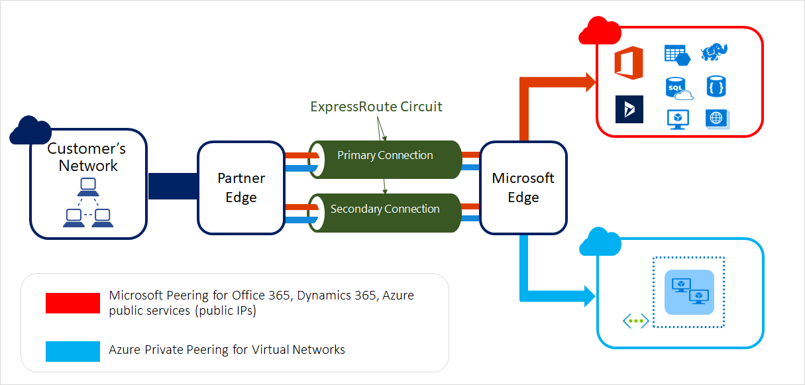
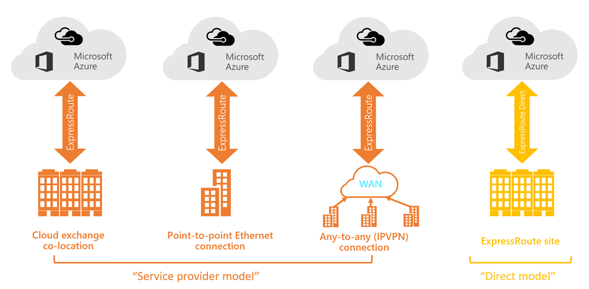
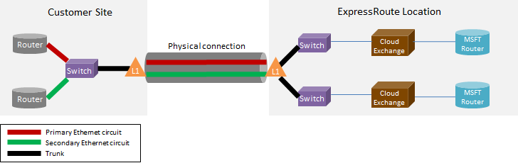
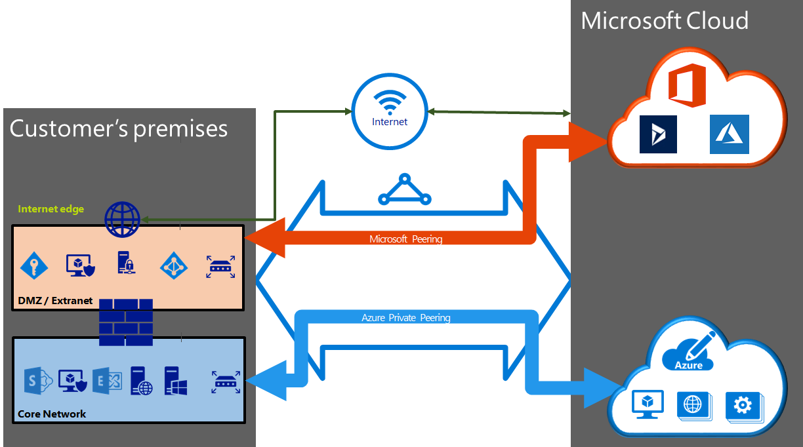
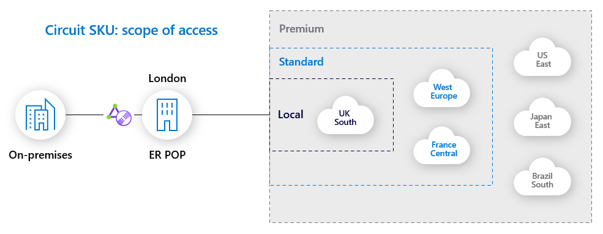

# ExpressRoute 실제 연결 구조

이 문서는 ExpressRoute가 실제로 어떻게 연결되는지, 어떤 구간이 물리 연결이고 어떤 구간이 논리 연결인지, 그 위에 어떤 네트워크 기술이 쓰이는지를 이해하기 위해 정리한 문서이다.

ExpressRoute는 On-prem과 Microsoft Cloud를 [Public Internet이 아닌 Private 경로로 연결해주는 서비스](https://learn.microsoft.com/en-us/azure/expressroute/expressroute-introduction)이다. 개념적으로는 "온프레미스와 Azure를 L3로 연결한다"가 맞다. 다만 실제 구현은 온프레미스에서 Azure VNet까지 전용 광케이블 하나가 그대로 꽂히는 구조라기보다는, 물리 연결 위에 여러 논리 계층을 얹는 구조에 가깝다.

1. 물리 구간
   - 고객 라우터/스위치
   - 광케이블, Patch Panel, ODF, Cross-Connect
   - 통신사 회선, Metro Ethernet, MPLS/WAN Backbone, Ethernet Exchange Fabric
   - ExpressRoute Peering Location의 Provider/Exchange 장비와 Microsoft MSEE router
2. 논리 구간
   - ExpressRoute Circuit
   - VLAN, VRF, MPLS L2/L3 VPN, EVPN 등 고객별 분리 기술
   - Private Peering, Microsoft Peering
   - BGP session과 route advertisement
   - Azure VNet과 ExpressRoute Gateway 연결

즉, ExpressRoute는 물리 연결 위에 논리 회선과 라우팅 도메인을 얹어서 만드는 Private L3 연결 서비스라고 보면 된다.

## 구성 주체

ExpressRoute 연결에는 보통 아래 주체가 등장한다.

1. 고객
   - 온프레미스 DC, 지사, 사무실, Co-location rack 등
2. 고객 네트워크 장비
   - Router, L3 Switch, Firewall, SD-WAN Edge 등
3. Connectivity Provider
   - ISP, Telco, MPLS/WAN 사업자, Cloud Exchange 사업자, 데이터센터 사업자 등
   - 예: KT, LG CNS, KINX, Equinix, Megaport 등
4. Microsoft Edge
   - MSEE, Microsoft Enterprise Edge router
   - ExpressRoute Circuit이 Microsoft Network로 들어오는 진입점

중요한 점은 [Azure Region과 ExpressRoute Location은 같은 개념이 아니라는 것](https://learn.microsoft.com/en-us/azure/expressroute/expressroute-locations-providers)이다.

- Azure Region
  - VM, VNet, Storage 같은 Azure Resource가 실제 배포되는 지역
  - 예: Korea Central, Korea South
- ExpressRoute Location
  - MSEE가 위치한 Peering Location 또는 Meet-Me Location
  - 고객/Provider가 Microsoft Network와 Cross-Connect를 맺는 위치
  - 예: Busan, Seoul, Seoul2

## ExpressRoute Circuit

ExpressRoute Circuit은 온프레미스와 Microsoft Cloud 사이의 [논리 연결](https://learn.microsoft.com/en-us/azure/expressroute/expressroute-circuit-peerings#circuits)이다.

Microsoft 문서 기준으로도 ExpressRoute Circuit은 Connectivity Provider를 통해 온프레미스 인프라와 Microsoft Cloud Service를 연결하는 logical connection으로 설명된다.

Circuit은 아래 속성을 가진다.

- Service Key로 식별된다.
  - 고객, Microsoft, Connectivity Provider 사이에서 공유되는 식별자이다.
  - 보안 비밀이라기보다는 회선 프로비저닝을 맞추기 위한 ID에 가깝다.
- 특정 Connectivity Provider와 Peering Location에 매핑된다.
- 고정 대역폭을 가진다.
  - 50 Mbps, 100 Mbps, 200 Mbps, 500 Mbps
  - 1 Gbps, 2 Gbps, 5 Gbps, 10 Gbps
- 하나의 Circuit 안에 여러 Peering이 있을 수 있다.
  - Azure Private Peering
  - Microsoft Peering
- 각 Peering은 고가용성을 위해 BGP session pair로 구성된다.

## 실제 연결 흐름

가장 일반적인 Provider 기반 ExpressRoute는 아래처럼 연결된다.

1. 고객 DC/Co-location에 고객 Router 또는 Switch가 있음
2. 고객 장비의 광 포트에서 나온 광케이블이 고객 rack의 Patch Panel 또는 ODF로 연결됨
3. Patch Panel/ODF에서 Provider 장비 또는 Ethernet Exchange 장비까지 Cross-Connect 됨
4. Provider Backbone, MPLS Network, Metro Ethernet, DC Ethernet Exchange Fabric 등을 통해 ExpressRoute Peering Location까지 이동함
5. ExpressRoute Peering Location에서 Provider/Exchange 장비가 Microsoft MSEE router와 연결됨
6. 고객 Router 또는 Provider-managed Router가 MSEE와 BGP Peering을 맺음
7. BGP를 통해 On-prem prefix와 Azure/Microsoft prefix가 교환됨
8. Azure 쪽에서는 ExpressRoute Circuit을 VNet Gateway에 연결해서 VNet address space를 온프레미스로 광고함

이 흐름에서 물리적인 부분과 논리적인 부분이 섞여 있다.

| 단계                                  | 성격        | 설명                                                                                    |
| ------------------------------------- | ----------- | --------------------------------------------------------------------------------------- |
| 고객 장비 - 고객 rack Patch Panel/ODF | 물리        | 광케이블, 포트, Patch Panel, ODF                                                        |
| 고객 구간 - Provider/Exchange 장비    | 물리 + 논리 | 실제 회선은 물리, 고객별 서비스는 VLAN/port/service로 구분                              |
| Provider Backbone/MPLS망              | 물리 + 논리 | 물리망은 공유되는 경우가 많고, 고객별로 VRF/MPLS VPN/EVPN 등으로 분리                   |
| Provider/Exchange - Microsoft MSEE    | 물리 + 논리 | Peering Location의 Private Interconnect/Cross-Connect. 고객별 Circuit은 논리적으로 할당 |
| ExpressRoute Circuit                  | 논리        | Azure에서 보이는 회선 리소스. Provider, bandwidth, location, SKU와 연결됨               |
| Peering/BGP                           | 논리        | Private Peering/Microsoft Peering별 BGP session과 route advertisement                   |
| VNet 연결                             | 논리        | ExpressRoute Gateway를 통해 VNet address space가 on-prem으로 광고됨                     |

정리하면 물리 케이블은 분명히 존재하지만, 고객이 구매하는 ExpressRoute Circuit 하나가 end-to-end 단일 전용 광케이블이라는 뜻은 아니다. 많은 경우 Provider와 Microsoft 사이의 대용량 Private Interconnect 또는 Provider Backbone 위에서 고객별 논리 Circuit이 할당되는 구조다.

## L2 연결인가 L3 연결인가

결론부터 보면 ExpressRoute 자체는 L3 연결이다.

- Microsoft와 고객/Provider 사이의 최종 라우팅은 BGP로 한다.
- Azure VNet의 subnet VLAN을 온프레미스로 그대로 늘리는 [L2 extension은 지원하지 않는다](https://learn.microsoft.com/en-us/azure/expressroute/expressroute-faqs#can-i-extend-one-of-my-vlans-to-azure-using-expressroute).
- Provider가 고객에게 L2 Ethernet handoff를 제공할 수는 있지만, Azure 안까지 VLAN이 그대로 연장되는 것은 아니다.

즉, Provider 구간은 L2처럼 보일 수 있지만 Azure와의 연결은 L3/BGP로 완성된다고 보는 게 맞다.

예를 들어 Point-to-Point Ethernet 모델에서는 고객 입장에서 Ethernet 회선처럼 보일 수 있다. 그래도 MSEE와는 BGP Peering을 맺고 route를 주고받는다.

Any-to-Any IPVPN 모델에서는 Provider가 MPLS L3VPN 형태로 고객 WAN에 Azure를 지점 하나처럼 붙여준다. 이 경우 고객은 Provider가 관리하는 L3 WAN 안에 Azure 경로가 들어오는 형태로 경험한다.

## 연결 모델 4가지

ExpressRoute [연결 모델](https://learn.microsoft.com/en-us/azure/expressroute/expressroute-connectivity-models)은 크게 4가지가 있다.

### 1. Cloud Exchange Co-location

Cloud Exchange 사업자의 Ethernet Exchange 플랫폼을 통해 Azure와 연결하는 방식.

- 고객 장비와 Provider/Exchange 장비가 같은 Co-location facility에 있거나, 고객이 그 facility의 Exchange Fabric에 접속할 수 있어야 한다.
- 고객 장비의 port에서 나온 광케이블이 Patch Panel/ODF를 거쳐 Exchange Provider 장비로 Cross-Connect 된다.
- Exchange Provider는 Microsoft와 이미 연결되어 있고, 고객은 해당 Exchange Fabric 위에서 Azure에 대한 Virtual Cross-Connection을 할당받는다.
- 이 Virtual Cross-Connection 위에서 MSEE와 BGP Peering을 맺는다.

이 모델에서 "물리적으로 가까운 연결"은 맞지만, 네트워크 사업자 개입이 아예 없는 것은 아니다.

- 같은 DC 안에서 연결되면 물리 경로는 짧아진다.
- 하지만 Exchange Provider의 Fabric, Virtual Cross-Connect, VLAN 같은 논리 구성이 핵심이다.
- Exchange Provider가 managed L3 cross-connect를 제공하는 경우 고객이 보는 형태는 L3 서비스에 더 가까울 수 있다.

원본 메모의 "네트워크 사업자의 개입이 거의 없다"는 표현은, 장거리 통신사 회선보다 Exchange Fabric 중심으로 직접 연결된다는 의미로 보정해서 이해하면 된다.

### 2. Point-to-Point Ethernet Connections

고객 DC/사무실과 Microsoft Peering Location 또는 Provider의 ExpressRoute 접속 지점을 Ethernet 회선으로 연결하는 방식.

- Provider가 고객 site와 ExpressRoute Peering Location 사이에 Point-to-Point Ethernet link를 제공한다.
- 보통 고객 입장에서는 L2 회선처럼 보인다.
- 고객 Router와 MSEE 또는 Provider Edge 사이에서 BGP Peering을 구성한다.

주의할 점.

- 반드시 고객 site와 Microsoft 사이에 물리 회선 2개를 직접 주문해야 한다는 뜻은 아니다.
- Provider가 하나의 물리 연결 위에 Primary/Secondary Ethernet Virtual Circuit을 구성할 수 있으면, 하나의 physical connection 위에서도 이중화된 Virtual Circuit을 제공할 수 있다.
- 이때 outer 802.1Q VLAN tag 등으로 Primary/Secondary Circuit이 구분될 수 있다.

### 3. Any-to-Any IPVPN Connections

고객이 이미 MPLS/WAN을 사용하고 있는 경우 Azure를 그 WAN 안에 지점 하나처럼 추가하는 방식.

- IPVPN Provider는 보통 MPLS L3VPN 기반의 managed L3 connectivity를 제공한다.
- 고객 지점, DC, Azure 연결이 같은 Provider WAN/VRF 안에 들어온다.
- 고객 입장에서는 Azure prefix가 기존 WAN 라우팅 테이블에 추가되는 느낌이다.
- Provider가 고객 Edge와 Microsoft Edge 사이의 라우팅 전파를 관리하는 경우가 많다.

이 모델은 고객이 지점이 많고 이미 MPLS WAN을 운영 중일 때 자연스럽다.

### 4. ExpressRoute Direct

[ExpressRoute Direct](https://learn.microsoft.com/en-us/azure/expressroute/expressroute-erdirect-about)는 일반 Connectivity Provider를 통해 Circuit을 주문하는 대신, Microsoft의 ExpressRoute Peering Location에서 Microsoft Global Network에 직접 연결하는 모델.

- Microsoft가 제공하는 port pair를 사용한다.
- 현재 공식 문서 기준으로 dual 10 Gbps, 100 Gbps, 400 Gbps 연결을 제공한다.
- 대량 데이터 수집, regulated industry의 physical isolation 요구, 더 세밀한 Circuit 분배 제어 같은 경우에 사용된다.

다만 "중간 사업자가 완전히 없다"는 의미로 이해하면 안 된다.

- ExpressRoute Connectivity Provider를 통해 Circuit을 받는 것은 아니다.
- 하지만 고객 장비를 Peering Location에 두거나, 해당 시설까지 광회선을 끌고 가거나, Co-location Provider에게 Cross-Connect를 요청하는 작업은 여전히 필요하다.
- 즉, ER 서비스 관점에서는 direct지만, 물리 설치 관점에서는 DC/colo/local carrier가 여전히 관여할 수 있다.

## Peering과 BGP

ExpressRoute Circuit 위에는 [routing domain](https://learn.microsoft.com/en-us/azure/expressroute/expressroute-circuit-peerings#routingdomains)이 올라간다.

현재 신규 Circuit에서 주로 보는 Peering은 아래 2가지.

1. Azure Private Peering
   - 온프레미스와 Azure VNet을 private IP로 연결하는 경로
   - VM, Private Endpoint, VNet 내부 리소스 접근에 사용
   - 온프레미스 WAN과 Azure VNet을 trusted extension처럼 연결
2. Microsoft Peering
   - Azure PaaS, Microsoft 365, Microsoft public service prefix 등 Microsoft public endpoint로 가는 경로
   - public IP prefix 기반으로 라우팅함
   - Microsoft 365는 특정 시나리오에서만 권장됨

각 Peering은 Primary/Secondary BGP session pair로 구성된다.

[BGP](https://www.rfc-editor.org/rfc/rfc4271)에서 주고받는 것은 결국 prefix다.

- Azure Private Peering에서는 VNet address space가 ExpressRoute Gateway를 통해 온프레미스로 광고된다.
- 온프레미스는 자신의 내부 prefix를 Azure 쪽으로 광고한다.
- VNet peering에서 gateway transit/use remote gateway를 쓰면 spoke VNet address space도 광고될 수 있다.
- Microsoft Peering에서는 public prefix와 route filter 개념이 중요하다.

## Redundancy

ExpressRoute Circuit 하나에는 기본적으로 [redundancy](https://learn.microsoft.com/en-us/azure/expressroute/expressroute-introduction#features)가 들어간다.

- 하나의 Circuit은 두 개의 connection을 가진다.
- 두 connection은 두 대의 MSEE에 연결된다.
- Microsoft는 Provider 또는 고객 Edge에서 MSEE 두 대 각각으로 dual BGP connection을 구성하도록 요구한다.
- Primary/Secondary connection 각각에 구매한 bandwidth가 적용된다.

다만 이건 단일 Peering Location 안에서의 redundancy다.

Critical workload에서는 다음까지 고려해야 한다.

- 서로 다른 ExpressRoute Peering Location에 Circuit을 하나 더 구성
- 서로 다른 Provider 사용
- 동일 VNet에 여러 ExpressRoute Circuit 연결
- ECMP, connection weight, AS PATH prepending, local preference 등을 통한 경로 제어
- [BFD](https://learn.microsoft.com/en-us/azure/expressroute/expressroute-bfd)를 통한 빠른 BGP failover

정리하면 single Circuit도 이중화는 되어 있지만, location 장애까지 견디려면 Circuit-level/[multi-site](https://learn.microsoft.com/en-us/azure/expressroute/designing-for-high-availability-with-expressroute) 구성이 필요하다.

## 대역폭

Provider 기반 ExpressRoute Circuit에서 일반적으로 지원되는 [bandwidth](https://learn.microsoft.com/en-us/azure/expressroute/expressroute-introduction#bandwidth-options)는 아래와 같다.

- 50 Mbps
- 100 Mbps
- 200 Mbps
- 500 Mbps
- 1 Gbps
- 2 Gbps
- 5 Gbps
- 10 Gbps

주의할 점.

- bandwidth는 [ingress/egress 각각에 적용되는 duplex](https://learn.microsoft.com/en-us/azure/expressroute/expressroute-faqs#is-bandwidth-for-expressroute-allocated-for-ingress-and-egress-traffic-separately) 개념이다.
  - 예: 200 Mbps Circuit이면 ingress 200 Mbps, egress 200 Mbps
- 모든 Provider가 모든 bandwidth를 제공하는 것은 아니므로 Provider 확인이 필요하다.
- [Circuit bandwidth는 모든 Peering이 공유](https://learn.microsoft.com/en-us/azure/expressroute/expressroute-circuit-peerings#circuits)한다.
  - Private Peering과 Microsoft Peering을 동시에 쓰면 같은 Circuit bandwidth를 나눠 쓴다.
- ExpressRoute Gateway SKU의 처리량 한계도 별도로 존재한다.

### 대역폭은 어떻게 조절되는가

정확한 내부 구현은 CSP와 Provider 장비마다 다를 수 있지만, 원리는 보통 물리 port 속도를 바꾸는 것이 아니라 논리 Circuit에 적용된 허용 전송률을 바꾸는 것이다.

ExpressRoute는 대개 아래처럼 동작한다고 보면 된다.

1. 물리 port는 더 큰 속도로 이미 연결되어 있다.
   - 예를 들어 Provider와 Microsoft MSEE 사이에는 10 Gbps, 100 Gbps 같은 물리 interconnect가 있을 수 있다.
   - 고객이 200 Mbps Circuit을 샀다고 해서 물리 port가 200 Mbps로 동작하는 것은 아니다.
2. 그 물리 port 위에 고객별 논리 Circuit이 올라간다.
   - VLAN, Virtual Circuit, VRF, service instance 같은 형태로 고객 traffic이 구분된다.
   - 같은 물리 port나 fabric 위에 여러 고객 Circuit이 같이 존재할 수 있다.
3. 각 Circuit에는 허용 bandwidth 값이 설정된다.
   - 이 값은 Provider Edge와 Microsoft Edge에서 해당 Circuit traffic의 최대 전송률을 제한하는 기준이 된다.
   - 예를 들어 200 Mbps Circuit이면 해당 Circuit traffic이 200 Mbps를 넘지 않도록 제한된다.
4. [bandwidth 증가](https://learn.microsoft.com/en-us/azure/expressroute/expressroute-faqs#can-the-bandwidth-of-an-expressroute-circuit-be-changed)란 이 허용 전송률 값을 올리는 것이다.
   - 예를 들어 200 Mbps에서 500 Mbps로 증설하면, 같은 논리 Circuit의 허용 전송률이 500 Mbps로 바뀐다.
   - BGP Peering이나 VLAN 자체를 새로 만드는 것이 아니라, 이미 있는 Circuit의 전송 한도를 키우는 개념이다.
5. 물리 port에 여유 capacity가 있어야 한다.
   - underlying physical port나 Provider backbone에 남는 capacity가 없으면 논리 Circuit의 한도만 올릴 수 없다.
   - 이 경우 더 큰 물리 port, 다른 port, 새 Circuit이 필요할 수 있다.

즉, 대역폭 증설은 이미 존재하는 물리 인프라 위에서 고객의 논리 Circuit에 걸린 전송 한도 값을 바꾸는 일이다. 다만 이 값은 Microsoft 쪽만 바뀌면 끝나는 것이 아니다.

- Microsoft Edge의 Circuit bandwidth 설정
- Provider Edge의 Circuit bandwidth 설정
- Provider Backbone의 capacity
- 고객 Router/Firewall interface 속도와 처리량
- Azure ExpressRoute Gateway SKU 처리량

이 경로 중 가장 낮은 한계가 실제 체감 throughput이 된다.

참고사항

- ExpressRoute는 Primary/Secondary connection이 각각 구매 bandwidth를 가진다.
- 트래픽을 두 connection에 분산하면 구매 bandwidth의 최대 2배에 가까운 트래픽을 잠깐 사용할 수 있다.
- 하지만 Secondary는 redundancy 목적이므로, 이를 지속적인 초과 대역폭으로 의존하면 안 된다.
- 한쪽 connection 장애가 나면 남은 connection 하나가 전체 traffic을 받아야 하므로, 평소에 2배에 가깝게 쓰고 있었다면 장애 시 drop이 발생할 수 있다.
- 단일 connection에서 구매 bandwidth를 초과하면 rate limiting 또는 packet drop이 발생할 수 있다.

## SKU와 연결 범위

ExpressRoute [SKU](https://learn.microsoft.com/en-us/azure/expressroute/expressroute-faqs#expressroute-sku-scope-access)는 연결 가능한 Azure Region 범위를 결정한다.

### Local

특정 ExpressRoute Peering Location 근처의 [local Azure Region 1개 또는 2개](https://learn.microsoft.com/en-us/azure/expressroute/expressroute-faqs#expressroute-local)에만 접근 가능.

- 예: Seoul Peering Location의 Local Region은 Korea Central
- 예: Busan Peering Location의 Local Region은 Korea South
- Local SKU에서는 다른 region prefix가 광고되지 않는다.
- Global Reach는 Local에서 지원되지 않는다.

따라서 Korea Central에 연결되는 Local ER을 만들었다면 North Europe 리소스에는 ExpressRoute로 접근할 수 없다고 보면 된다.

### Standard

같은 지정학적 지역 안의 Azure Region에 접근 가능.

한국의 경우 공식 표 기준으로 South Korea 지정학적 지역 안에 아래 Azure Region과 ExpressRoute Location이 매핑되어 있다.

- Azure Region
  - Korea Central
  - Korea South
- ExpressRoute Location
  - Busan
  - Seoul
  - Seoul2

즉, 한국 Peering Location의 Standard Circuit이면 Korea Central/Korea South 범위로 이해하면 된다.

North Europe처럼 다른 지정학적 지역의 Azure Region에 접근하려면 Standard만으로는 부족하고 Premium이 필요하다.

### Premium

[지정학적 경계를 넘어](https://learn.microsoft.com/en-us/azure/expressroute/expressroute-faqs#expressroute-premium) 전 세계 Azure Region의 Microsoft Cloud service에 접근 가능하다.

- route limit 증가
- Circuit당 연결 가능한 VNet 수 증가
- global connectivity
- Microsoft 365 시나리오 등에서 필요할 수 있음

국가별 cloud 환경은 별도 cloud로 격리되어 있으므로 public Azure ER로 다른 national cloud까지 연결되는 것은 아니다.

## ExpressRoute Global Reach

[ExpressRoute Global Reach](https://learn.microsoft.com/en-us/azure/expressroute/expressroute-global-reach)는 Azure VNet 연결 기능이 아니라, ExpressRoute를 통해 연결된 온프레미스 네트워크끼리를 Microsoft Backbone으로 연결하는 기능이다.

예를 들어 아래와 같은 구조.

1. 서울 DC가 Seoul ExpressRoute Circuit에 연결됨
2. 미국 DC가 Silicon Valley ExpressRoute Circuit에 연결됨
3. 두 Circuit에 Global Reach를 설정함
4. 서울 DC와 미국 DC 간 트래픽이 Microsoft Backbone을 통해 이동함

주의할 점.

- 두 Circuit은 [서로 다른 Peering Location](https://learn.microsoft.com/en-us/azure/expressroute/expressroute-faqs#can-i-enable-expressroute-global-reach-between-two-expressroute-circuits-at-the-same-peering-location)에 있어야 한다.
- 같은 Peering Location의 두 Circuit 사이에는 Global Reach를 설정할 수 없다.
- 서로 다른 지정학적 지역의 Circuit을 연결하려면 [양쪽 Circuit 모두 Premium](https://learn.microsoft.com/en-us/azure/expressroute/expressroute-faqs#do-i-need-expressroute-premium-for-expressroute-global-reach)이 필요하다.
- Global Reach 트래픽도 Circuit bandwidth를 공유한다.
- 여러 site를 full mesh로 연결하려면 Circuit pair마다 설정해야 한다.

## 한국 ExpressRoute 위치와 공급자

공식 [위치별 Provider 표](https://learn.microsoft.com/en-us/azure/expressroute/expressroute-locations-providers#partners) 기준으로 한국 관련 ExpressRoute 위치는 아래와 같다.

| Peering Location | Facility       | Zone | Local Azure Region | ER Direct | Providers                                                                                 |
| ---------------- | -------------- | ---- | ------------------ | --------- | ----------------------------------------------------------------------------------------- |
| Busan            | LG CNS         | 2    | Korea South        | No        | LG CNS                                                                                    |
| Seoul            | KINX Gasan IDC | 2    | Korea Central      | Yes       | Colt, Digital Realty, Equinix, KINX, KT, LG CNS, LGUplus, Sejong Telecom, SK Telecom, SKT |
| Seoul2           | KT IDC         | 2    | Korea Central      | No        | KINX, KT, LGUplus                                                                         |

여기서 Provider 목록은 해당 위치에서 ExpressRoute connectivity를 제공할 수 있는 파트너로 이해하면 된다.

고객이 반드시 해당 facility에 직접 장비를 넣어야만 하는 것은 아니고, Provider가 고객 site에서 해당 Peering Location까지 회선을 연장해 줄 수 있다.

## 밑단에 쓰이는 기술들

원본 메모에 있던 MPLS, VRF, MPLS L2/L3 VPN, EVPN, Ethernet Exchange Fabric은 아래처럼 보면 된다.

### VLAN / 802.1Q

같은 Ethernet 물리 링크 위에서 여러 논리 네트워크를 나누기 위한 [tagging 기술](https://learn.microsoft.com/en-us/azure/expressroute/expressroute-erdirect-about#vlan-tagging).

- Provider가 Primary/Secondary Virtual Circuit을 VLAN ID로 구분할 수 있음
- Private Peering과 Microsoft Peering 같은 routing domain도 별도 VLAN/subinterface로 구분될 수 있음

### VRF

[Virtual Routing and Forwarding](https://www.rfc-editor.org/rfc/rfc4364#section-3).

하나의 Router 안에 여러 개의 독립된 routing table을 두는 기술.

- Provider가 여러 고객의 route를 같은 장비에서 처리하면서도 routing table을 분리할 수 있음
- 고객 A의 prefix와 고객 B의 prefix가 섞이지 않도록 함
- MPLS L3VPN/IPVPN의 기본 구성요소로 자주 쓰임

### MPLS

IP prefix만 보고 hop-by-hop routing하는 대신 [label](https://www.rfc-editor.org/rfc/rfc3031#section-3.1)을 붙여 Provider망 안에서 트래픽을 전달하는 기술.

- Provider Backbone에서 고객별 VPN을 만들 때 많이 쓰임
- L2VPN, L3VPN, traffic engineering 등에 사용됨
- 고객 입장에서는 Provider 내부가 어떻게 구성되었는지 보이지 않을 수 있음

### MPLS L2VPN

Provider망 위에서 고객에게 L2 회선처럼 보이는 서비스를 제공하는 방식.

- VPWS, VPLS 같은 형태가 있음
- 고객 장비 입장에서는 Ethernet 회선처럼 보일 수 있음
- Point-to-Point Ethernet 모델의 Provider 내부 구현으로 쓰일 수 있음

### MPLS L3VPN / IPVPN

Provider가 고객별 [VRF](https://www.rfc-editor.org/rfc/rfc4364#section-3)를 만들고, 고객 route를 Provider망 안에서 L3로 전달하는 방식.

- 지점, DC, Azure 연결을 하나의 WAN처럼 묶음
- Any-to-Any IPVPN 모델의 전형적인 구현 방식
- 고객 입장에서는 Azure가 MPLS WAN에 붙은 branch처럼 보임

### EVPN

[EVPN](https://www.rfc-editor.org/rfc/rfc7432)은 BGP를 control plane으로 사용해서 L2/L3 overlay를 구성하는 기술.

- Data Center Ethernet Fabric 또는 Cloud Exchange Fabric에서 고객별 virtual connection을 구성하는 데 쓰일 수 있음
- VLAN 기반보다 더 확장성 있게 MAC/IP route 정보를 제어할 수 있음
- 실제 Provider 구현은 사업자마다 다르므로, 고객 문서에서 항상 노출되지는 않음

### DC Ethernet Exchange Fabric

Cloud Exchange 사업자가 운영하는 공유 Ethernet switching fabric.

- 여러 Cloud Provider와 여러 고객이 같은 Exchange platform에 연결됨
- 고객은 portal/API 또는 사업자 요청을 통해 Azure에 대한 Virtual Cross-Connect를 생성함
- 물리 switch fabric은 공유될 수 있지만, 고객별 연결은 VLAN/VRF/EVPN 등으로 논리 분리됨

### BGP

[ExpressRoute에서 라우팅을 완성](https://learn.microsoft.com/en-us/azure/expressroute/expressroute-introduction#features)하는 핵심 기술.

- 고객/Provider Edge와 MSEE 사이에서 [prefix를 교환](https://www.rfc-editor.org/rfc/rfc4271#section-3)함
- Private Peering, Microsoft Peering마다 별도 BGP session pair가 있음
- [AS_PATH](https://www.rfc-editor.org/rfc/rfc4271#section-5.1.2), [LOCAL_PREF](https://www.rfc-editor.org/rfc/rfc4271#section-5.1.5), [MED](https://www.rfc-editor.org/rfc/rfc4271#section-5.1.4), route filtering 같은 속성으로 경로 선호도를 제어할 수 있음
- [BFD](https://www.rfc-editor.org/rfc/rfc5880)를 함께 쓰면 장애 감지를 빠르게 할 수 있음

## 정리

ExpressRoute를 실제 연결 관점에서 보면 이렇게 이해하면 된다.

- ER은 최종적으로 L3/BGP 기반 private connectivity다.
- 하지만 물리적으로는 고객 장비, cross-connect, Provider Backbone, MSEE port가 모두 필요하다.
- Provider 기반 ER에서 고객별 Circuit은 공유 물리 인프라 위의 논리 연결인 경우가 많다.
- L2 Ethernet handoff를 받더라도 Azure 안으로 VLAN을 확장하는 것은 아니다.
- ExpressRoute Circuit은 Azure에서 관리되는 논리 회선이고, Peering/BGP가 실제 라우팅을 만든다.
- Local/Standard/Premium은 어디까지 Azure Region prefix를 받을 수 있는가의 차이로 보면 된다.
- Direct는 Microsoft port pair를 직접 쓰는 모델이지만, 물리 설치 관점에서는 Co-location/Cross-Connect/local carrier 작업이 여전히 필요하다.

## 참고 자료

- [What is Azure ExpressRoute?](https://learn.microsoft.com/en-us/azure/expressroute/expressroute-introduction)
- [ExpressRoute connectivity models](https://learn.microsoft.com/en-us/azure/expressroute/expressroute-connectivity-models)
- [ExpressRoute circuits and peering](https://learn.microsoft.com/en-us/azure/expressroute/expressroute-circuit-peerings)
- [ExpressRoute FAQ](https://learn.microsoft.com/en-us/azure/expressroute/expressroute-faqs)
- [ExpressRoute peering locations and connectivity partners](https://learn.microsoft.com/en-us/azure/expressroute/expressroute-locations-providers)
- [About ExpressRoute Direct](https://learn.microsoft.com/en-us/azure/expressroute/expressroute-erdirect-about)
- [RFC 4271 - A Border Gateway Protocol 4](https://www.rfc-editor.org/rfc/rfc4271)
- [RFC 3031 - Multiprotocol Label Switching Architecture](https://www.rfc-editor.org/rfc/rfc3031)
- [RFC 4364 - BGP/MPLS IP Virtual Private Networks](https://www.rfc-editor.org/rfc/rfc4364)
- [RFC 7432 - BGP MPLS-Based Ethernet VPN](https://www.rfc-editor.org/rfc/rfc7432)
- [RFC 5880 - Bidirectional Forwarding Detection](https://www.rfc-editor.org/rfc/rfc5880)
