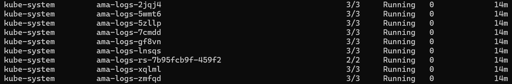
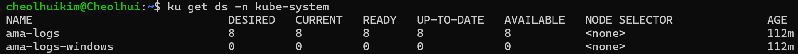
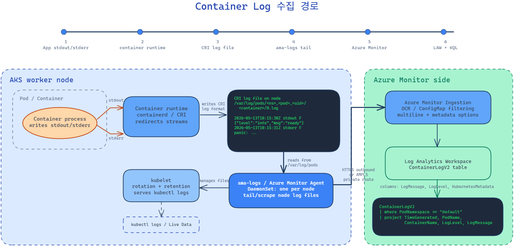

# Container Insight를 통해 Cotainer Log가 수집되는 경로를 이해하기

> Container Log 수집 경로 다이어그램: [overall-diagram.png](./img/overall-diagram.png) / [container-log-collection.excalidraw](./container-log-collection.excalidraw)

## 질문

- AKS에 Container Log 기능이 있다.
- (질문 1) 이건 Diagnostic Setting 기반인가?
- (질문 2) Diagnostic는 어떻게 데이터를 수집하는지?
- (질문 3) Container Insight는 Container의 stdout/stderr를 가져오는 것이다. 그렇다면 이걸 어떻게 가져오는 것일까?
- (질문 4) Scraper가 stdout/stderr를 어떻게 가져오지? 터미널에 출력된 걸 읽어오나?
- (질문 5) 그렇게 가져온 데이터가 어디에 저장되지?
  - Log Analytics Workspace
- (질문 6) 그럼 그걸 어떻게 쿼리하지?
  - KQL
- (질문 7) KQL로 쿼리를 한다는 것은 MS 제품 기반이라는 의미인데, LAW의 기반 엔진이 무엇인지 알고 있나?
- (질문 8) kubectl 접근 권한이 없는 경우, AKS Pod의 로그를 어떻게 확인할 것인지?
  - Azure Portal 밖에 접근을 못한다면?
  - 만약 private cluster라면 데이터 수집 경로가 달라지나? 혹은 트러블슈팅 경로가 달라지나?

## 답변

### 1. Container Insight는 Diagnostic Setting 기반이 아니다.

Diagnostic Settings는 주로 AKS 리소스의 control plane/resource logs를 라우팅하는 기능으로, kube-apiserver나 kube-audit, kube-scheduler 같은 AKS Control Plane의 로그를 라우팅한다.

반면에 Container Insight는 Pod 내 Container에서 발생한 `stdout/stderr` 로그를 수집하는데, 대략적인 로그 수집 경로는 아래와 같다.

1. Application `stdout/stderr`
2. container runtime이 `stdout/stderr`를 Pod가 속한 노드에 `CRI log file`로 저장
3. `kubelet`이 로그 파일을 관리하고, 요청 시 로그를 읽어줌.
4. Azure Monitor Agent / ama-logs DaemonSet이 각 노드에서 log file tailing/scraping
5. Azure Monitor Ingestion & Log Analytics Workspace에 저장
6. `ContainerLogV2` 테이블에서 KQL 조회

### 2. stdout의 터미널 출력을 긁어오는 것이 아니다.

Container Application이 stdout/stderr에 뭔가를 쓰는데, 이는 해당 프로세스의 stdout/stderr stream이다. Container runtime은 이 stream을 받아서 노드의 로그 파일에 기록한다.

즉, Container Insight는 터미널 화면을 scraper가 읽는 게 아니라, 노드 파일시스템의 Container Log 파일을 agent가 읽는 구조이다.

### 3. Scraper/Agent는 뭐냐?

Container Insight에는 Azure Monitor Agent를 통해서 로그를 scraping한다. kube-system namespace에 ama-logs 관련 DaemonSet이 배포된다.





각 노드에는 /var/log/pods 폴더 내에 각 Pod별 로그 파일이 존재하는데, AMA는 이 로그 파일을 읽고 Azure Monitor쪽으로 보내는 역할을 수행한다.

### 4. LAW의 기반 엔진

`Log Analytics Workspace`는 `Azure Data Explorer/Kusto` 계열이고, 쿼리 언어는 `KQL`이다. `Log Analytics`는 Azure Portal에서 이 로그 저장소를 조회하는 도구이다.

### 5. kubectl 권한이 없고, Azure Portal만 접근 가능하다면?

AKS 리소스에 Container Insight가 켜져있다면,

1. Monitor 탭에서 Nodes, Controllers, Containers의 상태와 로그를 확인할 수 있다.
2. AKS 리소스의 Logs 탭에서도 ContainerLogV2 테이블에서 관련 정보를 확인할 수 있다. KQL로 필요한 정보를 필터링하는 것도 가능하다. Log Analytics Workspace에서도 마찬가지다.

### 6. 만약 Private Cluster라면?

Private AKS Cluster라고 할지라도, LAWS에 이미 수집된 로그를 Azure Portal에서 보는 것 자체가 달라지는 것은 아니다.

다만 AMA가 수집한 데이터를 Azure Monitor Ingestion endpoint로 보내는 outbound 경로가 필요하다. 때문에 만약 Firewall 등이 구성되어 outbound 트래픽이 allowList로 관리된다면, Private Link/AMPLS를 구성하거나 Azure Monitor Ingestion endpoint에 대한 FQDN를 allowList에 추가해야한다.

### 구조도



```
[Container App]
stdout/stderr
↓
[Container Runtime]
CRI log file on node
/var/log/pods, /var/log/containers, runtime-specific path
↓
[kubelet]
log rotation + kubectl logs serving
↓
[ama-logs / Azure Monitor Agent DaemonSet]
node-level tail/scrape
↓
[Azure Monitor / ingestion]
↓
[Log Analytics Workspace]
ContainerLogV2, KubePodInventory, KubeEvents ...
↓
[KQL / Log Analytics]
```

## 레퍼런스

- Kubernetes Logging Architecture: https://kubernetes.io/docs/concepts/cluster-administration/logging/
- Azure Monitor data collection for Kubernetes: https://learn.microsoft.com/en-us/azure/azure-monitor/containers/kubernetes-data-collection-configure
- Azure Monitor ConfigMap container log collection: https://learn.microsoft.com/en-us/azure/azure-monitor/containers/kubernetes-data-collection-configmap
- ContainerLogV2 schema: https://learn.microsoft.com/en-us/azure/azure-monitor/containers/container-insights-logs-schema
- Query AKS container logs in ContainerLogV2: https://learn.microsoft.com/en-us/azure/azure-monitor/containers/container-insights-log-query#container-logs
- AKS live data / /var/log/containers: https://learn.microsoft.com/en-us/azure/azure-monitor/containers/container-insights-livedata-overview
- ama-logs DaemonSet manifest: https://github.com/microsoft/Docker-Provider/blob/ci_prod/kubernetes/ama-logs.yaml (4/4)
